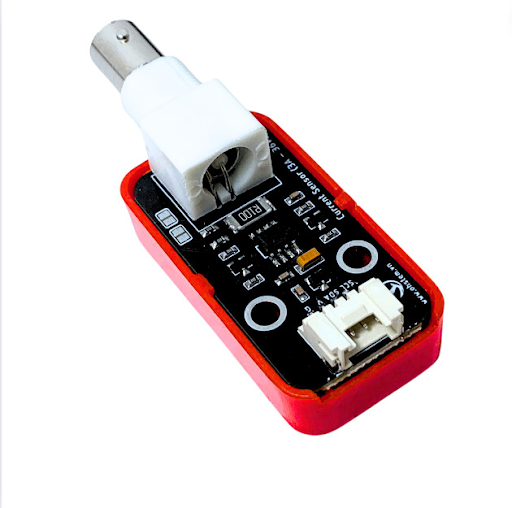
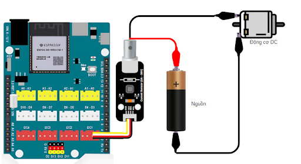
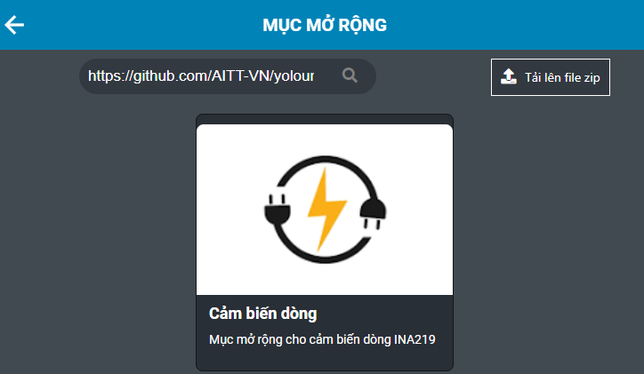
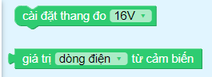
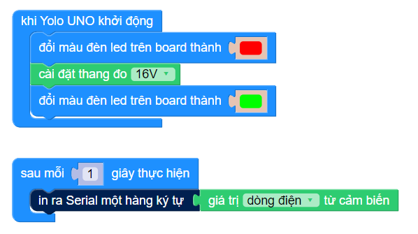

30. Cảm biến dòng điện INA219
=============

|

**Cảm biến dòng điện điện áp DC INA219 (DC Voltage Current Sensor)** được sử dụng để đo dòng điện và điện áp DC của các thiết bị sử dụng công suất nhỏ, với độ chính xác cao, sai số chỉ 1%. Cảm biến sử dụng giao tiếp I2C rất dễ kết nối và lập trình với vi điều khiển, khả năng đo tối đa của cảm biến là 26VDC / 3.2A, thích hợp với các ứng dụng đo điện áp, dòng điện, công suất tiêu thụ của các thiết bị sử dụng điện áp DC.

1. Mua sản phẩm
-----------
----------

..  image:: images/gio.png
    :alt: some image
    :target: https://ohstem.vn/product-category/danh-muc-san-pham/cam-bien/
    :class: with-shadow
    :scale: 100%
    :align: center
|

2. Thông số kỹ thuật
---------
----------

- Điện áp sử dụng: 3~5VDC
- Khoảng điện áp DC đo được: 0~26VDC
- Khoảng dòng điện DC đo được: 0~3.2A
- Khoảng công suất DC đo được: 0~83.2W
- Chuẩn giao tiếp: I2C

3. Kết nối
------------
------------

Kết nối cảm biến dòng điện điện áp DC INA219 với mạch điều khiển Yolo UNO thông qua cổng I2C và một thiết bị điện để đo lượng điện năng tiêu thụ, như hình minh họa sau:

    Cảm biến dòng điện điện áp DC INA219 kết nối với Yolo UNO thông qua giao thức I2C

4. Hướng dẫn lập trình
------------
------------

Để lập trình với cảm biến dòng điện, bạn cần thực hiện các bước sau:

1. Tải thư viện **Cảm biến dòng**: Sao chép đường dẫn sau và dán vào ô tìm kiếm trong mục mở rộng: `<https://github.com/AITT-VN/yolouno_extension_ina219.git>`_ 

|

Các khối lệnh làm việc với cảm biến:

|

2. Chương trình mẫu để đọc giá trị dòng điện như sau:

|

.. note:: **Giải thích chương trình:** Câu lệnh cài đặt thang đo 16V sử dụng khi điện áp cấp cho tải bé hơn 16V, khi cấp nguồn lớn hơn 16V - 26V thì chúng ta sẽ cài đặt sang thang đo 32V ở phần lựa chọn. Sau mỗi 1 giây, giá trị dòng điện (đơn vị mA) sẽ được in ra cửa sổ serial. 

**Link chương trình mẫu:** `<https://app.ohstem.vn/#!/share/yolouno/2hlPyfIw67KTqVTfUNDaBTTfwGL>`_