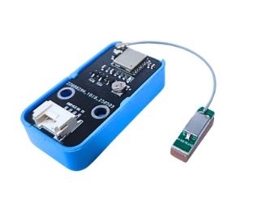
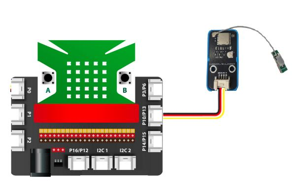
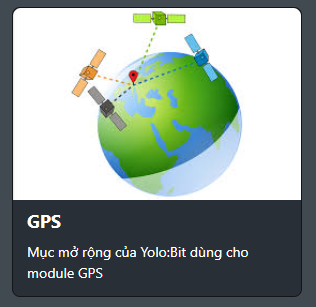
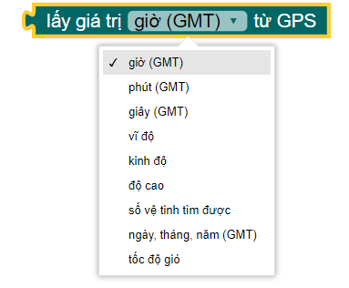
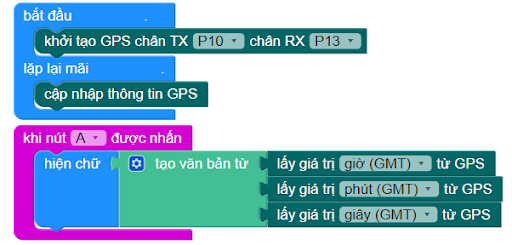
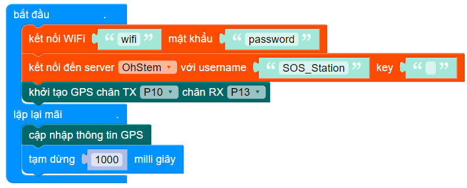
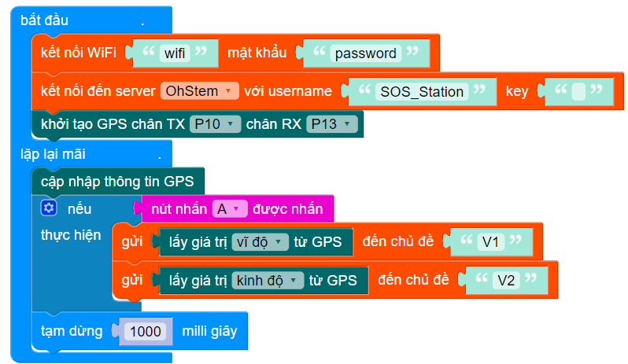

24. Mạch định vị GPS BDS ATGM336H
========

| 

Mạch định vị GPS BDS ATGM336H có thiết kế nhỏ gọn sử dụng IC chính SoC GNSS AT6558 thế hệ thứ 4 với khả năng tiết kiệm năng lượng vượt trội, mạch bắt tín hiệu định vị và thời gian nên các hệ thống GPS/US, Beidou/CN, GLONASS/RU, Galileo/EU, QZSS/JP, SBAS/enhanced system qua 32 kênh tracking chanel.
Mạch định vị GPS BDS ATGM336H có chuẩn đầu ra tín hiệu của mạch tương thích với các module của Ublox (NEO-6M / NEO-7/ NEO-M8N) nên có thể thay thế dễ dàng, sử dụng chung code mẫu Arduino và phần mềm U-Center trên máy tính, phù hợp với các ứng dụng định vị vị trí và lấy thời gian qua GPS.

**1. Mua sản phẩm**
-----------
----------

..  image:: images/gio.png
    :alt: some image
    :target: https://shop.ohstem.vn/san-pham/module-gps/
    :class: with-shadow
    :scale: 100%
    :align: center
|

**2. Thông số kỹ thuật**
---------
------------

- **Thông số kỹ thuật**

    + Điện áp cấp: 3.3~ 5VDC
    + IC chính: SoC GNSS AT6558
    + Giao tiếp UART/TTL.
    + Baudrate: 9600 (Default), 1200, 2400, 4800, 19200, 38400, 57600, 115200, 230400, 460800, 921600.
    + Tracking channels: 32
    + GNSS engine for GPS/US, Beidou/CN, GLONASS/RU, Galileo/EU, QZSS/JP, SBAS/enhanced system.
    + Support A-GNSS
    + Cold start capture sensitivity: -148dBm
    + Tracking sensitivity: -162dBm
    + Positioning accuracy: 2.5 meters (CEP50, open area)
    + First positioning time: 32 seconds
    + Low power consumption: continuous operation <25mA (@ 3.3V)
    + Kích thước: 15.7 x 13.1 mm

- **Pinout của module**

Module GPS có 4 chân, và mỗi chân có chức năng như sau:

..  csv-table:: 
    :header: "STT", "Chân", "Chức năng"
    :widths: 10, 15, 30

    1, "GND", "Nối đất"
    2, "VCC", "Cấp nguồn (3.3V)"
    3, "RX", "Đầu nhận tín hiệu"
    4, "TX", "Đầu gửi tín hiệu"

**3. Kết nối**
------------
------------

- **Bước 1**: Chuẩn bị các thiết bị như sau: 

.. list-table:: 
   :widths: auto
   :header-rows: 1
     
   * - .. image:: images/yolo.png
          :width: 200px
          :align: center
     - .. image:: images/mmr.png
          :width: 200px
          :align: center
     - .. image:: images/gps01.JPG
          :width: 200px
          :align: center
   * - Máy tính lập trình Yolo:Bit
     - Mạch mở rộng cho Yolo:Bit
     - Module GPS
   * - `Mua sản phẩm <https://shop.ohstem.vn/san-pham/may-tinh-lap-trinh-yolobit/>`_
     - `Mua sản phẩm <https://shop.ohstem.vn/san-pham/grove-shield/>`_
     - `Mua sản phẩm <https://shop.ohstem.vn/san-pham/module-gps/>`_

- **Bước 2**: Cắm Yolo:Bit vào mạch mở rộng

- **Bước 3**: Kết nối dây tín hiệu với module và mạch mở rộng như hình: 

    Module GPS sẽ kết nối với mạch Yolo:Bit ở hàng chân cắm theo mẫu. Dây màu đỏ tương ứng với dây nguồn dương (VCC), dây màu đen tương ứng nguồn âm (GND). Dây tín hiệu Tx và Rx sẽ quy định trong phần lập trình.

**4. Lập trình module GPS với Yolo:Bit trên OhStem App**
--------
------------

Để lập trình module GPS, chúng ta phải cần thêm thư viện mở rộng GPS, bạn hãy copy đường dẫn sau: `<https://github.com/AITT-VN/yolobit_extension_gps.git>`_ và dán vào mục mở rộng để tải thư viện mở rộng.

    Xem hướng dẫn tải thư viện `tại đây <https://docs.ohstem.vn/en/latest/module/thu-vien-yolobit.html>`_.

| 

**Chương trình cơ bản để lấy tín hiệu từ GPS:**

Đầu tiên chúng ta sẽ khởi tạo module GPS từ chân P10 và P13

Sau khi khởi tạo, chúng ta sẽ cập nhật thông tin GPS bằng khối lệnh : 

Các thông tin chúng ta được GPS hỗ trợ sẽ bao gồm các thông tin như sau : 

Chương trình đơn giản để kiểm tra thời gian lấy được từ GPS khi ấn nút A sẽ như sau:

 

**5.Dự án mẫu**
--------
------------

**Dự án gửi vị trí cần cứu hộ đến trạm thông tin cứu hộ:**

Với mạch Yolo:bit , chúng ta có thể kết nối với wifi và gửi tín hiệu lên server, kết hợp cùng module GPS chúng ta sẽ lấy vị trí tương đối chính xác để báo hiệu vị trí cần trợ giúp đến trạm thông tin.

Đầu tiên chúng ta cần kết nối wifi cho thiết bị và kết nối với server bằng lệnh:

Sau đó chúng ta sẽ khởi tạo module GPS ở chân P10 và P13 và sẽ cho cập nhật thông tin từ GPS sau mỗi 1 giây ở vòng lặp mãi : 

Khi cần ứng cứu , chúng ta sẽ dùng nút A để gửi vị trí của mình bao gồm kinh độ và vĩ độ lên trên kênh dữ liệu V1 và V2 trên server: 

Ở trạm điều khiển cứu nạn, chúng ta sẽ nhận được dữ liệu vĩ độ ở kênh V1 và kinh độ ở kênh V2, từ đó có thể tìm ra được vị trí cần để hỗ trợ kịp thời.

**6. Hướng dẫn lập trình Arduino**
--------
------------

- Mở phần mềm Arduino IDE. Xem hướng dẫn lập trình với Arduino `tại đây <https://docs.ohstem.vn/en/latest/module/cai-dat-arduino.html>`_. 

- Copy đoạn code sau, click vào nút ``Verify`` để kiểm tra lỗi chương trình. Sau khi biên dịch không báo lỗi, bạn có thể nạp đoạn code vào board. 

.. code-block:: guess

    #include “Yolobit.h”
    #include <TinyGPS++.h>
    #include <SoftwareSerial.h>

    Yolobit yolobit;
    static const int RXPin = P10, TXPin = P13;
    static const uint32_t GPSBaud = 9600;

    // The TinyGPS++ object
    TinyGPSPlus gps;

    // The serial connection to the GPS device
    SoftwareSerial ss(RXPin, TXPin);

    void setup(){
     Serial.begin(9600);
     ss.begin(GPSBaud);
    }

    void loop()
    {
      // This sketch displays information every time a new sentence is correctly encoded.
      while (ss.available() > 0)
      {
          gps.encode(ss.read());
          if (gps.location.isUpdated())
          {
             // Latitude in degrees (double)
             Serial.print("Latitude= "); 
             Serial.print(gps.location.lat(), 6);      
            
             // Longitude in degrees (double)
             Serial.print(" Longitude= "); 
             Serial.println(gps.location.lng(), 6); 
       
             // Raw latitude in whole degrees
             Serial.print("Raw latitude = "); 
             Serial.print(gps.location.rawLat().negative ? "-" : "+");
             Serial.println(gps.location.rawLat().deg); 
             // ... and billionths (u16/u32)
             Serial.println(gps.location.rawLat().billionths);
      
             // Raw longitude in whole degrees
             Serial.print("Raw longitude = "); 
             Serial.print(gps.location.rawLng().negative ? "-" : "+");
             Serial.println(gps.location.rawLng().deg); 
             // ... and billionths (u16/u32)
             Serial.println(gps.location.rawLng().billionths);

             // Raw date in DDMMYY format (u32)
             Serial.print("Raw date DDMMYY = ");
             Serial.println(gps.date.value()); 

             // Year (2000+) (u16)
             Serial.print("Year = "); 
             Serial.println(gps.date.year()); 
             // Month (1-12) (u8)
             Serial.print("Month = "); 
             Serial.println(gps.date.month()); 
             // Day (1-31) (u8)
             Serial.print("Day = "); 
             Serial.println(gps.date.day()); 

             // Raw time in HHMMSSCC format (u32)
             Serial.print("Raw time in HHMMSSCC = "); 
             Serial.println(gps.time.value()); 

             // Hour (0-23) (u8)
             Serial.print("Hour = "); 
             Serial.println(gps.time.hour()); 
             // Minute (0-59) (u8)
             Serial.print("Minute = "); 
             Serial.println(gps.time.minute()); 
             // Second (0-59) (u8)
             Serial.print("Second = "); 
             Serial.println(gps.time.second()); 
             // 100ths of a second (0-99) (u8)
             Serial.print("Centisecond = "); 
             Serial.println(gps.time.centisecond()); 

             // Raw speed in 100ths of a knot (i32)
             Serial.print("Raw speed in 100ths/knot = ");
             Serial.println(gps.speed.value()); 
             // Speed in knots (double)
             Serial.print("Speed in knots/h = ");
             Serial.println(gps.speed.knots()); 
             // Speed in miles per hour (double)
             Serial.print("Speed in miles/h = ");
             Serial.println(gps.speed.mph()); 
             // Speed in meters per second (double)
             Serial.print("Speed in m/s = ");
             Serial.println(gps.speed.mps()); 
             // Speed in kilometers per hour (double)
             Serial.print("Speed in km/h = "); 
             Serial.println(gps.speed.kmph()); 

             // Raw course in 100ths of a degree (i32)
             Serial.print("Raw course in degrees = "); 
             Serial.println(gps.course.value()); 
             // Course in degrees (double)
             Serial.print("Course in degrees = "); 
             Serial.println(gps.course.deg()); 

             // Raw altitude in centimeters (i32)
             Serial.print("Raw altitude in centimeters = "); 
             Serial.println(gps.altitude.value()); 
             // Altitude in meters (double)
             Serial.print("Altitude in meters = "); 
             Serial.println(gps.altitude.meters()); 
             // Altitude in miles (double)
             Serial.print("Altitude in miles = "); 
             Serial.println(gps.altitude.miles()); 
             // Altitude in kilometers (double)
             Serial.print("Altitude in kilometers = "); 
             erial.println(gps.altitude.kilometers()); 
             // Altitude in feet (double)
             Serial.print("Altitude in feet = "); 
             Serial.println(gps.altitude.feet()); 

             // Number of satellites in use (u32)
             Serial.print("Number os satellites in use = "); 
             Serial.println(gps.satellites.value()); 
  
             // Horizontal Dim. of Precision (100ths-i32)
             Serial.print("HDOP = "); 
             Serial.println(gps.hdop.value()); 
          } 
      }
    }

.. note:: 
    
    **Giải thích chương trình:** Sau khi chạy chương trình, thông tin vị trí sẽ được hiển thị trên cửa số Serial

