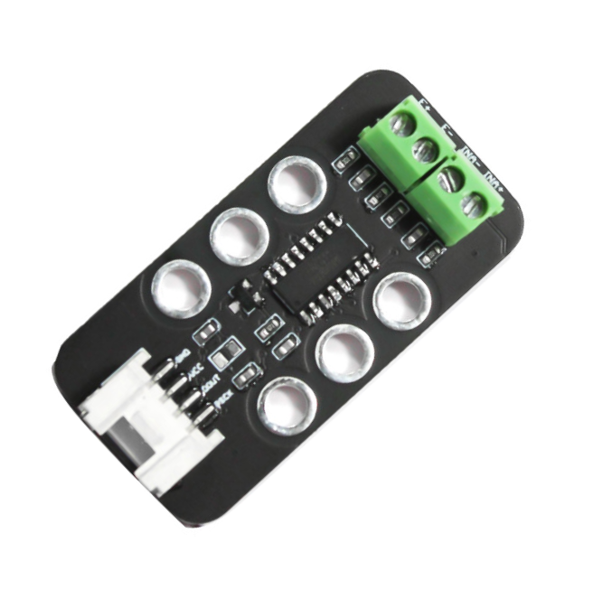
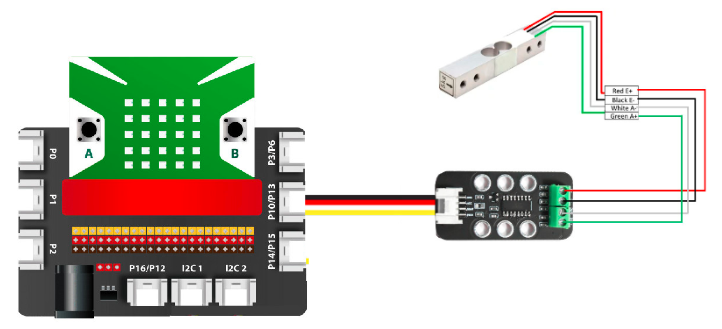
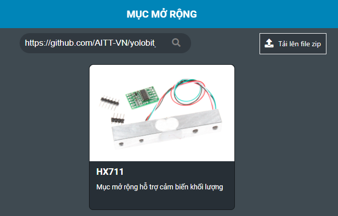
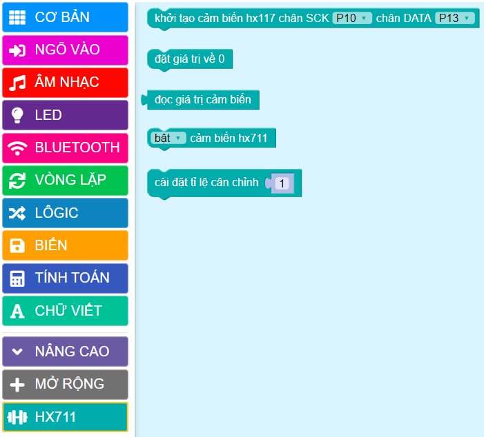
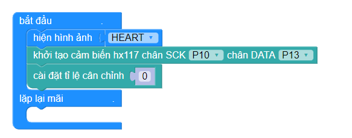
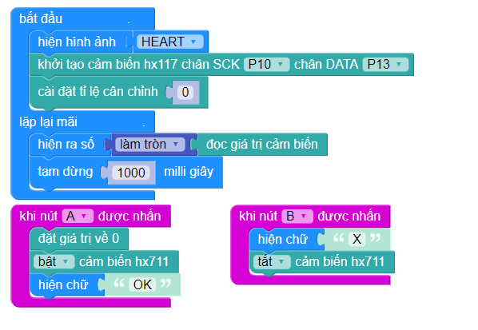

24. Mạch Chuyển Đổi ADC 24bit Loadcell HX711
====================

| 

- Mạch Chuyển Đổi ADC 24bit Loadcell HX711 là mạch đọc giá trị **cảm biến loadcell** với độ phân giải 24bit và chuyển sang giao tiếp 2 dây ( clock và data) để gửi dữ liệu cho mạch điều khiển Yolo:Bit

- Thường được ứng dụng làm cân điện tử.

**1. Mua sản phẩm**
-----------
----------

..  image:: images/gio.png
    :alt: some image
    :target: https://ohstem.vn/product/hx711/
    :class: with-shadow
    :scale: 100%
    :align: center
|

**2. Thông số kỹ thuật**
---------
------------

- **Thông số kỹ thuật:**

    + Điện áp hoạt động: 3.3V
    + Dòng tiêu thụ: <1.5mA
    + Tốc độ lấy mẫu : 10 - 80 SPS ( tùy chỉnh )
    + Độ phân giải : 24 bit ADC
    + Độ phân giải điện áp : 40m

**3. Kết nối**
------------
------------

- **Bước 1**: **Để làm việc với module HX711, bạn cần sử dụng thêm cảm biến cân nặng Loadcell**, hãy chuẩn bị các thiết bị như sau:

.. list-table:: 
   :widths: auto
   :header-rows: 1
     
   * - .. image:: images/yolo.png
          :width: 200px
          :align: center
     - .. image:: images/mmr.png
          :width: 200px
          :align: center
     - .. image:: images/24.1.png
          :width: 200px
          :align: center
     - .. image:: images/24.2.jpg
          :width: 200px
          :align: center
   * - Máy tính lập trình Yolo:Bit
     - Mạch mở rộng cho Yolo:Bit
     - Module HX711(kèm dây Grove)
     - Cảm biến cân nặng Loadcell (5kg) 
   * - `Mua sản phẩm <https://ohstem.vn/product/may-tinh-lap-trinh-yolobit/>`_
     - `Mua sản phẩm <https://ohstem.vn/product/grove-shield/>`_
     - `Mua sản phẩm <https://ohstem.vn/product/hx711/>`_
     - 

- **Bước 2**: Cắm Yolo:Bit vào mạch mở rộng
- **Bước 3**: Kết nối cảm biến cân nặng Loadcell với module HX711 vào các chân như sau: 

    + Dây đỏ - Chân E+ 
    + Dây đen - Chân E- 
    + Dây trắng - Chân INA-
    + Dây xanh - Chân INA+ 

- **Bước 4**: Kết nối module HX711 vào chân P10/ P13 trên mạch mở rộng

    Kết nối module HX711 với chân có 2 cổng tín hiệu. 

**4. Hướng dẫn lập trình**
--------
------------

- **Mục tiêu: Viết chương trình hiển thị khối lượng của vật lên màn hình LED Yolo:Bit**

- **Bước 1**: Tải thư viện **HX711**, bằng cách dán đường link sau `<https://github.com/AITT-VN/yolobit_extension_hx711.git>`_ vào phần tìm kiếm thư viện. 

    Xem hướng dẫn tải thư viện `tại đây <https://docs.ohstem.vn/en/latest/module/cai-dat-thu-vien.html>`_.

| 

    Sau khi tải thư viện thành công, trong danh mục khối lệnh sẽ xuất hiện các khối lệnh tương ứng:

| 

    Để làm việc với module LED 7 đoạn bạn cần sử dụng câu lệnh sau để khai báo chân được sử dụng trong chương trình: 

|

- **Bước 2:** Chúng ta sẽ đặt tỷ lệ của cân tự động. 

    Tỉ lệ này do bạn cân chỉnh, bạn hãy nhập một số bất kì và điều chỉnh cho đến khi gần bằng khối lượng của vật mà bạn đang cân

- **Bước 3:** Gửi chương trình sau xuống Yolo:Bit

    Câu lệnh **làm tròn** nằm trong phần **TÍNH TOÁN**

.. note::

    **Giải thích chương trình:**

    - Trên màn hình LED Yolo:Bit sẽ hiển thị khối lượng của cân liên tục sau mỗi giây. Vì tỷ lệ cân do chúng ta tự cảnh chỉnh và giá trị cảm biến trả về sẽ luôn thay đổi một lượng nhỏ ở phần thập phân. Vì vậy chúng ta cần làm tròn số trước khi hiển thị thông tin từ cảm biến.

    - Các câu lệnh trong sự kiện **khi nút A được nhấn**: sẽ giúp chúng ta đặt giá trị cân về giá trị 0, trước khi bắt đầu cân sản phẩm mới, để hạn chế sự sai lệch trong quá trình cân, và thoát khỏi chế độ chờ hoạt động.

    - **khi nút B được nhấn**: Giúp cân dừng hoạt động (tắt cảm biến), chuyển sang chế độ chờ. 

