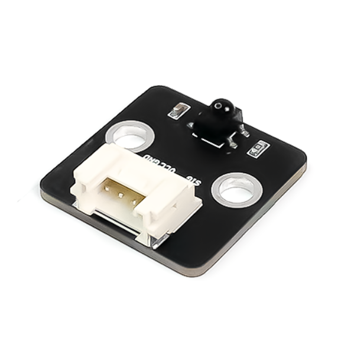
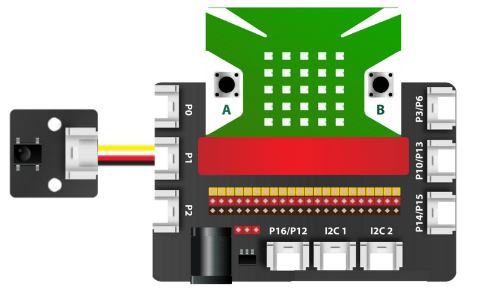

9. Mắt đọc hồng ngoại IR
==============

| 

- Module mắt đọc hồng ngoại IR được dùng để trao đổi tín hiệu giữa các thiết bị với nhau, dựa trên công nghệ tia hồng ngoại (tia sáng có bước sóng dài, nằm trong khoảng từ 700nm và có tần số 430 TGHz, mắt người không thể nhìn thấy được).

- Bạn có thể ứng dụng các mắt đọc hồng ngoại này vào những dự án điện tử cần điều khiển từ xa dễ dàng. 

**1. Mua sản phẩm**
-----------
----------

..  image:: images/gio.png
    :alt: some image
    :target: https://ohstem.vn/product/mat-doc-hong-ngoai-ir/
    :class: with-shadow
    :scale: 100%
    :align: center
|

**2. Thông số kỹ thuật**
------------
-------------

- **Thông số kỹ thuật của cảm biến:**

    + Điện áp sử dụng: 3.3V
    + Tần số nhận: 38kHz
    + Khoảng cách: 10m (MAX)

**3. Kết nối**
------------
------------

- **Bước 1**: Chuẩn bị các thiết bị như sau: 

.. list-table:: 
   :widths: auto
   :header-rows: 1
     
   * - .. image:: images/yolo.png
          :width: 200px
          :align: center
     - .. image:: images/mmr.png
          :width: 200px
          :align: center
     - .. image:: images/10.1.png
          :width: 200px
          :align: center
     - .. image:: images/10.2.png
          :width: 200px
          :align: center
   * - Máy tính lập trình Yolo:Bit
     - Mạch mở rộng cho Yolo:Bit
     - Mắt đọc IR (kèm dây Grove)
     - Remote điều khiển từ xa
   * - `Mua sản phẩm <https://ohstem.vn/product/may-tinh-lap-trinh-yolobit/>`_
     - `Mua sản phẩm <https://ohstem.vn/product/grove-shield/>`_
     - `Mua sản phẩm <https://ohstem.vn/product/mat-doc-hong-ngoai-ir/>`_
     - `Mua sản phẩm <https://ohstem.vn/product/remote-dieu-khien/>`_
    

- **Bước 2**: Cắm Yolo:Bit vào mạch mở rộng
- **Bước 3**: Sử dụng dây Grove cắm vào cảm biến
- **Bước 4**: Kết nối mắt đọc IR vào **chân P1 trên mạch mở rộng**

**4. Hướng dẫn lập trình với OhStem App**
--------
------------

- **Bước 1:** Tải thư viện **IR Remote**, bằng cách dán đường link sau vào phần tìm kiếm thư viện: `https://github.com/AITT-VN/yolobit_extension_mqx.git <https://github.com/AITT-VN/yolobit_extension_mqx.git>`_
    
    Xem hướng dẫn tải thư viện `tại đây <https://docs.ohstem.vn/en/latest/module/cai-dat-thu-vien.html>`_

    .. image:: images/10.4.png
        :scale: 100%
        :align: center 
    |

    Sau khi tải thư viện, trong danh mục khối lệnh sẽ xuất hiện các khối lệnh tương ứng:

    .. image:: images/10.5.png
        :scale: 100%
        :align: center 
    |   

    Để làm việc với mắt đọc hồng ngoại IR, bạn cần khai báo chân làm việc của cảm biến bằng câu lệnh sau: 

    .. image:: images/10.6.png
        :scale: 100%
        :align: center 
    |  

- **Bước 2:** Hãy gửi chương trình sau đến Yolo:Bit của bạn:      

    .. image:: images/10.7.png
        :scale: 100%
        :align: center 
    |  

.. note::

    **Giải thích chương trình:** Điều khiển đèn cơ bản bằng Remote. 

    - Nếu nút A trên remote được nhấn, tất cả các đèn LED sẽ chuyển sang màu vàng.

    - Nếu nút B được nhấn, đèn sẽ tắt. 
    
    - Sau khi Yolo:Bit đã nhận được tín hiệu từ cảm biến và xử lý, chúng ta sẽ phải xóa tín hiệu remote cũ để nhận lệnh mới chính xác hơn.

