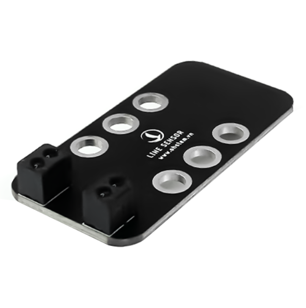
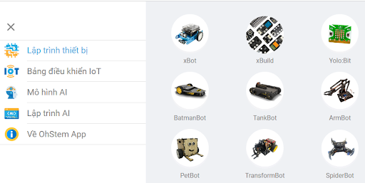
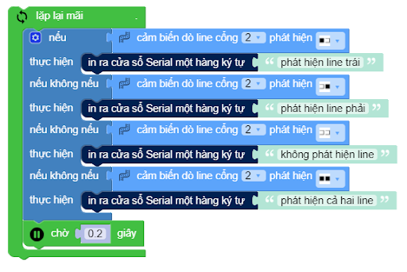

12. Cảm biến dò đường 2 mắt
===============

| 

- Cảm biến dò đường có thể dùng để phát hiện line trắng và đen. Module này sử dụng cảm biến hồng ngoại với khoảng cách phát hiện từ 1~25mm, bạn có thể dễ dàng tùy chỉnh cài đặt module theo nhu cầu của mình.

- Dựa vào tia hồng ngoại phản xạ trở về, cảm biến sẽ biết được đâu là vạch đen và đâu là nền trắng. Cảm biến dò line được ứng dụng vào các dự án như robot chạy theo đường vẽ được chỉ định sẵn hoặc khi sử dụng sa bàn, giải mê cung,…

- Trong hệ sinh thái sản phẩm của OhStem, cảm biến dò đường 2 mắt thường được sử dụng cho robot BatmanBot, TankBot, TransformBot, Robot Wall - E. 

**1. Mua sản phẩm**
-----------
----------

..  image:: images/gio.png
    :alt: some image
    :target: https://ohstem.vn/product/cam-bien-do-duong-2-mat/
    :class: with-shadow
    :scale: 100%
    :align: center
|

**2. Thông số kỹ thuật**
---------
------------

- **Thông số kỹ thuật**

    + Nguồn cung cấp: 3.3V
    + Mạch sử dụng chip so sánh LM393.
    + Dòng điện tiêu thụ: <10mA.
    + Dải nhiệt độ hoạt động: 0oC ~ 50oC.
    + Mức tín hiệu ngõ ra: TTL
    + Kích thước: 2.4 x 4.8mm

- **Pinout của cảm biến dò đường 2 mắt**

Cảm biến dò đường 4 mắt có 4 chân, và mỗi chân có chức năng như sau:

..  csv-table:: 
    :header: "STT", "Chân", "Chức năng"
    :widths: 10, 15, 30

    1, "GND", "Nối đất"
    2, "VCC", "Cấp nguồn (3.3V)"
    3, "S2", "Tín hiệu ngõ ra của cảm biến 2"
    4, "S1", "Tín hiệu ngõ ra của cảm biến 1"

**3. Chuẩn bị thiết bị**
---------
-------------

Để làm việc với cảm biến dò line, bạn cần chuẩn bị một trong các thiết bị sau đây: 

.. list-table:: 
   :widths: auto
   :header-rows: 1
     
   * - .. image:: images/4in1.png
          :width: 200px
          :align: center
   * - Xe robot 4in1
   * - `Mua sản phẩm <https://ohstem.vn/product/xe-robot-4-in-1-do-choi-lap-trinh-robot/>`_
     

**4. Hướng dẫn lập trình:**
----------
------------

- **Bước 1:** Chọn thiết bị lập trình mà bạn có: BatmanBot, TankBot, TransformBot, Robot Wall - E trên OhStem App: 

|

- **Bước 2:** Gửi chương trình sau lên robot của bạn: 

|

.. note::

    **Giải thích chương trình:** 
    
    Ở trong vòng lặp mãi, tương ứng với mỗi trạng thái (nhận mắt trái, phải, không phát hiện và phát hiện cả 2 line), chương trình sẽ hiện ra cửa sổ Serial hàng ký tự tương ứng với trạng thái đó.