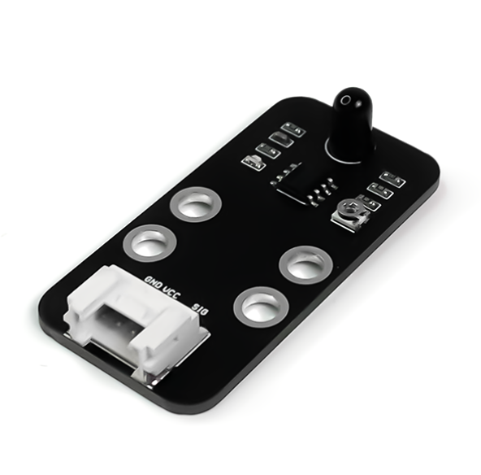
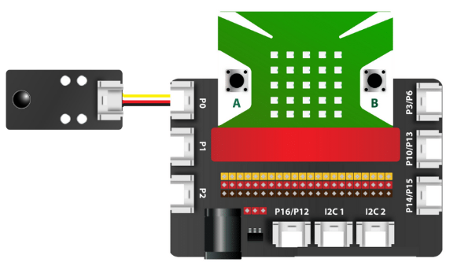
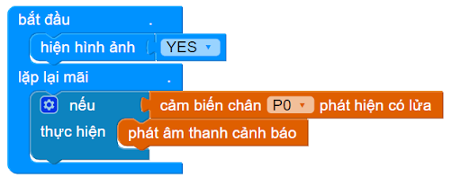

17. Cảm biến lửa
=============

| 

Module cảm biến lửa này có tới 5 kênh, giúp có thể phát hiện lửa ở 5 hướng khác nhau. Cảm biến phát hiện lửa thường được sử dụng cho các ứng dụng sáng tạo như: xe robot chữa cháy, nhà thông minh tự báo động khi phát hiện bị cháy,…

**1. Mua sản phẩm**
-----------
----------

..  image:: images/gio.png
    :alt: some image
    :target: https://ohstem.vn/product/cam-bien-lua/ 
    :class: with-shadow
    :scale: 100%
    :align: center
|

**2. Thông số kỹ thuật**
---------
------------

- **Thông số kỹ thuật**

    + Điện áp hoạt động: 3.3V
    + Kết nối: Digital
    + Khoảng cách: 80cm
    + Góc quét: 60 độ
    + Kích thước module: 66mm x 63 mm x 18 mm (DxRxC)

- **Pinout của cảm biến**

Cảm biến lửa có 4 chân, và mỗi chân có chức năng như sau:

..  csv-table:: 
    :header: "STT", "Chân", "Chức năng"
    :widths: 10, 15, 30

    1, "GND", "Nối đất"
    2, "VCC", "Cấp nguồn (3.3V)"
    3, "NC", "Không sử dụng"
    4, "SIG", "Tín hiệu cảm biến"

**3. Kết nối**
------------
------------

- **Bước 1**: Chuẩn bị các thiết bị như sau: 

.. list-table:: 
   :widths: auto
   :header-rows: 1
     
   * - .. image:: images/yolo.png
          :width: 200px
          :align: center
     - .. image:: images/mmr.png
          :width: 200px
          :align: center
     - .. image:: images/18.1.png
          :width: 200px
          :align: center
   * - Máy tính lập trình Yolo:Bit
     - Mạch mở rộng cho Yolo:Bit
     - Cảm biến lửa (kèm dây Grove)
   * - `Mua sản phẩm <https://ohstem.vn/product/may-tinh-lap-trinh-yolobit/>`_
     - `Mua sản phẩm <https://ohstem.vn/product/grove-shield/>`_
     - `Mua sản phẩm <https://ohstem.vn/product/cam-bien-lua/>`_

- **Bước 2**: Cắm Yolo:Bit vào mạch mở rộng
- **Bước 3**: Sử dụng dây Grove cắm vào cảm biến
- **Bước 4**: Kết nối cảm biến với **P0 trên mạch mở rộng**.

**4. Hướng dẫn lập trình với OhStem App**
--------
------------

- **Bước 1:** Tải thư viện **HOME:BIT V3**, xem hướng dẫn tải thư viện `tại đây <https://docs.ohstem.vn/en/latest/module/thu-vien-yolobit.html>`_

    .. image:: images/homebit.png
        :width: 250px
        :align: center 
    |

    Sau khi tải thư viện, trong danh mục khối lệnh sẽ xuất hiện các khối lệnh tương ứng:

    .. image:: images/lenh_homebit.png
        :width: 800px
        :align: center 
    |

- **Bước 2**: Gửi chương trình sau xuống Yolo:Bit

|

.. note::

    **Giải thích chương trình:** Khi cảm biến phát hiện lửa, mạch Yolo:Bit của bạn sẽ phát âm thanh cảnh báo. 

**5. Hướng dẫn lập trình Arduino**
--------
------------

- Mở phần mềm Arduino IDE. Xem hướng dẫn lập trình với Arduino `tại đây <https://docs.ohstem.vn/en/latest/module/cai-dat-arduino.html>`_. 

- Copy đoạn code sau, click vào nút ``Verify`` để kiểm tra lỗi chương trình. Sau khi biên dịch không báo lỗi, bạn có thể nạp đoạn code vào board. 

.. code-block:: guess

    #include <Yolobit.h>

    Yolobit yolobit;

    int FLAME_PIN = P0;

    void setup() {
      Serial.begin(9600);
      pinMode(FLAME_PIN, INPUT);
    }

    void loop() {
      int flame = digitalRead(FLAME_PIN);
    
      if (flame == LOW) {
          digitalWrite(BUZZER_PIN, HIGH);
          Serial.println("Khong co lua");
      }
      else if (flame == HIGH) {
          digitalWrite(BUZZER_PIN, LOW);
          Serial.println("Co lua");
      }
    
      delay(300);
    }

.. note:: 
    
    **Giải thích chương trình:** Sau khi nạp chương trình và mở cửa sổ Serial, bạn sẽ thấy giá trị đọc được từ cảm biến được in ra. 
