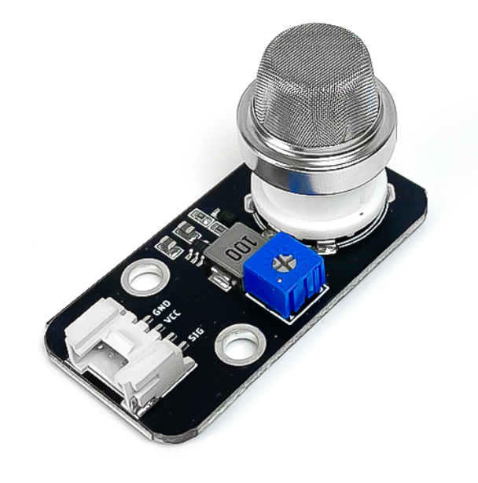
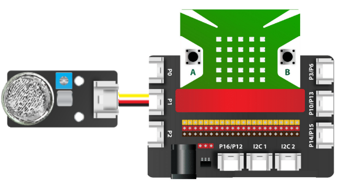

8. Cảm biến chất lượng không khí MQ135
===========

| 

- Cảm biến chất lượng không khí được sử dụng với nhiều dòng cảm biến MQ, có thể tinh chỉnh được bằng biến trở.

- Cảm biến này có khả năng nhận diện nhiều loại khí như khí gas, khí CO, khí cacbonic,… Dựa vào đó, chúng ta có thể xây dựng nhiều chương trình nhận biết chất lượng không khí, từ đó gửi thông báo cho chúng ta nhằm mục đích bảo vệ sức khỏe.

**1. Mua sản phẩm**
-----------
----------

..  image:: images/gio.png
    :alt: some image
    :target: https://ohstem.vn/product/cam-bien-chat-luong-khong-khi/
    :class: with-shadow
    :scale: 100%
    :align: center
|

**2. Thông số kỹ thuật**

- **Thông số kỹ thuật**

    + Điện áp: 3.3V
    + Đầu ra: Digital (pull-up ở trạng thái chưa nhấn)
    + Giao tiếp: 4 chân
    + Kích thước nút nhấn: 12mm x 12mm
    + Kích thước module: 86mm x 60 mm x 18 mm (DxRxC)

- **Pinout của cảm biến chất lượng không khí MQ135**

Cảm biến chất lượng không khí có 4 chân, mỗi chân có chức năng như sau:

..  csv-table:: 
    :header: "STT", "Chân", "Chức năng"
    :widths: 10, 15, 30

    1, "GND", "Nối đất"
    2, "VCC", "Cấp nguồn (3.3V)"
    3, "NC", "Không sử dụng"
    4, "SIG", "Tín hiệu cảm biến"
    

**3. Kết nối**
------------
------------

- **Bước 1**: Chuẩn bị các thiết bị như sau: 

.. list-table:: 
   :widths: auto
   :header-rows: 1
     
   * - .. image:: images/yolo.png
          :width: 200px
          :align: center
     - .. image:: images/mmr.png
          :width: 200px
          :align: center
     - .. image:: images/8.1.png
          :width: 200px
          :align: center
   * - Máy tính lập trình Yolo:Bit
     - Mạch mở rộng cho Yolo:Bit
     - Cảm biến MQ135 (kèm dây Grove)
   * - `Mua sản phẩm <https://ohstem.vn/product/may-tinh-lap-trinh-yolobit/>`_
     - `Mua sản phẩm <https://ohstem.vn/product/grove-shield/>`_
     - `Mua sản phẩm <https://ohstem.vn/product/cam-bien-chat-luong-khong-khi/>`_

- **Bước 2**: Cắm Yolo:Bit vào mạch mở rộng
- **Bước 3**: Sử dụng dây Grove cắm vào cảm biến
- **Bước 4**: Kết nối thiết bị vào **chân P1 trên mạch mở rộng**

    Đây cũng là một cảm biến có giá trị trả về là analog, do đó bạn có thể kết nối với các chân P0, P1, P2 trên mạch mở rộng

**3. Hướng dẫn lập trình với OhStem App**
--------
------------

- **Bước 1:** Tải thư viện **Cảm biến MQx**, bằng cách dán đường link sau vào phần tìm kiếm thư viện: `https://github.com/AITT-VN/yolobit_extension_mqx.git <https://github.com/AITT-VN/yolobit_extension_mqx.git>`_
    
    Xem hướng dẫn tải thư viện `tại đây <https://docs.ohstem.vn/en/latest/module/cai-dat-thu-vien.html>`_

    .. image:: images/6.3.png
        :scale: 80%
        :align: center 
    |

    Sau khi tải thư viện, trong danh mục khối lệnh sẽ xuất hiện các khối lệnh tương ứng:

    .. image:: images/6.4.png
        :scale: 100%
        :align: center 
    |   

- **Bước 2:** Hãy gửi chương trình sau đến Yolo:Bit của bạn:      

    .. image:: images/8.3.png
        :scale: 100%
        :align: center 
    |  

.. note::

    **Giải thích chương trình:** Chương trình kiểm tra chất lượng không khí xung quanh bạn: 

    - Đọc giá trị của mức độ ô nhiễm trong không khí bằng câu lệnh đọc giá trị analog cảm biến cồng P1 trong thư viện cảm biến MQx. 

    - Màn hình LED của Yolo:Bit sẽ hiện thị kết quả mà cảm biến đọc được. Nếu vượt trên 35 thì sẽ phát âm cảnh báo cho bạn. Nếu không, màn hình hiện chữ OK, nghĩa là không khí xung quanh bạn đang tốt. 
    
    **Lưu ý:** *Bạn có thể sử dụng các đơn vị đo như mg/l và ppm trong chương trình.* 

**4. Hướng dẫn lập trình Arduino**
--------
------------

- Mở phần mềm Arduino IDE. Xem hướng dẫn lập trình với Arduino

- Copy đoạn code sau, click vào nút ``Verify`` để kiểm tra lỗi chương trình. Sau khi biên dịch không báo lỗi, bạn có thể nạp đoạn code vào board. 

.. code-block:: guess

    #include "YoloBit.h"

    YoloBit yolobit;

    int sensorPin = P1_ADC;
    int sensorValue = 0;

    void setup() {
      Serial.begin(115200);
    }

    void loop() {
      // đọc giá trị cảm biến
      sensorValue = analogRead(sensorPin);
      Serial.println(sensorValue);
      delay(200);
    }

.. note:: 
    
    **Giải thích chương trình:** Sau khi nạp chương trình và mở cửa sổ Serial, bạn sẽ thấy giá trị đọc được từ cảm biến được in ra.
