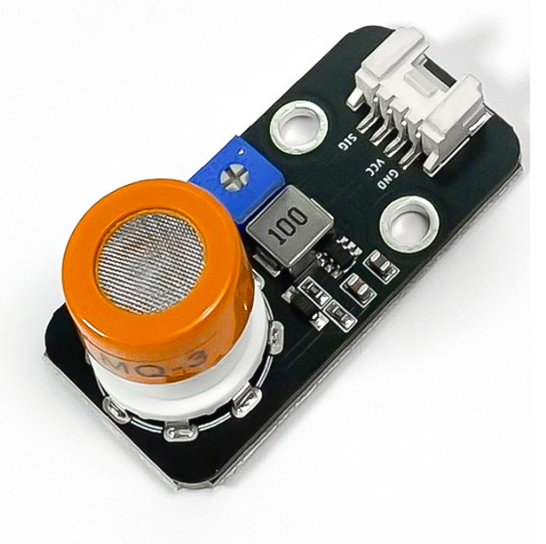
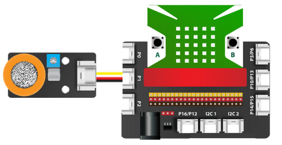

7. Cảm biến nồng độ cồn MQ3
==========

| 

- Cảm biến nồng độ cồn MQ3 được ứng dụng để phát hiện nồng độ cồn trong môi trường xung quanh hoặc trong hơi thở người. Cảm biến này có độ nhạy cao, cho phép trả về giá trị phản hồi nhanh.
- Cảm biến MQ3 có thể phát hiện các loại khí gas, cồn alcohol hoặc ethanol.
- Đặc điểm của cảm biến nồng độ cồn MQ3
    
    + Có độ bền cao, dễ dàng kết nối với các module, bảng mạch khác
    + Độ nhạy cao
    + Điện áp cung cấp ~ 3.3V

**1. Mua sản phẩm**
-----------
----------

..  image:: images/gio.png
    :alt: some image
    :target: https://ohstem.vn/product/cam-bien-nong-do-con-mq3/
    :class: with-shadow
    :scale: 100%
    :align: center
|

**2. Kết nối**
------------
------------

- **Bước 1**: Chuẩn bị các thiết bị như sau: 

.. list-table:: 
   :widths: auto
   :header-rows: 1
     
   * - .. image:: images/yolo.png
          :width: 200px
          :align: center
     - .. image:: images/mmr.png
          :width: 200px
          :align: center
     - .. image:: images/7.1.png
          :width: 200px
          :align: center
   * - Máy tính lập trình Yolo:Bit
     - Mạch mở rộng cho Yolo:Bit
     - Cảm biến MQ3 (kèm dây Grove)
   * - `Mua sản phẩm <https://ohstem.vn/product/may-tinh-lap-trinh-yolobit/>`_
     - `Mua sản phẩm <https://ohstem.vn/product/grove-shield/>`_
     - `Mua sản phẩm <https://ohstem.vn/product/cam-bien-nong-do-con-mq3/>`_

- **Bước 2**: Cắm Yolo:Bit vào mạch mở rộng
- **Bước 3**: Sử dụng dây Grove cắm vào cảm biến
- **Bước 4**: Kết nối thiết bị vào **chân P1 trên mạch mở rộng**

    Đây cũng là một cảm biến có giá trị trả về là analog, do đó bạn có thể kết nối với các chân P0, P1, P2 trên mạch mở rộng

**3. Hướng dẫn lập trình**
--------
------------

- **Bước 1:** Tải thư viện **Cảm biến MQx**, bằng cách dán đường link sau vào phần tìm kiếm thư viện: `https://github.com/AITT-VN/yolobit_extension_mqx.git <https://github.com/AITT-VN/yolobit_extension_mqx.git>`_
    
    Xem hướng dẫn tải thư viện `tại đây <https://docs.ohstem.vn/en/latest/module/cai-dat-thu-vien.html>`_

    .. image:: images/6.3.png
        :scale: 80%
        :align: center 
    |

    Sau khi tải thư viện, trong danh mục khối lệnh sẽ xuất hiện các khối lệnh tương ứng:

    .. image:: images/6.4.png
        :scale: 100%
        :align: center 
    |   

- **Bước 2:** Hãy gửi chương trình sau đến Yolo:Bit của bạn:      

    .. image:: images/7.3.png
        :scale: 100%
        :align: center 
    |  

.. note::

    **Giải thích chương trình**: Chương trình cảnh báo nồng độ cồn.
    
    - Để kiểm tra trong hơi thở của có cồn hay không? Bạn hãy thổi vào đầu dò của cảm biến. Kết quả bạn sẽ được hiển thị lên màn hình LED của Yolo:Bit.
    
    - Nếu nồng độ cồn vượt trên mức 0.25mg/l, sẽ có âm thanh cảnh báo cho bạn. Nếu màn hình hiện chữ OK, hơi thở của bạn không có cồn. 
    
    **Lưu ý:** *Bạn có thể sử dụng các đơn vị đo như analog và ppm trong chương trình.* 
