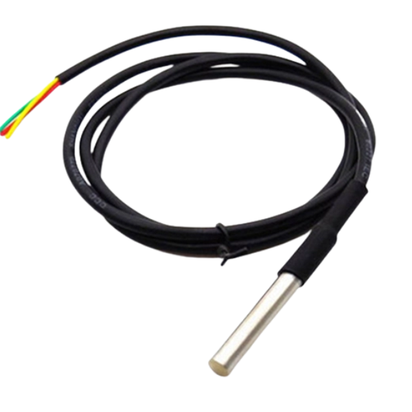
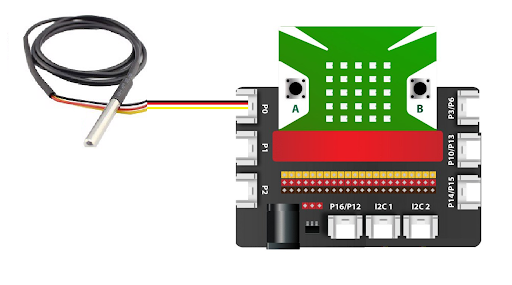
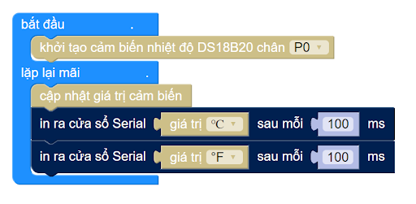

27. Cảm biến nhiệt độ DS18B20
=========

| 

**DS18B20 là cảm biến đo nhiệt độ 1 dây**, có thể lập trình được. Cảm biến này được dùng rộng rãi để đo nhiệt độ trong các môi trường cứng như trong dung dịch hóa chất, hầm mỏ hoặc đất,... tùy nhu cầu người dùng.

Phần thắt của cảm biến rất chắc chắn và dễ dàng lắp đặt. Bạn cũng có thể chọn mua loại chống thấm nước. DS18B20 có thể đo nhiệt độ từ -55°C đến + 125°C, với độ chính xác khá cao là ± 0.5°C.

Mỗi cảm biến có một địa chỉ duy nhất và chỉ yêu cầu một chân của vi điều khiển để truyền dữ liệu, vì vậy, đây là lựa chọn rất tốt để đo nhiệt độ ở nhiều khu vực mà không ảnh hưởng nhiều đến các chân kỹ thuật số trên vi điều khiển.

**Ứng dụng:** HVAC được dùng để kiểm soát nhiệt môi trường, đo nhiệt độ bên trong các tòa nhà, thiết bị, máy móc, và  trong hệ thống giám sát.

**1. Thông số kỹ thuật:**
-----
-----------

- Nguồn đầu vào: 3.3V
- Dải đo nhiệt độ: -55 đến 125°C ( -67 đến 257°F)
- Sai số: +- 0.5°C khi đo ở dải -10 – 85°C
- Độ phân giải: người dùng có thể chọn từ 9 – 12 bits
- Chuẩn giao tiếp: 1-Wire ( 1 dây ).
- Có cảnh báo nhiệt khi vượt ngưỡng cho phép và cấp nguồn từ chân data.
- Thời gian chuyển đổi nhiệt độ tối đa : 750ms ( khi chọn độ phân giải 12bit ).
- Mỗi IC có một mã riêng (lưu trên EEPROM của IC) nên có thể giao tiếp nhiều DS18B20 trên cùng 1 dây
- Ống thép không gỉ (chống ẩm , nước) đường kính 6mm, dài 50mm 
- Đường kính đầu dò: 6mm 
- Chiều dài dây: 1m

**2. Kết nối**
------------
------------

- **Chuẩn bị các thiết bị như sau:**

.. list-table:: 
   :widths: auto
   :header-rows: 1
     
   * - .. image:: images/yolo.png
          :width: 200px
          :align: center
     - .. image:: images/mmr.png
          :width: 200px
          :align: center
     - .. image:: images/ds18b20.png
          :width: 200px
          :align: center
   * - Máy tính lập trình Yolo:Bit
     - Mạch mở rộng cho Yolo:Bit
     - Cảm biến nhiệt độ DS18B20
   * - `Mua sản phẩm <https://shop.ohstem.vn/san-pham/may-tinh-lap-trinh-yolobit/>`_
     - `Mua sản phẩm <https://shop.ohstem.vn/san-pham/grove-shield/>`_
     - Mua tại các cửa hàng linh kiện điện tử

- **Kết nối:** 

    Chúng ta sẽ kết nối dây tương tự các cảm biến khác như DHT11, Module đèn led RGB hay quạt mini, cụ thể như hình:

    Hướng dẫn nối dây cảm biến với mạch mở rộng vào chân P0.

3. Lập trình Yolo:Bit với cảm biến
--------
----------

- Để làm việc với cảm biến nhiệt độ DS18B20, chúng ta phải cần thêm thư viện mở rộng **DS18B20**, bạn hãy copy đường dẫn sau: `<https://github.com/AITT-VN/yolobit_extension_max30102>`_ và dán vào mục mở rộng để tải thư viện mở rộng.

    Xem hướng dẫn tải thư viện `tại đây <https://docs.ohstem.vn/en/latest/module/thu-vien-yolobit.html>`_

    .. image:: images/ds18b20_2.png
        :width: 300px
        :align: center 
    |

- **Lập trình:**

Chúng ta sẽ sử dụng thư viện nhiệt độ DS18B20 để lập trình đọc nhiệt độ của cảm biến. 

Chương trình minh họa việc đọc nhiệt độ của cảm biến DS18B20 sẽ như sau:

Vậy là chúng ta đã có thể đo được nhiệt độ với cảm biến DS18B20, chúc các bạn thực hiện được các dự án thú vị với cảm biến này nhé!

**5. Hướng dẫn lập trình Arduino**
--------
------------

- Mở phần mềm Arduino IDE. Xem hướng dẫn lập trình với Arduino `tại đây <https://docs.ohstem.vn/en/latest/module/cai-dat-arduino.html>`_. 

- Copy đoạn code sau, click vào nút ``Verify`` để kiểm tra lỗi chương trình. Sau khi biên dịch không báo lỗi, bạn có thể nạp đoạn code vào board. 

.. code-block:: guess

    #include <Yolobit.h>
    #include <OneWire.h>
    #include <DallasTemperature.h>

    Yolobit yolobit;

    // Chân nối với Arduino
    #define ONE_WIRE_BUS P0

    // Thiết đặt thư viện OneWire
    OneWire oneWire(ONE_WIRE_BUS);

    // Sử dụng thư viện DallasTemperature để đọc cho nhanh
    DallasTemperature sensors(&oneWire);

    void setup() {
      Serial.begin(9600);
      sensors.begin();
    }

    void loop() {
      sensors.requestTemperatures();  
      Serial.print("Nhiet do: ");  
      Serial.println(sensors.getTempCByIndex(0)); // Vì chỉ có 1 cảm biến nên sử dụng chỉ số 0 
      // Chờ 1 giây rồi đọc lại để bạn có thể nhìn thấy sự thay đổi
      delay(1000);
    }

.. note:: 
    
    **Giải thích chương trình:** Sau khi nạp chương trình và mở cửa sổ Serial, bạn sẽ thấy giá trị đọc được từ cảm biến được in ra. 
