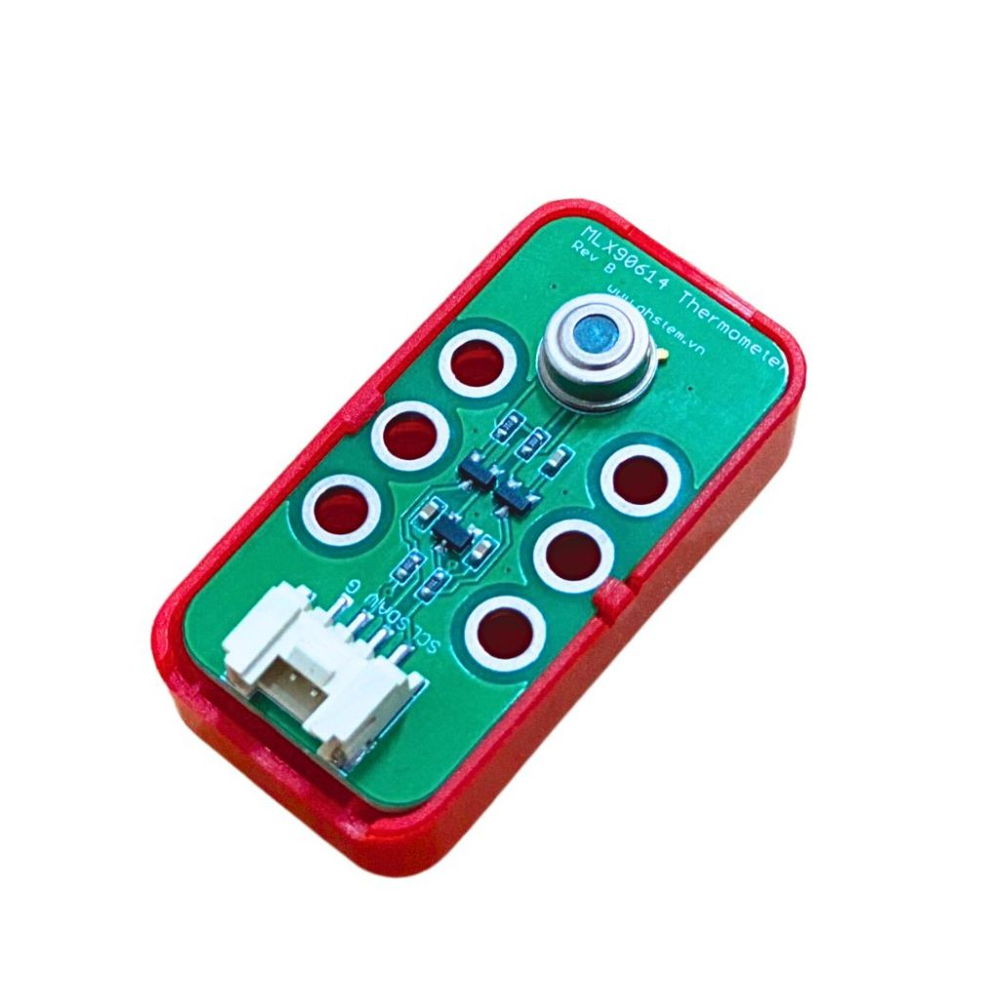
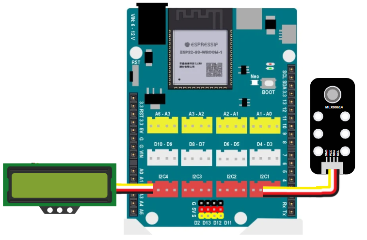
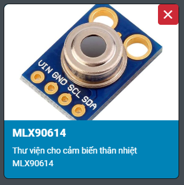
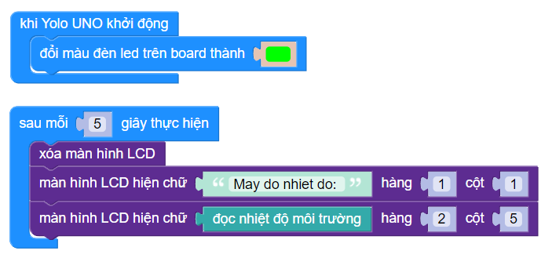

28. Cảm biến nhiệt độ hồng ngoại không tiếp xúc
============

| 

MLX90614 là Cảm biến nhiệt độ kỹ thuật số hồng ngoại không tiếp xúc (IR) có thể được sử dụng để đo nhiệt độ của một đối tượng cụ thể, từ -70 ° C đến 382,2 ° C. Cảm biến sử dụng tia IR để đo nhiệt độ của đối tượng và giao tiếp với vi điều khiển bằng giao thức I2C.

**Các ứng dụng của MLX90614:**

- Đo nhiệt độ của các đối tượng chuyển động
- Súng nhiệt công nghiệp
- Đo nhiệt độ cơ thể con người
- Kiểm soát nhiệt độ tại nhà / văn phòng
- Giám sát chăn nuôi
- Phát hiện chuyển động

1. Mua sản phẩm
-----------
----------

..  image:: images/gio.png
    :alt: some image
    :target: https://ohstem.vn/product/cam-bien-nhiet-do-hong-ngoai-khong-tiep-xuc/
    :class: with-shadow
    :scale: 100%
    :align: center
|

2. Thông số kỹ thuật
---------
----------

- Điện áp hoạt động: 3.3V đến 5V
- Dòng điện : 1.5mA
- Phạm vi nhiệt độ đối tượng: -70°C đến 382,2°C
- Phạm vi nhiệt độ môi trường: -40°C đến 125°C
- Độ chính xác: 0,02°C
- Góc quét: 80°
- Khoảng cách giữa đối tượng và cảm biến: 2cm-5cm (ước chừng)

3. Kết nối
------------
------------

- **Bước 1**: Chuẩn bị các thiết bị như sau: 

.. list-table:: 
   :widths: auto
   :header-rows: 1
     
   * - .. image:: images/yolo_uno.png
          :width: 200px
          :align: center
     - .. image:: images/28.1.jpg
          :align: center
     - .. image:: images/lcd_1602.png
          :width: 200px
          :align: center
   * - Mạch lập trình Yolo UNO
     - Cảm biến (kèm dây Grove)
     - Màn hình LCD 1602 (kèm dây Grove)
   * - `Mua sản phẩm <https://ohstem.vn/product/yolo-uno/>`_
     - `Mua sản phẩm <https://ohstem.vn/product/cam-bien-nhiet-do-hong-ngoai-khong-tiep-xuc/>`_
     - `Mua sản phẩm <https://ohstem.vn/product/man-hinh-lcd-1602/>`_

- **Bước 2**: Sử dụng dây Grove cắm vào cảm biến
- **Bước 3**: Kết nối cảm biến và màn hình LCD với **chân I2C trên Yolo UNO**.

    Cảm biến nhiệt độ hồng ngoại không tiếp xúc kết nối với Yolo UNO thông qua giao thức I2C
|

4. Hướng dẫn lập trình
------------
------------

1. Tải thư viện **MLX90614**  

|

Các khối lệnh sau để làm việc với cảm biến:

|

2. Chương trình minh họa thực hiện chức năng tạo một máy đo nhiệt độ môi trường: 

|

**Link chương trình mẫu:** `<https://app.ohstem.vn/#!/share/yolouno/2fu1wQBlgZ4Qjl7Jh47QPcAsgly>`_