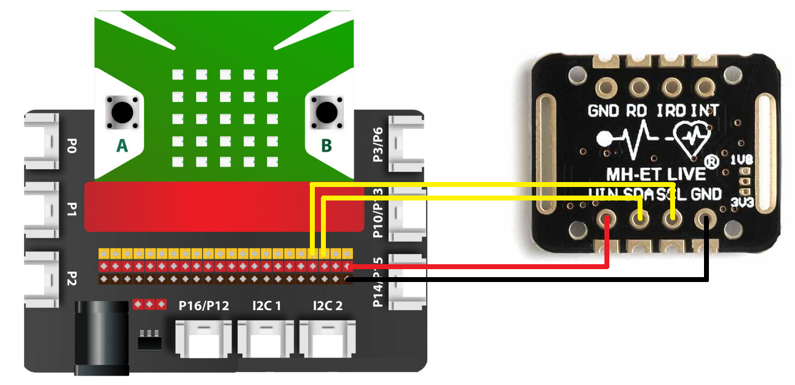

26. Cảm biến nhịp tim và oxy trong máu MAX30102:
=====

| 

**Cảm biến nhịp tim và oxy trong máu Max30102** là một mô-đun đo nhịp tim và oxy trong máy tích hợp. Nó bao gồm đèn LED bên trong, bộ tách sóng quang, các bộ phận quang học và các thiết bị điện tử có tiếng ồn thấp với khả năng loại bỏ ánh sáng xung quanh.

Cảm biến nhịp tim và oxy trong máu MAX30102 MH-ET LIVE có thiết kế tiện dụng, dễ dàng đeo vào ngón tay, cổ tay để đo nhịp tim và nồng độ Oxy trong máu. Cảm biến này thích hợp cho nhiều ứng dụng liên quan đến y sinh.

Cảm biến sử dụng phương pháp đo quang phổ biến hiện nay với thiết kế và chất liệu mắt đo chuyên biệt từ chính hãng Maxim, cho độ chính xác và độ bền cao. Cảm biến sử dụng giao tiếp I2C với bộ thư viện có sẵn, rất dễ sử dụng.

**1. Thông số kỹ thuật:**
-----
-----------

- IC chính: MAX30102.
- Đo được nhịp tim và nồng độ Oxy trong máu.
- Điện áp sử dụng: 3.3~5VDC.
- Nhỏ gọn, siêu tiết kiệm năng lượng, thích hợp cho các thiết bị đo nhỏ gọn, Wearable Devices.
- Giao tiếp: I2C, mức tín hiệu TTL.
- Kích thước: 20.6 x 15.5mm

**2. Kết nối**
------------
------------

- **Chuẩn bị các thiết bị như sau:**

.. list-table:: 
   :widths: auto
   :header-rows: 1
     
   * - .. image:: images/yolo.png
          :width: 200px
          :align: center
     - .. image:: images/mmr.png
          :width: 200px
          :align: center
     - .. image:: images/nhip_tim.webp
          :width: 200px
          :align: center
   * - Máy tính lập trình Yolo:Bit
     - Mạch mở rộng cho Yolo:Bit
     - Cảm biến nhịp tim
   * - `Mua sản phẩm <https://ohstem.vn/product/may-tinh-lap-trinh-yolobit/>`_
     - `Mua sản phẩm <https://ohstem.vn/product/grove-shield/>`_
     - Mua tại các cửa hàng linh kiện điện tử

- **Kết nối:** 

    Cảm biến nhịp tim và oxy trong máu MAX30102 sử dụng giao tiếp I2C, giúp bạn dễ dàng giao tiếp với Yolo:Bit thông qua mạch mở rộng với các chân tương ứng.

    Hướng dẫn nối dây cảm biến nhịp tim với mạch mở rộng

3. Lập trình Yolo:Bit với màn hình TFT:
--------
----------

Để làm việc với cảm biến nhịp tim MAX30102, chúng ta phải cần thêm thư viện mở rộng **MAX30102**, bạn hãy copy đường dẫn sau: `<https://github.com/AITT-VN/yolobit_extension_max30102>`_ và dán vào mục mở rộng để tải thư viện mở rộng.

    Xem hướng dẫn tải thư viện `tại đây <https://docs.ohstem.vn/en/latest/module/cai-dat-thu-vien.html>`_.

    .. image:: images/nhip_tim_2.png
        :width: 300px
        :align: center 
    |

Thư viện chỉ gồm 1 khối lệnh nhỏ để hiển thị giá trị của cảm biến. Bạn có thể thử 1 chương trình mẫu để hiển thị nhịp tim và oxy trong máu ra cửa sổ nhập lệnh như sau:

