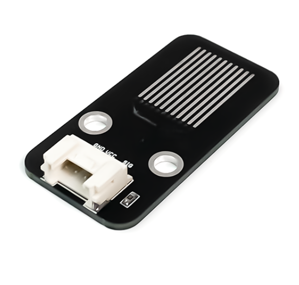
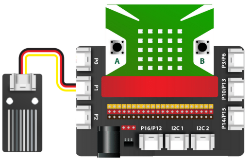

21. Cảm biến nước
===============

| 

- Cảm biến nước là cảm biến giúp nhận dạng nước, bạn có thể dễ dàng đo được có nước hay không trên bề mặt bằng các đường mạch song song có trên cảm biến.

- Sản phẩm sẽ chuyển đổi nước nhận được thành các tín hiệu Analog sau đó truyền đến các bảng mạch lập trình chính.

- Cảm biến nước là module phù hợp cho người mới bắt đầu tiếp xúc các dự án, nhờ vào tính dễ sử dụng và chi phí rẻ của nó. Ngoài ra, cảm biến này có kích thước khá nhỏ, mang lại sự thuận tiện cho việc học tập và thực hành.

- Bạn có thể áp dụng cảm biến vào các dự án như báo động khi có nước, khi thành phố bị ngập lụt,…

**1. Mua sản phẩm**
-----------
----------

..  image:: images/gio.png
    :alt: some image
    :target: https://ohstem.vn/product/cam-bien-nuoc/
    :class: with-shadow
    :scale: 100%
    :align: center
|

**2. Thông số kỹ thuật**
---------
------------

- **Thông số kỹ thuật**

    + Điện áp: 3.3V 
    + Tín hiệu: Analog
    + Trọng lượng: 3g

**3. Kết nối**
------------
------------

- **Bước 1**: Chuẩn bị các thiết bị như sau: 

.. list-table:: 
   :widths: auto
   :header-rows: 1
     
   * - .. image:: images/yolo.png
          :width: 200px
          :align: center
     - .. image:: images/mmr.png
          :width: 200px
          :align: center
     - .. image:: images/21.1.png
          :width: 200px
          :align: center
   * - Máy tính lập trình Yolo:Bit
     - Mạch mở rộng cho Yolo:Bit
     - Cảm biến nước (kèm dây Grove)
   * - `Mua sản phẩm <https://ohstem.vn/product/may-tinh-lap-trinh-yolobit/>`_
     - `Mua sản phẩm <https://ohstem.vn/product/grove-shield/>`_
     - `Mua sản phẩm <https://ohstem.vn/product/cam-bien-nuoc/>`_

- **Bước 2**: Cắm Yolo:Bit vào mạch mở rộng
- **Bước 3**: Sử dụng dây Grove cắm vào cảm biến
- **Bước 4**: Kết nối cảm biến với **P1 trên mạch mở rộng**.

    Bạn có thể kết nối cảm biến mực nước với chân P0, P1 hoặc P2 trên mạch mở rộng, vì giá trị trả về của cảm biến có giá trị là analog. 

**4. Hướng dẫn lập trình**
--------
------------

- **Bước 1:** Tải thư viện **City:Bit**, xem hướng dẫn tải thư viện `tại đây <https://docs.ohstem.vn/en/latest/module/cai-dat-thu-vien.html>`_

    .. image:: images/city.png
        :width: 250px
        :align: center 
    |

    Sau khi tải thư viện, trong danh mục khối lệnh sẽ xuất hiện các khối lệnh tương ứng:

    .. image:: images/lenh_city.png
        :width: 800px
        :align: center 
    |

- **Bước 2**: Gửi chương trình sau xuống Yolo:Bit

    ..  image:: images/21.3.png
        :scale: 100%
        :align: center 
    |

.. note::

    **Giải thích chương trình:** 

    Đặt một điều kiện, nếu cảm biến phát hiện mực nước trên 40%, sẽ chuyển đèn LED thành màu đỏ, để phát âm thanh cảnh báo. Nếu không, sẽ tắt đèn. 
