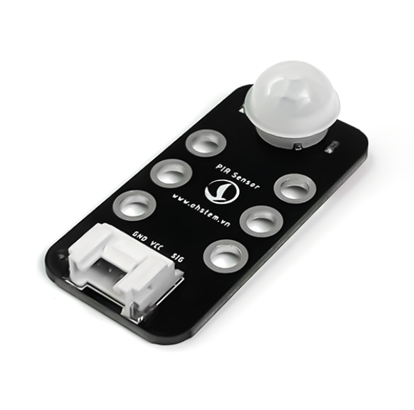
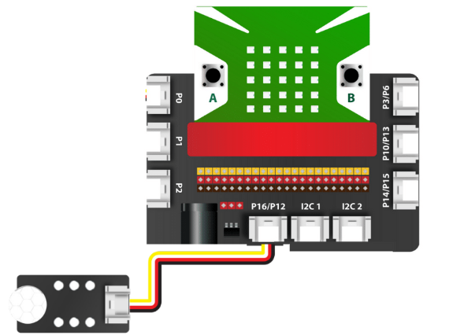

18. Cảm biến PIR
================

| 

- Cảm biến PIR (Passive infrared sensor) được sử dụng để phát hiện sự chuyển động của các vật thể phát ra bức xạ hồng ngoại (ví dụ như sự chuyển động của con người, con vật, các vật phát nhiệt,…). Cảm biến này còn có tên gọi khác là cảm biến thân nhiệt chuyển động PIR.

- Bạn có thể chỉnh được độ nhạy của cảm biến để giới hạn khoảng cách nhận dạng chuyển động trong mức khoảng cách xa hoặc gần, cũng như cường độ bức xạ của vật thể mong muốn.

**1. Mua sản phẩm**
-----------
----------

..  image:: images/gio.png
    :alt: some image
    :target: https://ohstem.vn/product/cam-bien-pir/
    :class: with-shadow
    :scale: 100%
    :align: center
|

**2. Thông số kỹ thuật**
---------
------------

- **Thông số kỹ thuật**

    + Điện áp hoạt động: 3.3V
    + Phạm vi phát hiện: góc 360 độ hình nón, độ xa tối đa 6m.
    + Nhiệt độ hoạt động: 32-122 ° F ( 050 ° C)
    + Điện áp hoạt động: DC 3.8V – 5V
    + Mức tiêu thụ dòng: ≤ 50 uA
    + IC: AS312
    + Kiểu tín hiệu: Digital
    + Kích thước của mạch: 24mm x 48mm x 16mm

- **Pinout của cảm biến**

Cảm biến có 4 chân và mỗi chân có chức năng như sau:

..  csv-table:: 
    :header: "STT", "Chân", "Chức năng"
    :widths: 10, 15, 30

    1, "GND", "Nối đất"
    2, "VCC", "Cấp nguồn (3.3V)"
    3, "NC", "Không sử dụng"
    4, "SIG", "Tín hiệu cảm biến"

**3. Kết nối**
------------
------------

- **Bước 1**: Chuẩn bị các thiết bị như sau: 

.. list-table:: 
   :widths: auto
   :header-rows: 1
     
   * - .. image:: images/yolo.png
          :width: 200px
          :align: center
     - .. image:: images/mmr.png
          :width: 200px
          :align: center
     - .. image:: images/19.1.png
          :width: 200px
          :align: center
   * - Máy tính lập trình Yolo:Bit
     - Mạch mở rộng cho Yolo:Bit
     - Cảm biến PIR (kèm dây Grove)
   * - `Mua sản phẩm <https://ohstem.vn/product/may-tinh-lap-trinh-yolobit/>`_
     - `Mua sản phẩm <https://ohstem.vn/product/grove-shield/>`_
     - `Mua sản phẩm <https://ohstem.vn/product/cam-bien-pir/>`_

- **Bước 2**: Cắm Yolo:Bit vào mạch mở rộng
- **Bước 3**: Sử dụng dây Grove cắm vào cảm biến
- **Bước 4**: Kết nối cảm biến với **P16/P12 trên mạch mở rộng**.

    Cảm biến PIR có kết quả trả về là digital, trên mạch mở rộng các bạn có thể sử dụng các khe cắm có 2 tín hiệu

**4. Hướng dẫn lập trình với OhStem App**
--------
------------

- **Bước 1:** Tải thư viện **AIOT KIT**, xem hướng dẫn tải thư viện `tại đây <https://docs.ohstem.vn/en/latest/module/cai-dat-thu-vien.html>`_

    .. image:: images/aiot.png
        :width: 250px
        :align: center 
    |

    Sau khi tải thư viện, trong danh mục khối lệnh sẽ xuất hiện các khối lệnh tương ứng:

    .. image:: images/lenh_aiot.png
        :width: 800px
        :align: center 
    |

- **Bước 2**: Gửi chương trình sau xuống Yolo:Bit

    Tùy vào dự án, bạn có thể lập trình để cảm biến thân nhiệt chuyển động PIR hoạt động sao cho như mong muốn. Ví dụ: Nếu bạn muốn phát ra âm thanh báo động khi có sự chuyển động (dùng trong các dự án như báo động khi xuất hiện kẻ trộm,…), bạn hãy lập trình như sau:

    ..  image:: images/19.3.png
        :scale: 100%
        :align: center 
    |

**5. Hướng dẫn lập trình Arduino**
--------
------------

- Mở phần mềm Arduino IDE. Xem hướng dẫn lập trình với Arduino `tại đây <https://docs.ohstem.vn/en/latest/module/cai-dat-arduino.html>`_. 

- Copy đoạn code sau, click vào nút ``Verify`` để kiểm tra lỗi chương trình. Sau khi biên dịch không báo lỗi, bạn có thể nạp đoạn code vào board. 

.. code-block:: guess

    #include "YoloBit.h"

    YoloBit yolobit;

    int pirPin = P0;

    void setup() {
      Serial.begin(115200);
      pinMode(pirPin, INPUT);
    }

    void loop() {
      Serial.println(digitalRead(pirPin));
      delay(500);
    }

.. note:: 
    
    **Giải thích chương trình:** Chúng ta khai báo chân tín hiệu nối với cảm biến PIR là Input và liên tục đọc và in ra trạng thái của cảm biến sau mỗi 500ms. 0 tức là cảm biến không thấy có người và 1 là có người.
