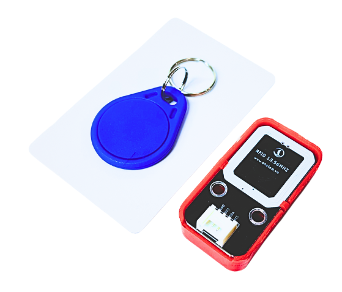
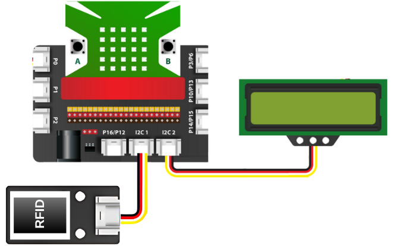
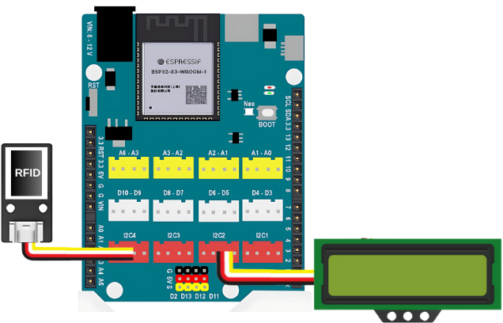

31. Module RFID NFC 13.56MHz RC522 I2C
=========

| 

Module RFID NFC 13.56MHz RC522 I2C là một thiết bị nhận dạng thẻ từ sử dụng giao tiếp I2C, có khả năng giao tiếp với các mạch YoloUNO và Yolo:Bit để truyền dữ liệu. Module này cho phép đọc mã UID của thẻ RFID nhanh chóng, hỗ trợ tần số 13.56MHz (chuẩn HF).

Với khả năng nhận dạng không tiếp xúc, module thích hợp cho việc xây dựng các hệ thống điểm danh học sinh, kiểm soát ra vào trường học, quản lý thư viện, khóa cửa thông minh... Thiết bị có độ bảo mật cao, dễ tích hợp và hoạt động ổn định giúp các thầy cô và các bạn học sinh dễ dàng ứng dụng vào các dự án sáng tạo

**1. Thông số kỹ thuật:**
-----
-----------

- Nguồn sử dụng: 3.3~5VDC
- Chuẩn giao tiếp I2C
- Hỗ trợ đọc/ghi các chuẩn thẻ RFID NFC
- Tích hợp Anten trên PCB
- Khoảng cách nhận thẻ: ~ 1-2cm

**2. Kết nối**
------------
------------

- **Chuẩn bị các thiết bị**, bạn có thể chuẩn bị 1 trong 2 mạch lập trình Yolo:Bit hoặc Yolo UNO và các thiết bị như bên dưới: 

.. list-table:: 
   :widths: auto
   :header-rows: 1
     
   * - .. image:: images/yolo_bit.png
          :width: 150px
          :align: center
     - .. image:: images/yolo_uno.png
          :width: 200px
          :align: center
     - .. image:: images/rfid_1.png
          :width: 200px
          :align: center
     - .. image:: images/rfid_20.png
          :width: 200px
          :align: center
   * - Máy tính lập trình Yolo:Bit kèm mạch mở rộng
     - Mạch lập trình Yolo UNO
     - Module RFID (kèm dây Grove)
     - Màn hình LCD1602 (kèm dây Grove)
   * - `Mua sản phẩm <https://shop.ohstem.vn/san-pham/may-tinh-lap-trinh-yolobit/>`_
     - `Mua sản phẩm <https://shop.ohstem.vn/san-pham/yolo-uno/>`_
     - `Mua sản phẩm <https://shop.ohstem.vn/san-pham/module-rfid/>`_
     - `Mua sản phẩm <https://shop.ohstem.vn/san-pham/man-hinh-lcd-1602/>`_

- **Kết nối với Yolo:Bit:** 

    *Kết nối vào cổng I2C trên mạch mở rộng Yolo:Bit*

- **Kết nối với Yolo UNO:**

    *Kết nối vào cổng I2C trên mạch Yolo UNO*
|

3. Lập trình với Yolo:Bit
--------
----------

    1. Trước khi bắt đầu lập trình, chúng ta phải cần thêm thư viện mở rộng **RFID I2C** cho mạch lập trình Yolo:Bit, bạn hãy copy đường dẫn sau: `<https://github.com/AITT-VN/yolobit_extension_rfid_i2c>`_ và dán vào mục mở rộng để tải thư viện mở rộng.

        Xem hướng dẫn tải thư viện `tại đây <https://docs.ohstem.vn/en/latest/module/thu-vien-yolobit.html>`_

        .. image:: images/rfid_4.png
            :scale: 60%
            :align: center 
        |
        
        Các khối lệnh của thư viện RFID I2C như sau:

            .. image:: images/rfid_5.png
                :scale: 90%
                :align: center 
            |

    2. Tải thêm thư viện **AIoT Kit** để hiển thị thông tin lên màn hình LCD1602 trong mục **MỞ RỘNG**:

        .. image:: images/rfid_6.png
            :scale: 60%
            :align: center 
        |   

        Các khối lệnh của thư viện AIoT Kit như sau: 

        .. image:: images/rfid_7.png
            :scale: 80%
            :align: center 
        |  

    3. **Viết chương trình**

    - **1. Đọc ID thẻ và hiển thị ra màn hình LCD**

    ..  figure:: images/rfid_9.png
        :scale: 70%
        :align: center 

        Link chương trình: `<https://app.ohstem.vn/#!/share/yolobit/2vR2WzVWMYOViCroZ2gfE1uIMkU>`_
    |   
        Chương trình hiển thị ID của thẻ ra màn hình LCD1602 được quét.

    - **2. Quét và thêm thẻ vào danh sách thẻ:**

    ..  figure:: images/rfid_8.png
        :scale: 80%
        :align: center 

        Link chương trình: `<https://app.ohstem.vn/#!/share/yolobit/2vROqgORvRFRTiT9AL8u5U5v63C>`_
    |   
        Với chương trình này, bạn có thể **quét và thêm thẻ RFID** vào **một trong năm danh sách được chỉ định**. Sau khi tải chương trình lên mạch, hãy **đưa từng thẻ RFID lại gần module đọc thẻ**. Mỗi khi một thẻ mới được thêm thành công vào danh sách, **màn hình sẽ hiển thị thông báo "Success!"**, giúp bạn dễ dàng nhận biết quá trình ghi nhận đã hoàn tất.

    **Lưu ý:** người dùng chỉ cần gửi chương trình lên **Yolo:Bit** và thực hiện thao tác quét thẻ, các **ID của thẻ sẽ được tự động lưu vào bộ nhớ của module RFID**.

    - **3. Quét và kiểm tra thẻ trong danh sách:**

    ..  figure:: images/rfid_10.png
        :scale: 80%
        :align: center 

        Link chương trình: `<https://app.ohstem.vn/#!/share/yolobit/2vR2oOzw6eUDgwIOggYoqFplsDR>`_
    |   
        Sau khi đã thêm các thẻ vào danh sách được chỉ định ở bước 2, bạn có thể sử dụng chương trình này để **kiểm tra xem thẻ đã được lưu thành công hay chưa**. Cách thực hiện rất đơn giản: **đưa thẻ cần kiểm tra lại gần module RFID**, nếu thẻ đó thuộc **danh sách 1** đã lưu trước đó, màn hình sẽ hiển thị "**Yes**". Ngược lại, nếu thẻ không có trong danh sách, màn hình sẽ hiển thị "**No**".

    Dựa trên chương trình này, người dùng có thể dễ dàng tích hợp vào các dự án thực tế như:

    + Mở khóa bằng thẻ từ: nếu quét đúng thẻ đã được lưu, servo sẽ quay để mô phỏng việc mở cửa.
    + Hệ thống kiểm soát ra vào bãi đỗ xe: chỉ cho phép xe vào/ra khi quét đúng thẻ đã đăng ký.
    + Điểm danh học sinh: mỗi học sinh dùng thẻ RFID cá nhân để điểm danh nhanh chóng và chính xác.

    - **4. Quét và xóa thẻ khỏi danh sách**

    ..  figure:: images/rfid_11.png
        :scale: 70%
        :align: center 

        Link chương trình: `<https://app.ohstem.vn/#!/share/yolobit/2vR3IZkDapIhq3d8YTrxWCDZjwR>`_
    |   
        Với chức năng này, người dùng có thể **quét thẻ RFID và xóa thẻ đó khỏi một danh sách đã được chỉ định trước đó**. Khi đưa thẻ lại gần module đọc thẻ, nếu thẻ tồn tại trong danh sách, hệ thống sẽ tự động **xóa thông tin của thẻ khỏi bộ nhớ** và **hiển thị thông báo xác nhận trên màn hình**.

    Chức năng này hữu ích trong các tình huống cần **thu hồi quyền truy cập, quản lý lại danh sách thẻ hoặc cập nhật hệ thống kiểm soát ra và**o một cách linh hoạt.

    - **5. Xóa danh sách lưu** 

    ..  figure:: images/rfid_12.png
        :scale: 80%
        :align: center 

        Link chương trình: `<https://app.ohstem.vn/#!/share/yolobit/2vR3drJEe8MYp7pHWhXRo3vQMJa>`_
    |   
        Chức năng này cho phép người dùng **xóa toàn bộ các thẻ RFID đã được lưu** trong một danh sách cụ thể. Khi thực hiện thao tác này, **tất cả ID thẻ trong danh sách được chọn sẽ bị xóa khỏi bộ nhớ của module**, đưa danh sách về trạng thái trống.

    Đây là thao tác cần thiết khi bạn muốn **thiết lập lại hệ thống, cập nhật dữ liệu mới hoặc hủy bỏ toàn bộ quyền truy cập** đã cấp trước đó.

4. Lập trình với Yolo UNO
--------
----------

    1. Trước khi bắt đầu lập trình, chúng ta phải cần thêm thư viện mở rộng **RFID I2C** cho mạch lập trình Yolo UNO, bạn hãy copy đường dẫn sau: `<https://github.com/AITT-VN/yolouno_extension_rfid_i2c>`_ và dán vào mục mở rộng để tải thư viện mở rộng.

        Xem hướng dẫn tải thư viện `tại đây <https://docs.ohstem.vn/en/latest/module/thu-vien-yolouno.html>`_

        .. image:: images/rfid_13.png
            :scale: 70%
            :align: center 
        |
        
        Các khối lệnh của thư viện RFID I2C như sau:

            .. image:: images/rfid_14.png
                :scale: 70%
                :align: center 
            |

    2. **Viết chương trình**

    - **1. Đọc ID thẻ và hiển thị ra màn hình LCD**

    ..  figure:: images/rfid_15.png
        :scale: 80%
        :align: center 

        Link chương trình: `<https://app.ohstem.vn/#!/share/yolouno/2vR41V7GvThNQA45YAncG6nSvyc>`_
    |   
        Chương trình hiển thị ID của thẻ ra màn hình LCD1602 được quét.

    - **2. Quét và thêm thẻ vào danh sách thẻ:**

    ..  figure:: images/rfid_16.png
        :scale: 80%
        :align: center 

        Link chương trình: `<https://app.ohstem.vn/#!/share/yolouno/2vR4RWzjCfMUQrFlbyROTK7N4oA>`_
    |   
        Với chương trình này, bạn có thể **quét và thêm thẻ RFID** vào **một trong năm danh sách được chỉ định**. Sau khi tải chương trình lên mạch, hãy **đưa từng thẻ RFID lại gần module đọc thẻ**. Mỗi khi một thẻ mới được thêm thành công vào danh sách, **màn hình sẽ hiển thị thông báo "Success!"**, giúp bạn dễ dàng nhận biết quá trình ghi nhận đã hoàn tất.

    **Lưu ý:** người dùng chỉ cần gửi chương trình lên **Yolo UNO** và thực hiện thao tác quét thẻ, các **ID của thẻ sẽ được tự động lưu vào bộ nhớ của module RFID**.

    - **3. Quét và kiểm tra thẻ trong danh sách:**

    ..  figure:: images/rfid_17.png
        :scale: 80%
        :align: center 

        Link chương trình: `<https://app.ohstem.vn/#!/share/yolouno/2vR4EnKCT81nhr0nvc0jzcDQTRv>`_
    |   
        Sau khi đã thêm các thẻ vào danh sách được chỉ định ở bước 2, bạn có thể sử dụng chương trình này để **kiểm tra xem thẻ đã được lưu thành công hay chưa**. Cách thực hiện rất đơn giản: **đưa thẻ cần kiểm tra lại gần module RFID**, nếu thẻ đó thuộc **danh sách 1** đã lưu trước đó, màn hình sẽ hiển thị "**Yes**". Ngược lại, nếu thẻ không có trong danh sách, màn hình sẽ hiển thị "**No**".

    Dựa trên chương trình này, người dùng có thể dễ dàng tích hợp vào các dự án thực tế như:

    + Mở khóa bằng thẻ từ: nếu quét đúng thẻ đã được lưu, servo sẽ quay để mô phỏng việc mở cửa.
    + Hệ thống kiểm soát ra vào bãi đỗ xe: chỉ cho phép xe vào/ra khi quét đúng thẻ đã đăng ký.
    + Điểm danh học sinh: mỗi học sinh dùng thẻ RFID cá nhân để điểm danh nhanh chóng và chính xác.

    - **4. Quét và xóa thẻ khỏi danh sách**

    ..  figure:: images/rfid_18.png
        :scale: 80%
        :align: center 

        Link chương trình: `<https://app.ohstem.vn/#!/share/yolouno/2vR4YtwX7iuhW7rqOKGpTHZmtqg>`_
    |   
        Với chức năng này, người dùng có thể **quét thẻ RFID và xóa thẻ đó khỏi một danh sách đã được chỉ định trước đó**. Khi đưa thẻ lại gần module đọc thẻ, nếu thẻ tồn tại trong danh sách, hệ thống sẽ tự động **xóa thông tin của thẻ khỏi bộ nhớ** và **hiển thị thông báo xác nhận trên màn hình**.

    Chức năng này hữu ích trong các tình huống cần **thu hồi quyền truy cập, quản lý lại danh sách thẻ hoặc cập nhật hệ thống kiểm soát ra vào** một cách linh hoạt.

    - **5. Xóa danh sách lưu**

    ..  figure:: images/rfid_19.png
        :scale: 80%
        :align: center 

        Link chương trình: `<https://app.ohstem.vn/#!/share/yolouno/2vR6Fy1GMexMVMoTwWhqsOUPGGQ>`_
    |   
        Chức năng này cho phép người dùng **xóa toàn bộ các thẻ RFID đã được lưu** trong một danh sách cụ thể. Khi thực hiện thao tác này, **tất cả ID thẻ trong danh sách được chọn sẽ bị xóa khỏi bộ nhớ của module**, đưa danh sách về trạng thái trống.

    Đây là thao tác cần thiết khi bạn muốn **thiết lập lại hệ thống, cập nhật dữ liệu mới hoặc hủy bỏ toàn bộ quyền truy cập** đã cấp trước đó.

