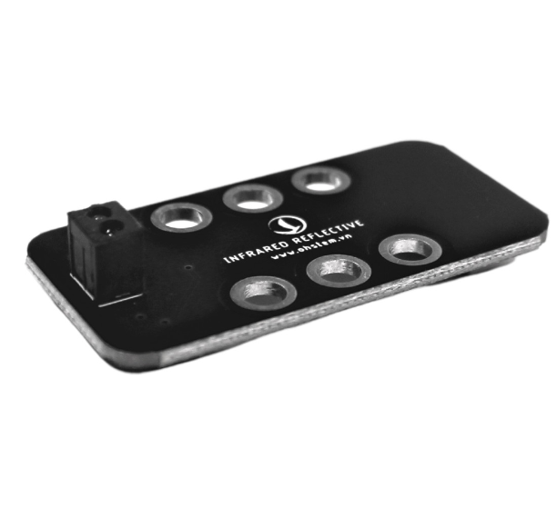

5. Cảm biến vật cản hồng ngoại 
==============

| 

- Cảm biến vật cản sử dụng tia hồng ngoại để phát hiện có vật cản ở trước mặt hay không, với khoảng cách gần. 

- **Các ứng dụng:** 
    
    + Thùng rác thông minh giúp phát hiện rác đầy
    + Máy rửa tay tự động… 

**1. Mua sản phẩm**
-----------
----------

..  image:: images/gio.png
    :alt: some image
    :target: https://shop.ohstem.vn/san-pham/cam-bien-vat-can/
    :class: with-shadow
    :scale: 100%
    :align: center
|

**2. Thông số kỹ thuật**
------------
-------------

- **Thông số kỹ thuật của cảm biến:**

    + Điện áp hoạt động: 3.3V
    + Khoảng cách có thể phát hiện hiệu quả: 4 – 15 mm
    + Thời gian đáp ứng: 10 μs
    + Phototransistor - Bước sóng độ nhạy đỉnh: 800 nm
    + IR LED - Bước sóng phát ra ánh sáng cực đại:  940 nm

**3. Kết nối**
------------
------------

- **Bước 1**: Chuẩn bị các thiết bị như sau: 

.. list-table:: 
   :widths: auto
   :header-rows: 1
     
   * - .. image:: images/yolo.png
          :width: 200px
          :align: center
     - .. image:: images/mmr.png
          :width: 200px
          :align: center
     - .. image:: images/5.1.png
          :width: 200px
          :align: center
   * - Máy tính lập trình Yolo:Bit
     - Mạch mở rộng cho Yolo:Bit
     - Cảm biến vật cản (kèm dây Grove)
   * - `Mua sản phẩm <https://shop.ohstem.vn/san-pham/may-tinh-lap-trinh-yolobit/>`_
     - `Mua sản phẩm <https://shop.ohstem.vn/san-pham/grove-shield/>`_
     - `Mua sản phẩm <https://shop.ohstem.vn/san-pham/cam-bien-vat-can/>`_

- **Bước 2**: Cắm Yolo:Bit vào mạch mở rộng
- **Bước 3**: Sử dụng dây Grove cắm vào cảm biến
- **Bước 4**: Kết nối thiết bị vào **chân P0 trên mạch mở rộng**

..  figure:: images/5.2.png
    :scale: 100%
    :align: center 

    Cảm biến vật cản bạn có thể kết nối vào bất kỳ chân nào trên mạch mở rộng

**4. Hướng dẫn lập trình với OhStem App**
--------
------------

- Gửi chương trình sau vào Yolo:Bit: 

|

.. note::

    Sử dụng câu lệnh **trạng thái bật tắt của chân P0** trong danh mục **CHÂN CẮM** để làm việc với cảm biến. 

        - Nếu chân P0 ở trạng thái là Tắt, khi đó cảm biến phát hiện có vật cản. Đèn LED sẽ chuyển sang màu vàng. 
        - Ngược lại, đèn sẽ tắt. 
    
    Chương trình được lặp lại liên tục

**5. Hướng dẫn lập trình Arduino**
--------
------------

- Mở phần mềm Arduino IDE. Xem hướng dẫn lập trình với Arduino `tại đây <https://docs.ohstem.vn/en/latest/module/cai-dat-arduino.html>`_. 

- Copy đoạn code sau, click vào nút ``Verify`` để kiểm tra lỗi chương trình. Sau khi biên dịch không báo lỗi, bạn có thể nạp đoạn code vào board. 

.. code-block:: guess

    #include "YoloBit.h"

    YoloBit yolobit;

    const int IR = P;

    void setup() {
      pinMode(IR, INPUT);
      Serial.begin(9600);
    }

    void loop() {
      int sensorValue = digitalRead(IR);
      if(sensorValue==LOW){ 
         Serial.println("no Object");
         delay(500);
      }
      else{
         Serial.println("Object Detected");
         delay(500);
      }
    }
    
.. note:: 
    
    **Giải thích chương trình:** Sau khi nạp chương trình và mở cửa sổ Serial, bạn sẽ thấy giá trị đọc được từ cảm biến được in ra.

    
