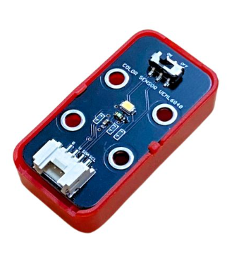
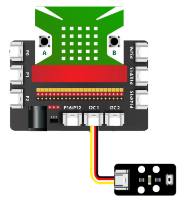
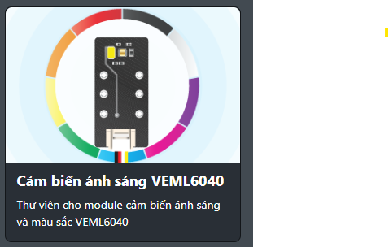
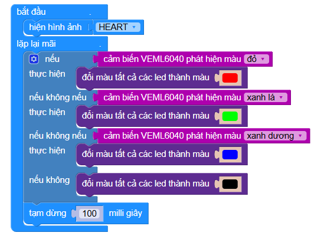

35. Module cảm biến màu VEML6040
=================================

| 

Module **VEML6040** là cảm biến nhận diện màu sắc RGBW (Red, Green, Blue, White) có độ chính xác cao. Nó được thiết kế để đo cường độ ánh sáng theo từng kênh màu riêng biệt, giúp xác định màu sắc của vật thể hoặc ánh sáng môi trường một cách chính xác.

Cảm biến này giao tiếp qua chuẩn **I2C**, rất dễ dàng kết nối với mạch Yolo:Bit và lập trình thông qua OhStem App hoặc MicroPython. VEML6040 có khả năng đo ánh sáng trong dải rộng, độ nhạy cao, và thời gian phản hồi nhanh.

**Ứng dụng phổ biến:**

+ Nhận diện màu sắc vật thể
+ Đo ánh sáng môi trường cho hệ thống chiếu sáng thông minh
+ Điều chỉnh màn hình theo ánh sáng xung quanh
+ Hệ thống phân loại sản phẩm theo màu

**1. Thông số kỹ thuật**
------------------------

- **Thông số kỹ thuật**

    + Điện áp hoạt động: 3.3V
    + Giao tiếp: I2C
    + Địa chỉ I2C mặc định: 0x10
    + Đo 4 kênh ánh sáng: Red, Green, Blue, White
    + Dải đo: 0 – 16.7 triệu (16-bit)
    + Thời gian tích hợp: có thể cấu hình
    + Nhiệt độ hoạt động: -40 ~ 85 ℃
    + Kích thước nhỏ gọn

- **Pinout của module**

.. csv-table::
    :header: "STT", "Chân", "Chức năng"
    :widths: 10, 15, 30

    1, "GND", "Nối đất"
    2, "VCC", "Nguồn 3.3V"
    3, "SDA", "Chân dữ liệu I2C"
    4, "SCL", "Chân xung nhịp I2C"

**2. Kết nối**
--------------

- **Bước 1**: Chuẩn bị thiết bị

.. list-table:: 
   :widths: auto
   :header-rows: 1
     
   * - .. image:: images/yolo.png
          :width: 200px
          :align: center
     - .. image:: images/mmr.png
          :width: 200px
          :align: center
     - .. image:: images/veml6040_01.png
          :width: 200px
          :align: center
   * - Máy tính lập trình Yolo UNO
     - Mạch mở rộng Grove
     - Module VEML6040
   * - `Mua sản phẩm <https://ohstem.vn/product/may-tinh-lap-trinh-yolobit/>`_
     - `Mua sản phẩm <https://ohstem.vn/product/grove-shield/>`_
     - `Mua sản phẩm <https://ohstem.vn/product/module-veml6040/>`_

- **Bước 2**: Kết nối phần cứng

    Kết nối module VEML6040 vào bất kỳ cổng I2C nào trên mạch mở rộng Grove.

**3. Lập trình VEML6040 với Yolo:Bit trên OhStem App**
------------------------------------------------------

Để lập trình, bạn cần cài đặt thư viện mở rộng cho cảm biến VEML6040:

`https://github.com/AITT-VN/yolobit_extension_veml6040.git`

    Xem hướng dẫn thêm thư viện mở rộng `tại đây <https://docs.ohstem.vn/en/latest/module/thu-vien-yolobit.html>`_

|

**Chương trình kiểm tra các màu cơ bản:**

    Chương trình kiểm tra màu Red, Green, Blue, White mỗi 1 giây và đổi màu tương ứng

**Lưu ý**

+ Cảm biến nhạy với ánh sáng mạnh, tránh chiếu trực tiếp đèn flash hoặc ánh sáng mặt trời gần.
+ Có thể sử dụng giá trị RGB để tính toán mã màu HEX.

**Chương trình mẫu** `tại đây <https://app.ohstem.vn/#!/share/yolobit/31J0wfFJCQiAowiY8xkxgib4beQ>`_