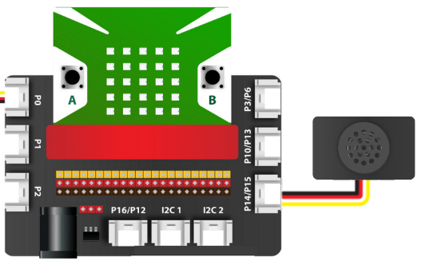
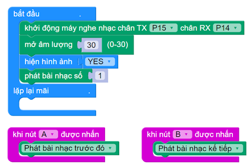

6. Module phát nhạc - Sound Player
==============

.. image:: images/nhac.1.png
    :width: 400px
    :align: center 
|

- Module phát nhạc Sound Player là một module có khả năng phát âm thanh. Bạn có thể ứng dụng chúng vào các ứng dụng vui nhộn sáng tạo như phát các đoạn nhạc ngắn, phát ra âm thanh báo động,…

- Dựa vào tính năng này, chúng tôi sẽ đưa ra hướng dẫn Sound Player cơ bản, để bạn có thể phát ra âm thanh mà mình thích. Bạn có thể ứng dụng chúng vào để biến Yolo:Bit thành một hướng dẫn viên du lịch tài năng, một giáo sư giảng dạy cho học sinh hoặc đơn giản chỉ cần là một cỗ máy thông báo thông minh cho người dùng, bằng cách ghi âm sẵn âm thanh mình cần hoặc tạo ra giọng đọc bằng phần mềm.

**1. Mua sản phẩm**
-----------
----------

..  image:: images/gio.png
    :alt: some image
    :target: https://ohstem.vn/product/sound-player/
    :class: with-shadow
    :scale: 100%
    :align: center
|

**2. Thông số kỹ thuật**
------------
-------------

- **Thông số kỹ thuật của Sound Player:**

    + USB giao tiếp: 2.0.
    + Giao tiếp UART: TTL.
    + Điện áp đầu vào: 3.3V
    + Dòng làm việc : 10mA.
    + Nhiệt độ Làm Việc: -40°C ~ 85°C

**3.  Lưu file MP3 vào Sound Player:**
--------
--------------

- **Bước 1:** Kết nối module Sound Player (cổng lưu file được khoanh đỏ như hình bên dưới) với máy tính bằng dây cáp USB type C.

..  image:: images/nhac.2.png
    :scale: 100%
    :align: center 
|

- **Bước 2**: Bộ nhớ lưu trữ của module sẽ xuất hiện như hình, trong ví dụ là USB Drive (E:):

..  image:: images/nhac.3.png
    :scale: 100%
    :align: center 
|

    OhStem Education đã chuẩn bị sẵn 1 số tập tin MP3 có sẵn trong Module. Bạn có thể sao chép các file MP3 bạn muốn vào đây. Chúng tôi đề xuất bạn đặt tên tập tin MP3 của bạn theo số thứ tự như hình trên.

    **Bạn có thể tải thêm một số mẫu có sẵn tại đây:** `https://github.com/AITT-VN/yolobit_extension_sound_player <https://github.com/AITT-VN/yolobit_extension_sound_player>`_ 

- **Bước 3:** Ngắt kết nối module Sound Player với máy tính và thực hiện các bước như chương tiếp theo.

**4. Kết nối**
------------
------------

- **Bước 1**: Chuẩn bị các thiết bị như sau: 

.. list-table:: 
   :widths: auto
   :header-rows: 1
     
   * - .. image:: images/yolo.png
          :width: 200px
          :align: center
     - .. image:: images/mmr.png
          :width: 200px
          :align: center
     - .. image:: images/nhac.1.png
          :width: 200px
          :align: center
   * - Máy tính lập trình Yolo:Bit
     - Mạch mở rộng cho Yolo:Bit
     - Module phát nhạc (kèm dây Grove)
   * - `Mua sản phẩm <https://ohstem.vn/product/may-tinh-lap-trinh-yolobit/>`_
     - `Mua sản phẩm <https://ohstem.vn/product/grove-shield/>`_
     - `Mua sản phẩm <https://ohstem.vn/product/sound-player/>`_

- **Bước 2**: Cắm Yolo:Bit vào mạch mở rộng
- **Bước 3**: Sử dụng dây Grove cắm vào cảm biến
- **Bước 4**: Kết nối Sound Player với **P14/P15 trên mạch mở rộng**.

|

**5. Hướng dẫn lập trình:**
------------
-------------

- **Bước 1**: Tải thư viện Sound Player, bằng cách dán đường link sau `https://github.com/AITT-VN/yolobit_extension_sound_player.git <https://github.com/AITT-VN/yolobit_extension_sound_player.git>`_ vào phần tìm kiếm thư viện. 

    Xem hướng dẫn tải thư viện `tại đây <https://docs.ohstem.vn/en/latest/module/cai-dat-thu-vien.html>`_

    .. image:: images/nhac.5.png
        :scale: 100%
        :align: center 
    |

    Sau khi thực hiện xong phần hướng dẫn Sound Player cơ bản này, trong danh mục khối lệnh sẽ xuất hiện các khối lệnh tương ứng: 

    .. image:: images/nhac.6.png
        :scale: 100%
        :align: center 
    |

    Để làm việc với module Sound Player, bạn cần sử dụng câu lệnh sau để khai báo chân được sử dụng trong chương trình:

    .. image:: images/nhac.7.png
        :scale: 100%
        :align: center 
    |

- **Bước 2**: Gửi chương trình sau vào Yolo:Bit:

|

.. note::

    **Giải thích chương trình:** 

    Sau khi gửi chương trình xuống Yolo:Bit, bài nhạc số 1 sẽ được phát ra, âm lượng bạn có thể tùy chỉnh từ 0-30. Khi bạn nhấn nút A, bài hát đang phát sẽ dừng lại để chuyển sang bài kế tiếp. Tương tự với nút B. 

**6. Hướng dẫn tạo file MP3 bằng giọng nói tiếng Việt**
------------
---------------

Trong một số dự án như tạo ra các thiết bị cảnh báo, chào khách hàng, thông báo hướng dẫn,… chúng ta cần phát ra một âm thanh giọng nói. OhStem Education sẽ hướng dẫn các bạn tạo một file MP3 giọng nói từ một đoạn văn bản nhé!

    - **Bước 1:** Từ trình duyệt Web, các bạn truy cập vào địa chỉ sau: `https://soundoftext.com/ <https://soundoftext.com/>`_

Trang web này cho phép chúng ta tạo ra các âm thanh giọng đọc của con người từ văn bản bất kỳ với đa dạng các ngôn ngữ trên thế giới, trong đó có tiếng Việt.

    .. image:: images/nhac.9.png
        :scale: 100%
        :align: center 
    |

    - **Bước 2:** Nhập câu nói mà bạn muốn tạo vào ô **“Text”.** Ở đây, mình sẽ tạo thử một câu **“Xin chào các bạn”**

    .. image:: images/nhac.10.png
        :scale: 100%
        :align: center 
    |

    - **Bước 3:** Chọn ngôn ngữ bạn muốn tại ô **“Voice”**. Ở đây mình cần tạo giọng đọc tiếng Việt nên mình sẽ chọn **“Vietnamese”**

    .. image:: images/nhac.11.png
        :scale: 100%
        :align: center 
    |

    - **Bước 4:** Nhấn **“Submit”** để hệ thống tự động tạo câu nói bạn muốn.