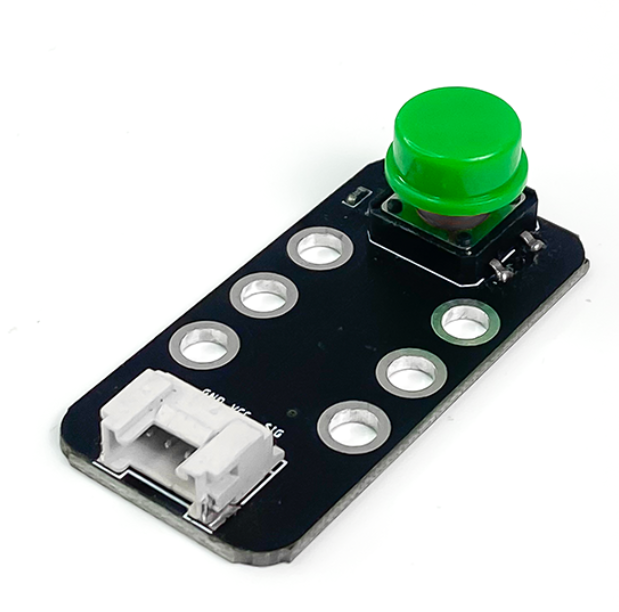
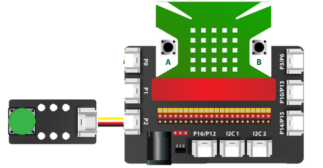

4. Nút nhấn đơn
===========

| 

- Nút nhấn đơn là một loại vật dụng được sử dụng thường xuyên trong gia đình, ví dụ  như: chuông cửa, nút nhấn khởi động xe, bàn phím,… Module 1 nút nhấn đơn 12×12 là sản phẩm thiết kế nhỏ gọn, dễ kết nối sử dụng, phù hợp cho các ứng dụng điều khiển bằng phím nhấn.

**1. Mua sản phẩm**
-----------
----------

..  image:: images/gio.png
    :alt: some image
    :target: https://ohstem.vn/product/nut-nhan-don/
    :class: with-shadow
    :scale: 100%
    :align: center

**2. Thông số kỹ thuật**
------------
-------------

- **Thông số kỹ thuật của nút nhấn**

    + Điện áp: 3.3V
    + Đầu ra: Digital (pull-up ở trạng thái chưa nhấn)
    + Giao tiếp: 3 chân (S V G)
    + Kích thước nút nhấn: 12mm x 12mm
    + Kích thước module: 48mm x 24 mm x 18 mm (DxRxC)

- **Pinout của nút nhấn đơn**

Module nút nhấn đơn có 3 chân, và mỗi chân có chức năng như sau:

..  csv-table:: 
    :header: "STT", "Chân", "Chức năng"
    :widths: 10, 15, 30

    1, "GND", "Nối đất"
    2, "VCC", "Cấp nguồn (3.3V)"
    3, "NC", "Không sử dụng"
    4, "SIG", "Tín hiệu nút nhấn"

**3. Kết nối**
------------
------------

- **Bước 1**: Chuẩn bị các thiết bị như sau: 

.. list-table:: 
   :widths: auto
   :header-rows: 1
     
   * - .. image:: images/yolo.png
          :width: 200px
          :align: center
     - .. image:: images/mmr.png
          :width: 200px
          :align: center
     - .. image:: images/4.1.png
          :width: 200px
          :align: center
   * - Máy tính lập trình Yolo:Bit
     - Mạch mở rộng cho Yolo:Bit
     - Nút nhấn đơn (kèm dây Grove)
   * - `Mua sản phẩm <https://ohstem.vn/product/may-tinh-lap-trinh-yolobit/>`_
     - `Mua sản phẩm <https://ohstem.vn/product/grove-shield/>`_
     - `Mua sản phẩm <https://ohstem.vn/product/nut-nhan-don/>`_

- **Bước 2**: Cắm Yolo:Bit vào mạch mở rộng
- **Bước 3**: Sử dụng dây Grove cắm vào nút nhấn
- **Bước 4**: Kết nối thiết bị vào **chân P2 trên mạch mở rộng**

    Bạn có thể kết nối nút đơn vào bất kỳ chân tín hiệu nào trên mạch mở rộng

**4. Hướng dẫn lập trình**
--------
------------

- Sử dụng các khối lệnh trong danh mục **CHÂN CẮM**, để làm việc với nút nhấn đơn. 

- Gửi chương trình sau lên Yolo:Bit: 

    .. image:: images/4.3.png
        :scale: 100%
        :align: center 
    |  

.. note::

    **Giải thích chương trình:**
    Khi nút nhấn được nhấn, trạng của chân P2 sẽ là tắt. và khi đó, sẽ hiện trái tim lên màn hình LED và phát âm báo hiệu. Nếu nút không được nhấn, sẽ hiện dấu “X” lên màn hình LED của Yolo:Bit

