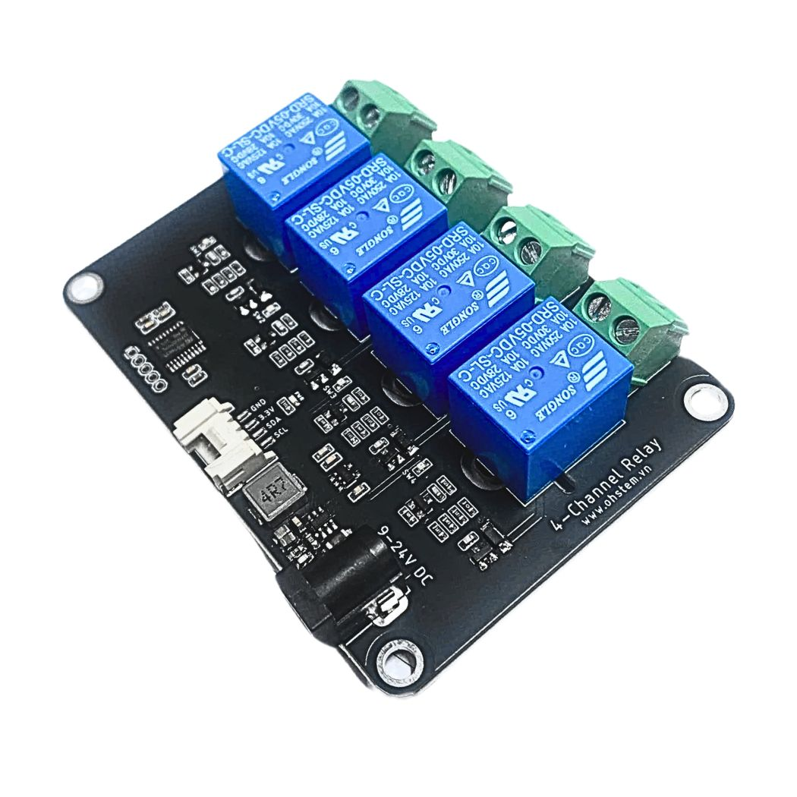
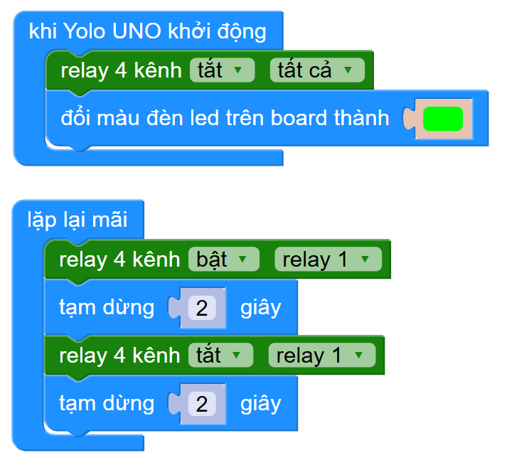

6. Relay 4 kênh
============

| 

Relay 4 kênh là một bộ 4 công tắc điện tử có thể sử dụng để đóng tắt nguồn cho 4 thiết bị, điện áp điều khiển có thể lên tới 24V, cho phép điều khiển đóng ngắt bằng cách lập trình.

Với hướng dẫn này, sẽ thực hiện chương trình đổi trạng thái của relay để bật tắt quạt 12V.

**1. Mua sản phẩm**
-----------
----------

..  image:: images/gio.png
    :alt: some image
    :target: https://shop.ohstem.vn/san-pham/relay-4-kenh/
    :class: with-shadow
    :scale: 100%
    :align: center
|

**2. Thông số kỹ thuật**
------------
-------------

- **Thông số kỹ thuật của Relay 4 kênh**

    + Điện áp cấp nguồn: 9-24V
    + Điện áp giao tiếp: 3.3V
    + Chuẩn giao tiếp điều khiển: I2C

- **Pinout của Relay 4 kênh**

Module relay có 3 chân, và mỗi chân có chức năng như sau:

..  csv-table:: 
    :header: "STT", "Chân", "Chức năng"
    :widths: 10, 15, 30

    1, "GND", "Nối đất"
    2, "VCC", "Cấp nguồn (3.3V)"
    3, "SDA", "Tín hiệu điều khiển I2C"
    4, "SCL", "Tín hiệu điều khiển I2C"

**3. Kết nối**
------------
------------

- **Bước 1**: Chuẩn bị các thiết bị như sau: 

.. list-table:: 
   :widths: auto
   :header-rows: 1
     
   * - .. image:: images/yolo-uno.png
          :width: 200px
          :align: center
     - .. image:: images/relay-4-kenh-1.jpg
          :width: 200px
          :align: center
     - .. image:: images/pin-12V.jpg
          :width: 200px
          :align: center
     - .. image:: images/quat-cn.png
          :width: 200px
          :align: center
   * - Mạch lập trình Yolo UNO
     - Relay 4 kênh
     - Pin
     - Quạt
   * - `Mua sản phẩm <https://shop.ohstem.vn/san-pham/yolo-uno/>`_
     - `Mua sản phẩm <https://shop.ohstem.vn/san-pham/relay-4-kenh/>`_
     - `Mua sản phẩm <https://shop.ohstem.vn/san-pham/pin-3s-12v-kem-sac/>`_
     - Mua sản phẩm

- **Bước 2**: Kết nối **Relay 1** với quạt và cấp nguồn cho relay:

|

**4. Hướng dẫn lập trình với OhStem App**
--------
------------

- **Bước 1**: Tải thư viện **Relay 4 kênh**, bằng cách dán đường link sau `https://github.com/AITT-VN/yolouno_extension_relay4ch <https://github.com/AITT-VN/yolouno_extension_relay4ch>`_ vào phần tìm kiếm thư viện. 

    Xem hướng dẫn tải thư viện `tại đây <https://docs.ohstem.vn/en/latest/module/thu-vien-yolouno.html>`_

..  image:: images/relay-4-kenh-3.png
    :scale: 70%
    :align: center 
| 

    Sau khi tải thư viện thành công, trong danh mục khối lệnh sẽ xuất hiện các khối lệnh tương ứng:

| 

- **Bước 2:** Gửi chương trình sau vào Yolo UNO: 

|

**Giải thích chương trình:**

    Trong chương trình trên, quạt được kết nối với Relay 3, sẽ bật tắt sau mỗi 2 giây. 

