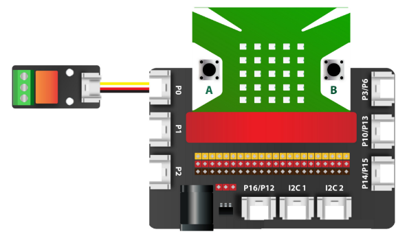
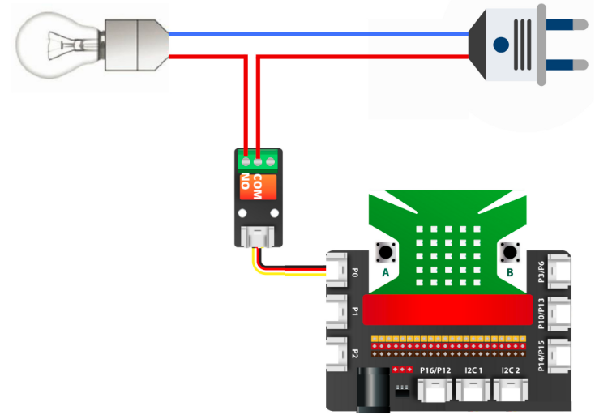
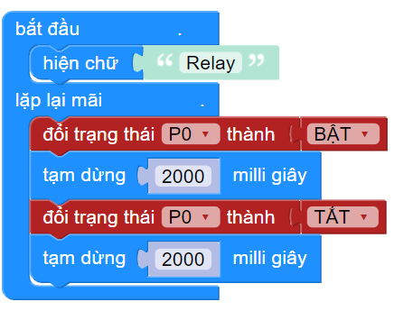

5. Công tắc điện tử Relay
============

.. image:: images/5.1.png
    :width: 400px
    :align: center 
| 

- Công tắc điện tử Relay là một thiết bị đóng tắt nguồn cho một thiết bị. Nó hoạt động giống với công tắc cơ mà chúng ta thường sài trong dân dụng. Điều khác biệt là nó có thể điểu khiển đóng ngắt bằng cách lập trình. 

**1. Mua sản phẩm**
-----------
----------

..  image:: images/gio.png
    :alt: some image
    :target: https://ohstem.vn/product/relay/
    :class: with-shadow
    :scale: 100%
    :align: center
|

**2. Thông số kỹ thuật**
------------
-------------

- **Thông số kỹ thuật của Relay**

    + Điện áp: 3.3V
    + Dòng chịu đựng: 3A
    + Không có bảo vệ ngược cực, cần chú ý khi cấp nguồn
    + Tín hiệu điều khiển: Digital
    + Kích thước của mạch: 24mm x 48mm x 16mm

- **Pinout của Relay**

Module relay có 3 chân, và mỗi chân có chức năng như sau:

..  csv-table:: 
    :header: "STT", "Chân", "Chức năng"
    :widths: 10, 15, 30

    1, "GND", "Nối đất"
    2, "VCC", "Cấp nguồn (3.3V)"
    3, "NC", "Không sử dụng"
    4, "SIG", "Tín hiệu điều khiển"

**3. Kết nối**
------------
------------

- **Bước 1**: Chuẩn bị các thiết bị như sau: 

.. list-table:: 
   :widths: auto
   :header-rows: 1
     
   * - .. image:: images/yolo.png
          :width: 200px
          :align: center
     - .. image:: images/mmr.png
          :width: 200px
          :align: center
     - .. image:: images/5.1.png
          :width: 200px
          :align: center
   * - Máy tính lập trình Yolo:Bit
     - Mạch mở rộng cho Yolo:Bit
     - Relay (kèm dây Grove)
   * - `Mua sản phẩm <https://ohstem.vn/product/may-tinh-lap-trinh-yolobit/>`_
     - `Mua sản phẩm <https://ohstem.vn/product/grove-shield/>`_
     - `Mua sản phẩm <https://ohstem.vn/product/relay/>`_

- **Bước 2**: Cắm Yolo:Bit vào mạch mở rộng
- **Bước 3**: Sử dụng dây Grove cắm vào Relay
- **Bước 4**: Kết nối thiết bị vào **chân P0 trên mạch mở rộng**

    Relay có thể kết nối vào cổng điều khiển có 2 chân tín hiệu. 

- **Bước 5**: Kết nối Relay với bóng đèn 220V và phích cắm điện. 

    **Cách kết nối:** Một chân của đèn nối vào nguồn, chân còn lại sẽ ngắt ra làm 2, để nối vào chân COM và NO của Relay, như hình minh hoạt sau đây. 

|

- **Bước 6**: Cắm phích cắm vào nguồn điện 220V và tiến hành lập trình như bên dưới. 

**4. Hướng dẫn lập trình**
--------
------------

**Lập trình bật tắt đèn trong 2 giây**

- Sử dụng các câu lệnh trong danh mục **CHÂN CẮM**, để làm việc với Relay. 

- Gửi chương trình sau xuống Yolo:Bit: 

|

**Giải thích chương trình:**

    Trong chương trình trên, trạng thái của Relay sẽ bật và tắt sau mỗi 2 giây. Khi trạng thái của Relay là bật - bóng đèn sáng, đó là lúc chân COM và NO kết nối với nhau, tạo thành một mạch điện hoàn chỉnh giúp đèn sáng. Ngược lại, chân COM và NO không kết nối được với nhau nên đèn tắt. 

.. note::

    Relay chỉ có thể hoạt động được với các thiết bị có công suất nhỏ, trong tầm 100W đến 150W. Do đó, khi kết nối với các thiết bị sử dụng động cơ 220V như máy bơm hoặc máy quạt công nghiệp, chúng ta phải nối Relay thông qua một công tắc chuyên dụng hơn cho điện 220V, gọi là **khởi động từ** hoặc **công tắc tơ**. Thiết bị này có khả năng khử nhiễu từ trường đối với các thiết bị sử dụng động cơ 220V.