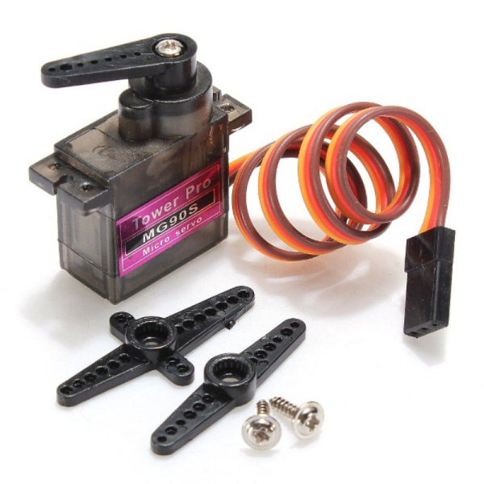
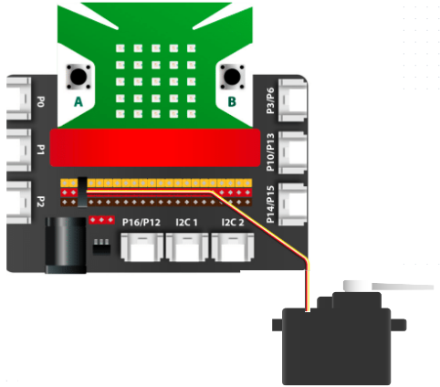

3. Động cơ Servo MG90S
=============

| 

- Động cơ Servo MG90S với bánh răng được làm từ kim loại, mang lại lực kéo và độ bền cao hơn so với các dòng Servo khác. Động cơ này có kích thước nhỏ gọn, dễ ứng dụng vào các dự án điện tử.

- Bạn có thể lập trình điều khiển Servo MG90S tương tự như đối với các dòng Servo khác như MG996,… Sản phẩm phù hợp để ứng dụng vào các dự án như cánh tay robot, robot nhện, xe robot,…

**1. Mua sản phẩm**
-----------
----------

..  image:: images/gio.png
    :alt: some image
    :target: https://ohstem.vn/product/dong-co-servo-mg90s/
    :class: with-shadow
    :scale: 100%
    :align: center
|

**2. Kết nối**
------------
------------

- **Bước 1**: Chuẩn bị các thiết bị như sau: 

.. list-table:: 
   :widths: auto
   :header-rows: 1
     
   * - .. image:: images/yolo.png
          :width: 200px
          :align: center
     - .. image:: images/mmr.png
          :width: 200px
          :align: center
     - .. image:: images/3.1.png
          :width: 200px
          :align: center
   * - Máy tính lập trình Yolo:Bit
     - Mạch mở rộng cho Yolo:Bit
     - Động cơ Servo MG90S
   * - `Mua sản phẩm <https://ohstem.vn/product/may-tinh-lap-trinh-yolobit/>`_
     - `Mua sản phẩm <https://ohstem.vn/product/grove-shield/>`_
     - `Mua sản phẩm <https://ohstem.vn/product/dong-co-servo-mg90s/>`_

- **Bước 2**: Cắm Yolo:Bit vào mạch mở rộng

- **Bước 3**: Kết nối thiết bị vào **chân P4 trên mạch mở rộng**

| 

**3. Hướng dẫn lập trình với OhStem App**
--------
------------

- **Đối với động cơ servo 180 độ:** 

    + Sử dụng khối lệnh sau trong danh mục **CHÂN CẮM**, để điều khiển:

    .. image:: images/2.3.png
        :scale: 100%
        :align: center 
    |

    + Trước khi lập trình, bạn cần xác định vị trí góc của servo để việc lập trình thuận lợi hơn.

    + Gửi chương trình sau xuống Yolo:Bit, để kiểm tra hoạt động của servo:

    .. image:: images/2.4.png
        :scale: 100%
        :align: center 
    |

.. note:: 

   Khi sau khi xác định vị trí góc của servo, bằng câu lệnh trong khối bắt đầu. Bạn hãy nhấn nút để xem sự di chuyển của cánh servo.

- **Đối với động cơ servo 360 độ:** 

    + Sử dụng khối lệnh sau trong danh mục **CHÂN CẮM**, để điều khiển:

    .. image:: images/2.5.png
        :scale: 100%
        :align: center 
    |

    + Động cơ servo 360, sẽ có các chế độ hoạt động như sau: 

        - Tốc độ 0: Đứng yên
        - Tốc độ 100: Tối đa
        - Tốc độ -100 - 0: Động cơ quay ngược chiều kim đồng hồ
        - Tốc độ 0- 100: Động cơ quay cùng chiều kim đồng hồ

    + Gửi chương trình sau xuống Yolo:Bit, để kiểm tra hoạt động của servo:

    .. image:: images/2.6.png
        :scale: 100%
        :align: center 
    |

.. note::

    Chương trình được ứng dụng vào các dự án như sáng tạo bánh xe robot, ròng rọc của cáp treo… 

**5. Hướng dẫn lập trình Arduino**
--------
------------

- Mở phần mềm Arduino IDE. Xem hướng dẫn lập trình với Arduino `tại đây <https://docs.ohstem.vn/en/latest/module/cai-dat-arduino.html>`_. 

- Copy đoạn code sau, click vào nút ``Verify`` để kiểm tra lỗi chương trình. Sau khi biên dịch không báo lỗi, bạn có thể nạp đoạn code vào board. 

    + **Điều khiển Servo 180 độ:**

.. code-block:: guess

    #include "YoloBit.h"  
    #include <Servo.h>
    
    YoloBit yolobit;

    // Điều khiển servo 180, quay liên tục từ góc 0 đến 180 độ và ngược lại. 

    Servo myservo;
    int pos = 0; // lưu vị trí của servo

    void setup() {
      myservo.attach(P4);  // kết nối servo vào chân P4
    }

    void loop() {
      for (pos=0; pos<=180; pos++) { // từ 0 đến 180 độ
          myservo.write(pos);
          delay(15);
      }

      // Đảo ngược quá trình từ 180 đến 0 độ
      for (pos=180; pos>=0; pos--) {
          myservo.write(pos);
          delay(15);
      }
    }
    

+ **Điều khiển Servo 360 độ:**

.. code-block:: guess

    #include <Servo.h>
    #include “Yolobit.h”
    
    Servo myservo;
   
    Yolobit yolobit;
    
    int pos = 0;
    int Control_Pin = P4;

    void setup() {
      // Điều khiển servo qua chân P4 của Yolobit
      myservo.attach(Control_Pin );
      // Servo ở trạng thái đứng yên, ở góc 90 độ
      myservo.write(90);
    }

    void loop() {
      // Servo quay về vị trí tối đa ở góc 180 độ trong 1 giây
      myservo.write(180);
      delay(1000);
      // Servo ở trạng thái đứng yên trong 1 giây
      myservo.write(90);
      delay(1000);
      // Servo quay về vị trí tối đa ở góc 0 độ trong 1 giây
      myservo.write(0);
      delay(1000);
      // Servo ở trạng thái đứng yên trong 1 giây
      myservo.write(90);
      delay(1000);
    }

