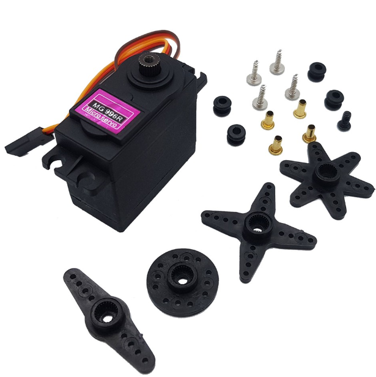
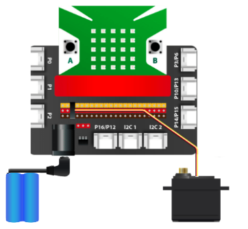

4. Động cơ Servo MG996R
==========

| 

- Động cơ Servo MG996R có thể xoay được một góc bất kỳ từ 0 – 180 độ hoặc 0 – 360 độ/. Sản phẩm có kích thước nhỏ gọn và có độ bền, lực kéo khỏe hơn rất nhiều so với động cơ Servo MG90S thông thường.

- Sản phẩm phù hợp để ứng dụng vào các ứng dụng sáng tạo như làm cánh tay robot chuyển động, làm robot nhện, cơ cấu quay góc,… tùy vào sở thích của người dùng.

**1. Mua sản phẩm**
-----------
----------

..  image:: images/gio.png
    :alt: some image
    :target: https://ohstem.vn/product/dong-co-servo-mg996r/
    :class: with-shadow
    :scale: 100%
    :align: center
|

**2. Thông số kỹ thuật**

- **Thông số kỹ thuật của động cơ Servo MG996R**

    + Lực kéo ở điện áp 6V ~ 11kg
    + Có momen xoắn lớn
    + Điện áp hoạt động: 4,8 ~ 7.2V
    + Bánh răng: Kim loại
    + Trọng lượng: Khoảng 55g

- **Sơ đồ dây nối:**

    + Màu đỏ: Dương nguồn
    + Màu nâu:  Âm nguồn
    + Màu cam: Truyền tín hiệu

**3. Kết nối**
------------
------------

- **Bước 1**: Chuẩn bị các thiết bị như sau, đối với động cơ MG996R cần có thêm pin 8.4V 18650.  

.. list-table:: 
   :widths: auto
   :header-rows: 1
     
   * - .. image:: images/yolo_mmr.png
          :width: 200px
          :align: center
     - .. image:: images/4.1.png
          :width: 200px
          :align: center
     - .. image:: images/4.2.png
          :width: 200px
          :align: center
   * - Mạch mở rộng kèm Yolo:Bit
     - Động cơ Servo MG996R
     - Pin 18650
   * - `Mua sản phẩm <https://ohstem.vn/product/may-tinh-lap-trinh-yolobit/>`_
     - `Mua sản phẩm <https://ohstem.vn/product/dong-co-servo-mg996r/>`_
     - `Mua sản phẩm <https://ohstem.vn/product/pin-sac-2s-8-4v-18650/>`_

- **Bước 2**: Cắm Yolo:Bit vào mạch mở rộng
- **Bước 3**: Kết nối pin 18650 vào mạch mở rộng
- **Bước 4**: Kết nối servo vào **chân P4 trên mạch mở rộng**

| 

**4. Hướng dẫn lập trình**
--------
------------

- **Đối với động cơ servo 180 độ:** 

    + Sử dụng khối lệnh sau trong danh mục **CHÂN CẮM**, để điều khiển:

    .. image:: images/2.3.png
        :scale: 100%
        :align: center 
    |

    + Trước khi lập trình, bạn cần xác định vị trí góc của servo để việc lập trình thuận lợi hơn.

    + Gửi chương trình sau xuống Yolo:Bit, để kiểm tra hoạt động của servo:

    .. image:: images/2.4.png
        :scale: 100%
        :align: center 
    |

.. note:: 

   Khi sau khi xác định vị trí góc của servo, bằng câu lệnh trong khối bắt đầu. Bạn hãy nhấn nút để xem sự di chuyển của cánh servo.

- **Đối với động cơ servo 360 độ:** 

    + Sử dụng khối lệnh sau trong danh mục **CHÂN CẮM**, để điều khiển:

    .. image:: images/2.5.png
        :scale: 100%
        :align: center 
    |

    + Động cơ servo 360, sẽ có các chế độ hoạt động như sau: 

        - Tốc độ 0: Đứng yên
        - Tốc độ 100: Tối đa
        - Tốc độ -100 - 0: Động cơ quay ngược chiều kim đồng hồ
        - Tốc độ 0- 100: Động cơ quay cùng chiều kim đồng hồ

    + Gửi chương trình sau xuống Yolo:Bit, để kiểm tra hoạt động của servo:

    .. image:: images/2.6.png
        :scale: 100%
        :align: center 
    |

.. note::

    Chương trình được ứng dụng vào các dự án như sáng tạo bánh xe robot, ròng rọc của cáp treo… 
