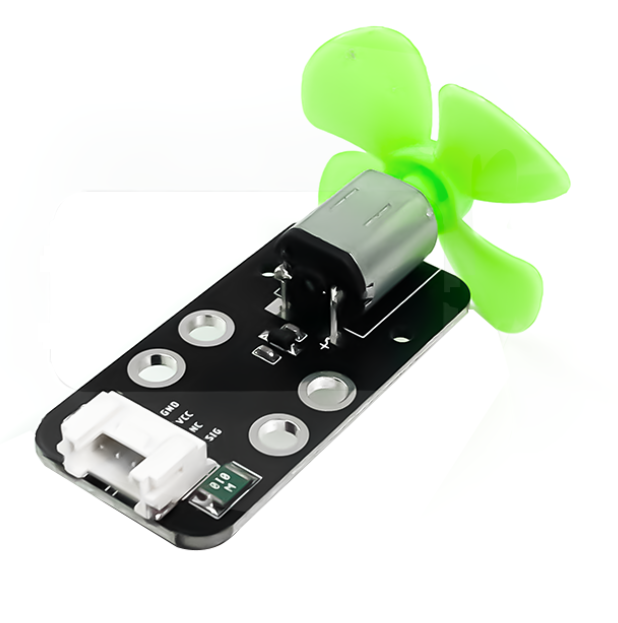
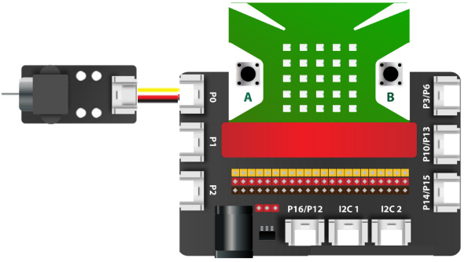

5. Động cơ quạt mini
==========

| 

- Động cơ là một thiết bị điện tử rất phổ biến trong cuộc sống của chúng ta (như quạt, động cơ xe, máy bơm nước…). Động cơ khi được cung cấp điện sẽ làm xoay trục động cơ, từ đó tạo nên nhiều ứng dụng khác nhau.

- Ta có thể kết hợp module động cơ này với những module cảm biến khác như: điều khiển bật/tắt quạt theo thời gian, đọc giá trị nhiệt độ để bật/tắt quạt,…

**1. Mua sản phẩm**
-----------
----------

..  image:: images/gio.png
    :alt: some image
    :target: https://shop.ohstem.vn/san-pham/dong-co-quat-mini/
    :class: with-shadow
    :scale: 100%
    :align: center
|

**2. Thông số kỹ thuật**

- **Thông số kỹ thuật của động cơ quạt mini**

    + Điện áp hoạt động: 3.3V
    + Tín hiệu điều khiển: 2 pins
    + Kích thước của mạch: 24mm x 48mm x 16mm

- **Pinout của động cơ quạt mini**

Module động cơ quạt mini có 4 chân, và mỗi chân có chức năng như sau:

..  csv-table:: 
    :header: "STT", "Chân", "Chức năng"
    :widths: 10, 15, 30

    1, "GND", "Nối đất"
    2, "VCC", "Cấp nguồn (3.3V)"
    3, "S2", "Tín hiệu điều khiển quay nghịch"
    4, "S1", "Tín hiệu điều khiển quay thuận"
    

**3. Kết nối**
------------
------------

- **Bước 1**: Chuẩn bị các thiết bị như sau: 

.. list-table:: 
   :widths: auto
   :header-rows: 1
     
   * - .. image:: images/yolo.png
          :width: 200px
          :align: center
     - .. image:: images/mmr.png
          :width: 200px
          :align: center
     - .. image:: images/5.1.png
          :width: 200px
          :align: center
   * - Máy tính lập trình Yolo:Bit
     - Mạch mở rộng cho Yolo:Bit
     - Động cơ quạt mini (kèm dây Grove)
   * - `Mua sản phẩm <https://shop.ohstem.vn/san-pham/may-tinh-lap-trinh-yolobit/>`_
     - `Mua sản phẩm <https://shop.ohstem.vn/san-pham/grove-shield/>`_
     - `Mua sản phẩm <https://shop.ohstem.vn/san-pham/dong-co-quat-mini/>`_

- **Bước 2**: Cắm Yolo:Bit vào mạch mở rộng
- **Bước 3**: Sử dụng dây Grove cắm động cơ quạt mini 
- **Bước 4**: Kết nối thiết bị vào **chân P0 trên mạch mở rộng**

    Bạn có thể kết nối động cơ quạt mini vào bất kỳ chân nào của mạch mở rộng

**4. Hướng dẫn lập trình với OhStem App**
--------
------------

- **Bước 1:** Tải thư viện **AIOT KIT**, xem hướng dẫn tải thư viện `tại đây <https://docs.ohstem.vn/en/latest/module/cai-dat-thu-vien.html>`_

    .. image:: images/5.3.png
        :width: 300px
        :align: center 
    |

    Sau khi tải thư viện, trong danh mục khối lệnh sẽ xuất hiện các khối lệnh tương ứng:

    .. image:: images/5.4.png
        :width: 800px
        :align: center 
    |   

- **Bước 2:** Hãy gửi chương trình sau đến Yolo:Bit của bạn:      

    .. image:: images/5.5.png
        :scale: 100%
        :align: center 
    |  

.. note::

    Nếu nút trên mạch Yolo:Bit được nhấn, tốc độ của quạt sẽ thay đổi tương ứng. Với tốc độ 0, quạt sẽ dừng hoạt động. Tốc độ tối đa của quạt là 100. 

**5. Hướng dẫn lập trình Arduino**
--------
------------

- Mở phần mềm Arduino IDE. Xem hướng dẫn lập trình với Arduino `tại đây <https://docs.ohstem.vn/en/latest/module/cai-dat-arduino.html>`_. 

- Copy đoạn code sau, click vào nút ``Verify`` để kiểm tra lỗi chương trình. Sau khi biên dịch không báo lỗi, bạn có thể nạp đoạn code vào board. 

.. code-block:: guess

    #include "YoloBit.h"

    // Bật tắt module quạt mini sau mỗi 1 giây
    
    YoloBit yolobit;

    int miniFanPin = P0; 

    void setup() { 
      pinMode(miniFanPin, OUTPUT);
    }

    void loop() {
      digitalWrite(miniFanPin, HIGH);
      delay(1000);
      digitalWrite(miniFanPin, LOW);
      delay(1000);
    }
    
.. note:: 
    
    **Giải thích chương trình:** Sau khi chạy chương trình, bạn sẽ thấy module quạt mini quay và dừng quay liên lục sau mỗi 1 giây.