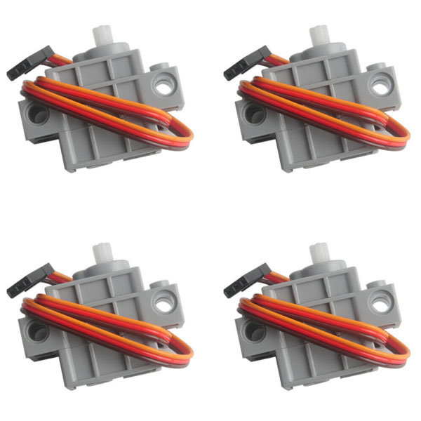
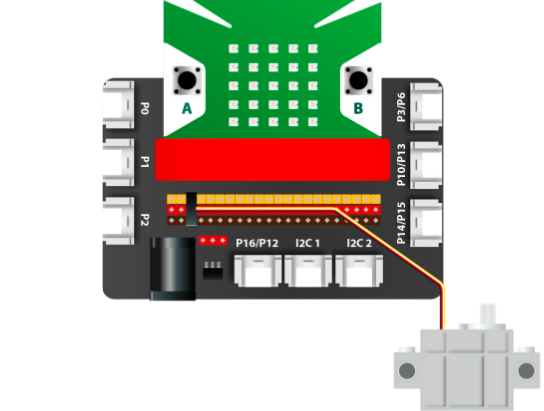
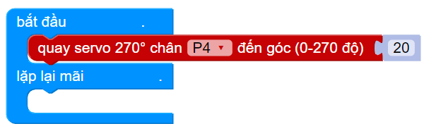
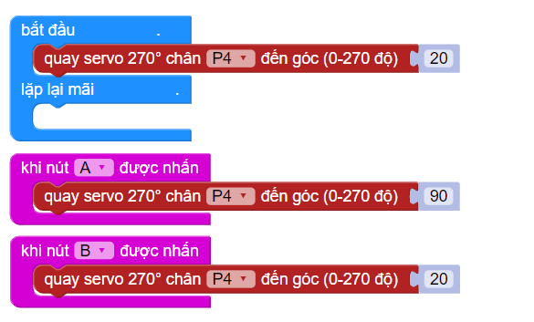

1. Geek Servo 270 tương thích với Lego
==============

| 

Động cơ Geek Servo 270 tương thích với Lego, có thể dùng để lắp ráp vào các mô hình sáng tạo theo ý thích.

**1. Mua sản phẩm**
-----------
----------

..  image:: images/gio.png
    :alt: some image
    :target: https://shop.ohstem.vn/san-pham/geek-servo-270/
    :class: with-shadow
    :scale: 100%
    :align: center

**2. Kết nối**
------------
------------

- **Bước 1**: Chuẩn bị các thiết bị như sau: 

.. list-table:: 
   :widths: auto
   :header-rows: 1
     
   * - .. image:: images/yolo.png
          :width: 200px
          :align: center
     - .. image:: images/mmr.png
          :width: 200px
          :align: center
     - .. image:: images/1.1.png
          :width: 200px
          :align: center
   * - Máy tính lập trình Yolo:Bit
     - Mạch mở rộng cho Yolo:Bit
     - Động cơ Servo 270
   * - `Mua sản phẩm <https://shop.ohstem.vn/san-pham/may-tinh-lap-trinh-yolobit/>`_
     - `Mua sản phẩm <https://shop.ohstem.vn/san-pham/grove-shield/>`_
     - `Mua sản phẩm <https://shop.ohstem.vn/san-pham/geek-servo-270/>`_

- **Bước 2**: Cắm Yolo:Bit vào mạch mở rộng

- **Bước 3**: Kết nối thiết bị vào **chân P4 trên mạch mở rộng**

| 

**3. Hướng dẫn lập trình với OhStem App**
--------
------------

- Sử dụng các câu lệnh trong danh mục **CHÂN CẮM** để làm việc với Servo.

- Trước khi lập trình với Servo bạn cần chỉnh Servo về góc 20 trước khi lập trình, để xác định góc của servo. 

| 
- Sau đó gửi chương trình sau xuống Yolo:Bit: 

| 

.. note:: 
    **Giải thích chương trình**:

    Chương trình mô phỏng một cánh cửa tự động từ servo, nếu nút A được nhấn thì cửa mở (góc 20), nút B nhấn thì cửa đóng (góc 90)

**4. Hướng dẫn lập trình Arduino**
--------
------------

- Mở phần mềm Arduino IDE. Xem hướng dẫn lập trình với Arduino `tại đây <https://docs.ohstem.vn/en/latest/module/cai-dat-arduino.html>`_. 

- Copy đoạn code sau, click vào nút ``Verify`` để kiểm tra lỗi chương trình. Sau khi biên dịch không báo lỗi, bạn có thể nạp đoạn code vào board. 

.. code-block:: guess

    #include <Servo.h>  
    #include “Yolobit.h”

    Yolobit yolobit;

    Servo myservo;  // Tạo đối tượng servo để điều khiển động cơ servo
    int pos = 0;    // Biến lưu trữ vị trí servo  

    void setup() 
    { 
      myservo.attach(P4);  // Connect to pin P4
    }  
    
    void loop() 
    { 
      // Quay servo từ 0 độ tới 270 độ
      for(pos = 0; pos <= 270; pos += 1) // in steps of 1 degree 
      {                                  
         myservo.write(pos);              // Điều khiển servo đến vị trí pos 
         delay(15);                       // Chờ động cơ servo đạt đến vị trí 
      } 
    
      // Quay servo từ 270 độ về lại 0 độ
    
      for(pos = 270; pos>=0; pos-=1)     
      {                                
         myservo.write(pos);              // Điều khiển servo đến vị trí pos
         delay(15);                       // Chờ động cơ servo đạt đến vị trí 
      } 
    } 
