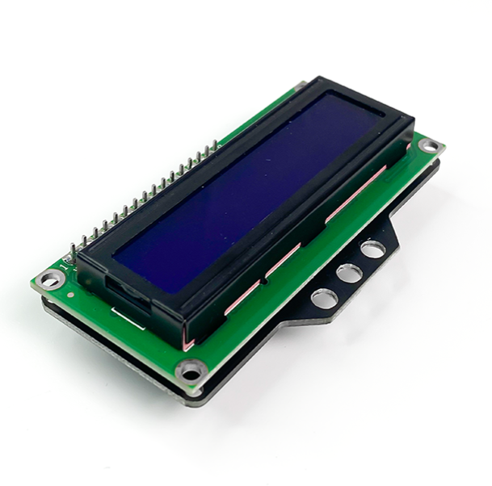
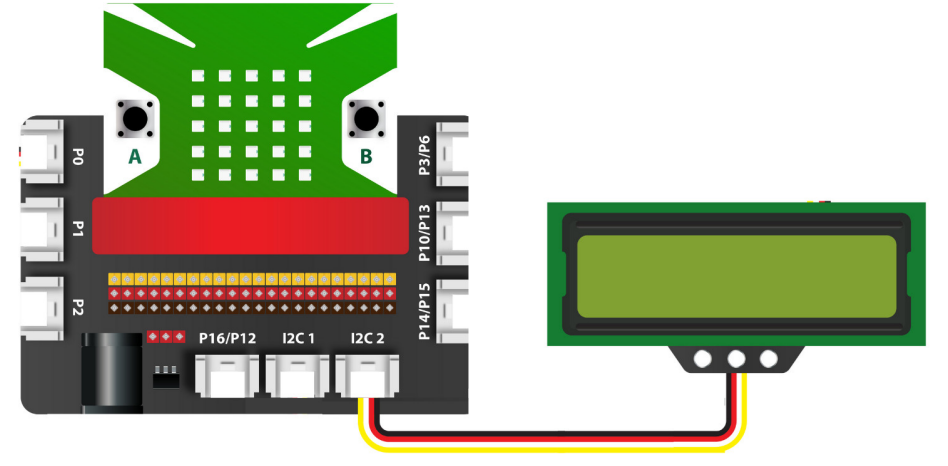
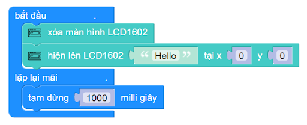

3. Màn hình LCD 1602
=============

| 

Màn hình LCD 1602 có kèm module I2C sử dụng driver HD44780. Module này có khả năng hiển thị 2 dòng với mỗi dòng 16 ký tự.LCD 1602 có độ bền cao và rất phổ biến (có nhiều code mẫu). Nếu bạn là người mới học và làm dự án, đây sẽ là thiết bị điện tử phù hợp nhờ vào tính dễ sử dụng của chúng. Màn hình LCD được tích hợp module giao tiếp I2C giúp việc giao tiếp được dễ dàng và nhanh chóng hơn rất nhiều.

**1. Mua sản phẩm**
-----------
----------

..  image:: images/gio.png
    :alt: some image
    :target: https://ohstem.vn/product/man-hinh-lcd-1602/
    :class: with-shadow
    :scale: 100%
    :align: center
|

**2. Thông số kỹ thuật**
------------
-------------

- **Thông số kỹ thuật của màn hình LCD 1602**

    + Điện áp hoạt động: 3.3V.
    + Địa chỉ I2C: 0x27
    + Màu: Xanh lá
    + Kích thước lỗ bắt ốc: 3x M3
    + Kích thước của mạch: 80mm x 42mm x 19m
    + Trọng lượng 38g

- **Pinout của màn hình LCD1602**

Module LCD1602 có 4 chân, và mỗi chân có chức năng như sau:

..  csv-table:: 
    :header: "STT", "Chân", "Chức năng"
    :widths: 10, 15, 30

    1, "GND", "Nối đất"
    2, "VCC", "Cấp nguồn (3.3V)"
    3, "SDA", "Truyền tín hiệu"
    4, "SCL", "Xung tín hiệu"

**3. Kết nối**
------------
------------

- **Bước 1**: Chuẩn bị các thiết bị như sau: 

.. list-table:: 
   :widths: auto
   :header-rows: 1
     
   * - .. image:: images/yolo.png
          :width: 200px
          :align: center
     - .. image:: images/mmr.png
          :width: 200px
          :align: center
     - .. image:: images/3.1.png
          :width: 200px
          :align: center
   * - Máy tính lập trình Yolo:Bit
     - Mạch mở rộng cho Yolo:Bit
     - Màn hình LED1602 (kèm dây Grove)
   * - `Mua sản phẩm <https://ohstem.vn/product/may-tinh-lap-trinh-yolobit/>`_
     - `Mua sản phẩm <https://ohstem.vn/product/grove-shield/>`_
     - `Mua sản phẩm <https://ohstem.vn/product/man-hinh-lcd-1602/>`_

- **Bước 2**: Cắm Yolo:Bit vào mạch mở rộng
- **Bước 3**: Sử dụng dây Grove cắm vào màn hình LED1602 
- **Bước 4**: Kết nối thiết bị vào **chân I2C trên mạch mở rộng**

    Bạn có thể kết nối vào 1 trong 2 chân I2C

**4. Hướng dẫn lập trình với OhStem App**
--------
------------

- **Bước 1:** Tải thư viện **AIOT KIT**, xem hướng dẫn tải thư viện `tại đây <https://docs.ohstem.vn/en/latest/module/thu-vien-yolobit.html>`_

    .. image:: images/aiot.png
        :width: 300px
        :align: center 
    |

    Sau khi tải thư viện, trong danh mục khối lệnh sẽ xuất hiện các khối lệnh tương ứng:

    .. image:: images/lenh_aiot.png
        :width: 800px
        :align: center 
    |

- **Bước 2**: Gửi chương trình sau xuống Yolo:Bit

|

.. note::

    **Giải thích chương trình:** Chương trình hiển thị thông tin lên màn hình LCD1602.
    
    Câu lệnh đầu tiên sẽ xóa toàn bộ màn hình, trong khi câu lệnh thứ 2 sẽ được dùng để hiển thị thông tin lên màn hình LCD tại tọa độ x và y:
        - x (cột): có giá trị từ 0 đến 15 - tương ứng cho 16 cột
        - y (hàng): có giá trị từ 0 đến 1 - tương ứng cho 2 dòng

..  attention::

    Trong trường hợp không thấy xuất hiện chữ trên màn hình LCD, bạn cũng đừng hoang mang và kết luận rằng chương trình bị lỗi. Thông thường, điều này xảy ra do độ tương phản của màu chữ và màu nền chưa hợp lý.
    
    Để khắc phục vấn đề này, bạn có thể sử dụng một tuốc nơ vít nhỏ, vặn một đầu vít có ghi chữ CONTRAST (như hình minh họa bên dưới), bạn sẽ thấy chữ dần dần hiện lên.
 
 ..  figure:: images/3.4.png
    :scale: 70%
    :align: center 

    Chỉnh tương phản cho việc hiển thị trên LCD

**5. Hướng dẫn lập trình Arduino**
--------
------------

- Mở phần mềm Arduino IDE. Xem hướng dẫn lập trình với Arduino `tại đây <https://docs.ohstem.vn/en/latest/module/cai-dat-arduino.html>`_. 

- Copy đoạn code sau, click vào nút ``Verify`` để kiểm tra lỗi chương trình. Sau khi biên dịch không báo lỗi, bạn có thể nạp đoạn code vào board. 

.. code-block:: guess

    #include "YoloBit.h"
    #include <Wire.h> 
    #include <LiquidCrystal_I2C.h>

    YoloBit yolobit;

    LiquidCrystal_I2C lcd(0x21, 16, 2); // I2C address: 0x21, 16 chars, 2 line

    void setup() {
      lcd.init(); // initialize the lcd
      lcd.backlight();
    }
    
    void loop() {
      lcd.setCursor(0, 0);
      lcd.print("OhStem"); 
      lcd.setCursor(0, 1);
      lcd.print("xin chao ban"); 
      delay(2000);
      lcd.clear();
      delay(1000);
    }
    
.. note:: 
    
    **Giải thích chương trình:** Bạn sẽ thấy dòng chữ **"OhStem xin chao ban!"** được hiển thị liên tục trên 2 dòng của màn hình LCD (hiển thị trong 2 giây rồi biến mất trong 1 giây)