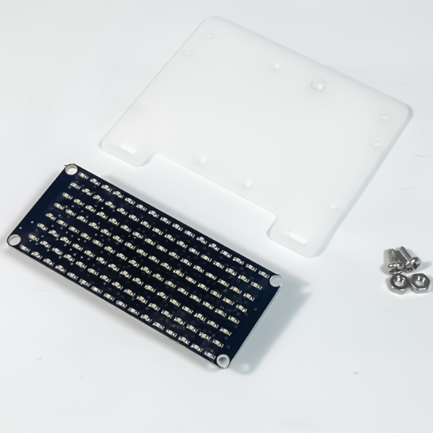
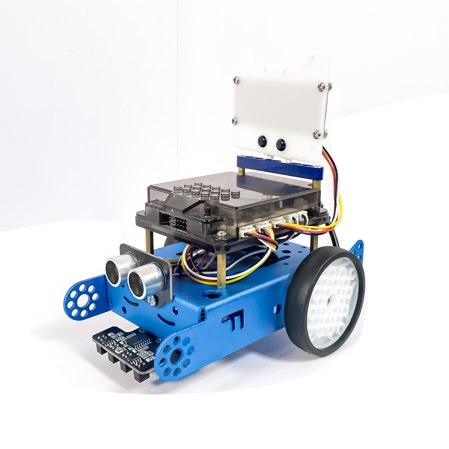
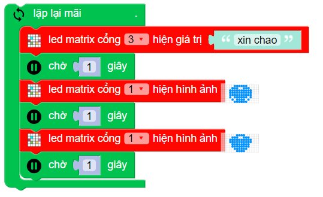

2. LED ma trận 16x8
=========

| 

- LED ma trận (8 x 16) có tổng cộng 128 LED đơn được căn chỉnh. Màn hình LED có màu xanh dương. Bằng cách lập trình từ nhiều ngôn ngữ khác nhau, bạn có thể lập trình để đèn LED ma trận chạy chữ, số hoặc ký hiệu tùy thích.

**1. Mua sản phẩm**
-----------
----------

..  image:: images/gio.png
    :alt: some image
    :target: https://shop.ohstem.vn/san-pham/led-ma-tran-16-8/
    :class: with-shadow
    :scale: 100%
    :align: center
|

**2. Thông số kỹ thuật**
------------
-------------

- **Thông số kỹ thuật của màn hình  LED ma trận**

    + Điện áp: 3.3V
    + Giao tiếp: I2C
    + Kích thước module: 73 x 31 x 15 mm (DxRxC)

- **Pinout của màn hình LED ma trận**

Màn hình ma trận LED 16×8 có 4 chân, và mỗi chân có chức năng như sau:

..  csv-table:: 
    :header: "STT", "Chân", "Chức năng"
    :widths: 10, 15, 30

    1, "GND", "Nối đất"
    2, "VCC", "Cấp nguồn (3.3V)"
    3, "SCLK", "Clock"
    4, "DIN", "Data"

**3. Kết nối**
------------
------------

- **Bước 1**: Chuẩn bị các thiết bị như sau: 

.. list-table:: 
   :widths: auto
   :header-rows: 1
     
   * - .. image:: images/xbot.png
          :width: 200px
          :align: center
     - .. image:: images/2.1.png
          :width: 200px
          :align: center
   * - Robot xBot
     - Màn hình LED 7 đoạn (kèm dây Grove)
   * - `Mua sản phẩm <https://shop.ohstem.vn/san-pham/robot-lap-trinh-xbot-stem-robot-kit/>`_
     - `Mua sản phẩm <https://shop.ohstem.vn/san-pham/led-ma-tran-16-8/>`_

- **Bước 2**: Kết nối thiết bị vào cổng 3 trên robot xBot, như hình sau: 

|

**4. Hướng dẫn lập trình**
--------
------------

- **Bước 1**: Chọn thiết bị lập trình là xBot

|

- **Bước 2**: Gửi chương trình sau lên robot xBot: 

    Sử dụng câu lệnh trong danh mục khối lệnh **HIỆU ỨNG**

.. note::

    **Giải thích chương trình:** Ở trong vòng lặp mãi, chúng ta sẽ cho màn hình đèn ma trận LED hiển thị:
    
        + Đầu tiên, hiển thị dòng chữ xin chào trong 1 giây (chờ một giây)
        + Sau đó, đèn LED chạy chữ này sẽ hiển thị biểu tượng mặt cười trong 1 giây (chờ 1 giây)
        + Cuối cùng, LED ma trận chuyển sang hình ảnh trái tim trong 1 giây.
    
    Chương trình trên sẽ được lặp đi lặp lại liên tục. 
    
    **Bạn có thể đổi hình ảnh hiển thị lên màn hình LED 16x8, bằng cách chọn hình hiển thị trong câu lệnh**. 

