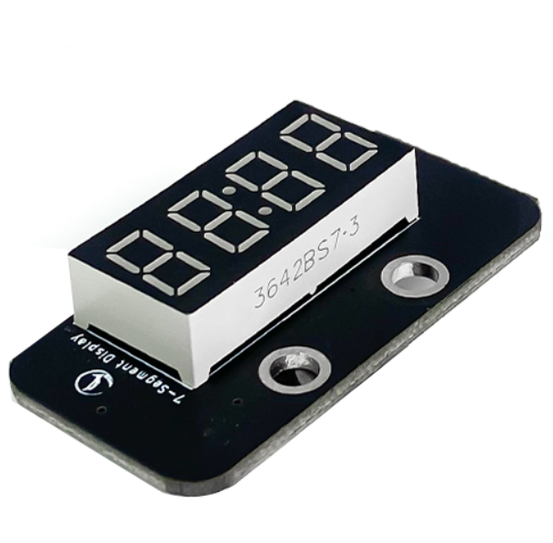
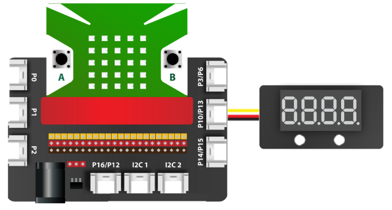
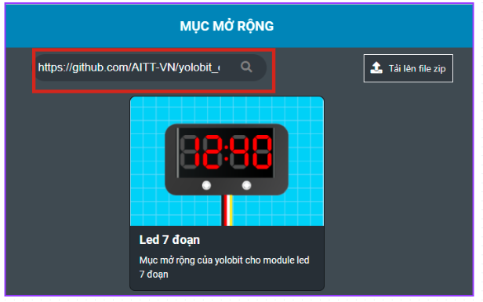
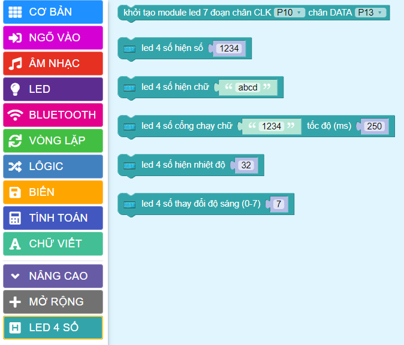
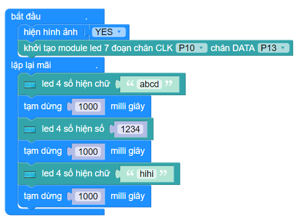

1. Màn hình 4 số LED 7 đoạn 
================================

| 

- Màn hình 4 số LED 7 đoạn sử dụng LED 7 đoạn anode chung 4 chữ số để hiển thị các số và một vài ký tự đặc biệt. Module có thể được sử dụng trong những dự án để hiển thị các dữ liệu như tốc độ, thời gian, điểm số, nhiệt độ, khoảng cách, v.v.

**1. Mua sản phẩm**
-----------
----------

..  image:: images/gio.png
    :alt: some image
    :target: https://ohstem.vn/product/led-7-doan/
    :class: with-shadow
    :scale: 100%
    :align: center
|

**2. Thông số kỹ thuật**
------------
-------------

- **Thông số kỹ thuật của màn hình LED 7 đoạn**

    + Điện áp hoạt động: 3.3 – 5V DC
    + Số led 7 đoạn: 4
    + Điều khiển: Sử dụng 2 chân tín hiệu DIO, CLK
    + Driver chip: TM1637
    + Màu đoạn led kỹ thuật số: Đỏ
    + Kích thước: 48 x 24 x 23.4 mm (D x R x C)

- **Pinout của màn hình 4 số LED 7 đoạn**

Màn hình 4 số LED 7 đoạn có 4 chân, và mỗi chân có chức năng như sau:

..  csv-table:: 
    :header: "STT", "Chân", "Chức năng"
    :widths: 10, 15, 30

    1, "GND", "Nối đất"
    2, "VCC", "Cấp nguồn"
    3, "CLK", "Clock"
    4, "DIO", "Data"

**3. Kết nối**
------------
------------

- **Bước 1**: Chuẩn bị các thiết bị như sau: 

.. list-table:: 
   :widths: auto
   :header-rows: 1
     
   * - .. image:: images/yolo.png
          :width: 200px
          :align: center
     - .. image:: images/mmr.png
          :width: 200px
          :align: center
     - .. image:: images/1.1.png
          :width: 200px
          :align: center
   * - Máy tính lập trình Yolo:Bit
     - Mạch mở rộng cho Yolo:Bit
     - Màn hình LED 7 đoạn (kèm dây Grove)
   * - `Mua sản phẩm <https://ohstem.vn/product/may-tinh-lap-trinh-yolobit/>`_
     - `Mua sản phẩm <https://ohstem.vn/product/grove-shield/>`_
     - `Mua sản phẩm <https://ohstem.vn/product/led-7-doan/>`_

- **Bước 2**: Cắm Yolo:Bit vào mạch mở rộng
- **Bước 3**: Sử dụng dây Grove cắm vào màn hình LED 
- **Bước 4**: Kết nối thiết bị vào **P10/ P13 trên mạch mở rộng**

    Trên mạch mở rộng các bạn có thể sử dụng các khe cắm có 2 chân tín hiệu để kết nối với LED 7 đoạn 

**4. Hướng dẫn lập trình**
--------
------------

- **Bước 1**: Tải thư viện **LED 7 đoạn**, bằng cách dán đường link sau **https://github.com/AITT-VN/yolobit_extension_led7segment.git** vào phần tìm kiếm thư viện. 

    Xem hướng dẫn tải thư viện `tại đây <https://docs.ohstem.vn/en/latest/module/cai-dat-thu-vien.html>`_.

| 
    Sau khi tải thư viện thành công, trong danh mục khối lệnh sẽ xuất hiện các khối lệnh tương ứng:

| 

    Để làm việc với module LED 7 đoạn bạn cần sử dụng câu lệnh sau để khai báo chân được sử dụng trong chương trình: 

|

- **Bước 2:** Gửi chương trình sau vào Yolo:Bit: 

|

.. note::

    **Giải thích chương trình:**

    Ở trong vòng lặp mãi, chúng ta sẽ cho module LED 7 đoạn hiển thị lần lượt dòng chữ ‘abcd’, 4 số ‘1234’ và chữ ‘HiHi’ trong 1 giây (chờ 1 giây). Chương trình này sẽ được lặp đi lặp lại liên tục cho tới khi ta rút nguồn điện hoặc reset.