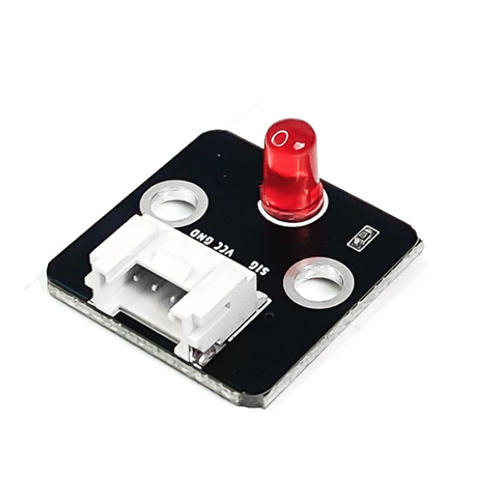
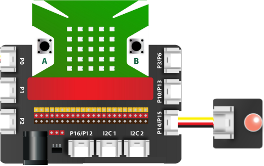
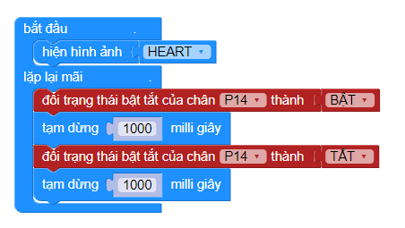

6. Đèn LED đơn
=============

|

- LED đơn là một tín hiệu ngõ ra, khi được cấp nguồn điện vào thì đèn LED sẽ bật. Đèn LED đơn thường được sử dụng để thông báo trạng thái (ví dụ như làm đèn giao thông) hoặc dùng làm đèn cửa, đèn chiếu sáng,…

**1. Mua sản phẩm**
-----------
----------

..  image:: images/gio.png
    :alt: some image
    :target: https://ohstem.vn/product/den-led-don/
    :class: with-shadow
    :scale: 100%
    :align: center
|

**2. Thông số kỹ thuật**
------------
-------------

- **Thông số kỹ thuật**

    + Hỗ trợ cả 3.3V
    + Đèn LED đơn thường có 3 màu: đỏ, xanh lá, vàng 
    + Kích thước của mạch: 24mm x 24mm x 8mm

- **Pinout của module LED đơn**

Module LED có 3 chân, và mỗi chân có chức năng như sau:

..  csv-table:: 
    :header: "STT", "Chân", "Chức năng"
    :widths: 10, 15, 30

    1, "GND", "Nối đất"
    2, "VCC", "Cấp nguồn (3.3V)"
    3, "NC", "Không sử dụng"
    4, "SIG", "Tín hiệu điều khiển LED"

**3. Kết nối**
------------
------------

- **Bước 1**: Chuẩn bị các thiết bị như sau: 

.. list-table:: 
   :widths: auto
   :header-rows: 1
     
   * - .. image:: images/yolo.png
          :width: 200px
          :align: center
     - .. image:: images/mmr.png
          :width: 200px
          :align: center
     - .. image:: images/6.1.png
          :width: 200px
          :align: center
   * - Máy tính lập trình Yolo:Bit
     - Mạch mở rộng cho Yolo:Bit
     - Module LED đơn (kèm dây Grove)
   * - `Mua sản phẩm <https://ohstem.vn/product/may-tinh-lap-trinh-yolobit/>`_
     - `Mua sản phẩm <https://ohstem.vn/product/grove-shield/>`_
     - `Mua sản phẩm <https://ohstem.vn/product/den-led-don/>`_

- **Bước 2**: Cắm Yolo:Bit vào mạch mở rộng
- **Bước 3**: Sử dụng dây Grove cắm vào module 
- **Bước 4**: Kết nối thiết bị vào **P14/P15 trên mạch mở rộng**

    Bạn có thể kết nối LED đơn vào bất kỳ chân nào trên mạch mở rộng. 

**4. Hướng dẫn lập trình**
--------
------------

- Sử dụng các khối lệnh trong danh mục **CHÂN CẮM** để làm việc với đèn LED đơn

- Gửi chương trình sau vào Yolo:Bit: 

|

.. note::

    **Giải thích chương trình:** Đèn LED sẽ bật tắt liên tục sau mỗi giây, tạo nên hiệu ứng nhấp nháy của đèn. 

**5. Hướng dẫn lập trình Arduino**
--------
------------

- Mở phần mềm Arduino IDE. Xem hướng dẫn lập trình với Arduino `tại đây <https://docs.ohstem.vn/en/latest/module/thu-vien-yolobit.html>`_

- Copy đoạn code sau, click vào nút ``Verify`` để kiểm tra lỗi chương trình. Sau khi biên dịch không báo lỗi, bạn có thể nạp đoạn code vào board. 

.. code-block:: guess

    #include "YoloBit.h"

    YoloBit yolobit;

    int ledPin = P14;

    // Bật tắt Relay sau mỗi 2 giây
   
    void setup() {
      pinMode(relayPin, OUTPUT);
    }

    void loop() {
      digitalWrite(ledPin, HIGH);
      delay(2000);
      digitalWrite(ledPin, LOW);
      delay(2000);
    }
    
.. note:: 
    
    **Giải thích chương trình:** Sau khi nạp chương trình và mở cửa sổ Serial, bạn sẽ thấy giá trị đọc được từ cảm biến được in ra. Bạn hãy thử lấy tay che cảm biến để thấy được sự thay đổi.
