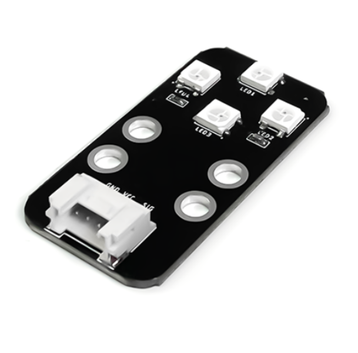
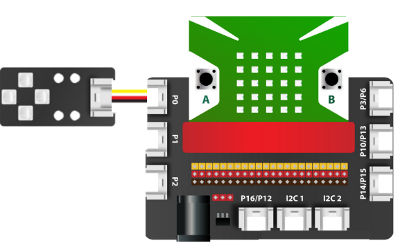
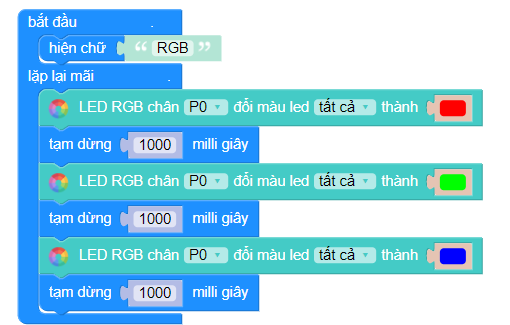

5. Module 4 LED RGB
=========

|

- Module 4 LED RGB là gồm có 4 đèn LED RGB ws2812 đủ màu. Với chip tích hợp, bạn có thể điều khiển từng đèn LED riêng lẻ hoặc tất cả đèn LED có trên nó. Ngoài ra, bạn có thể điều chỉnh độ sáng và tạo ra bất kỳ màu nào trong bảng màu RGB. Module này có chi phí rẻ, phù hợp với các chương trình ứng dụng chạy hiệu ứng, trang trí.

**1. Mua sản phẩm**
-----------
----------

..  image:: images/gio.png
    :alt: some image
    :target: https://ohstem.vn/product/module-4-led-rgb/
    :class: with-shadow
    :scale: 100%
    :align: center
|

**2. Thông số kỹ thuật**
------------
-------------

- **Thông số kỹ thuật**

    + Điện áp hoạt động: 3.3V
    + Số lượng LED: 4 x RGB LED 
    + Dòng điện tối đa: 60mA / (1 LED) , 240mA / (4 LED) 
    + Loại LED: WS2812-4 
    + Độ sáng: 0~255 
    + Điều khiển: Sử dụng 1 chân tín hiệu điều khiển 
    + Góc khả vi: >140° 
    + Kích thước: 48 x 24 x 18 mm (D x R x C)

- **Pinout của module 4 LED RGB**

Module 4 LED RGB có 4 chân, và mỗi chân có chức năng như sau:

..  csv-table:: 
    :header: "STT", "Chân", "Chức năng"
    :widths: 10, 15, 30

    1, "GND", "Nối đất"
    2, "VCC", "Cấp nguồn (3.3V)"
    3, "NC", "Không sử dụng"
    4, "SIG", "Tín hiệu điều khiển LED"

**3. Kết nối**
------------
------------

- **Bước 1**: Chuẩn bị các thiết bị như sau: 

.. list-table:: 
   :widths: auto
   :header-rows: 1
     
   * - .. image:: images/yolo.png
          :width: 200px
          :align: center
     - .. image:: images/mmr.png
          :width: 200px
          :align: center
     - .. image:: images/5.1.png
          :width: 200px
          :align: center
   * - Máy tính lập trình Yolo:Bit
     - Mạch mở rộng cho Yolo:Bit
     - Module 4 LED RGB (kèm dây Grove)
   * - `Mua sản phẩm <https://ohstem.vn/product/may-tinh-lap-trinh-yolobit/>`_
     - `Mua sản phẩm <https://ohstem.vn/product/grove-shield/>`_
     - `Mua sản phẩm <https://ohstem.vn/product/module-4-led-rgb/>`_

- **Bước 2**: Cắm Yolo:Bit vào mạch mở rộng
- **Bước 3**: Sử dụng dây Grove cắm vào module 
- **Bước 4**: Kết nối thiết bị vào **chân P0 trên mạch mở rộng**

    Bạn có thể kết nối module 4 LED RGB vào bất kỳ chân nào trên mạch mở rộng. 

**4. Hướng dẫn lập trình với OhStem App**
--------
------------

- **Bước 1:** Tải thư viện **AIOT KIT**, xem hướng dẫn tải thư viện `tại đây <https://docs.ohstem.vn/en/latest/module/cai-dat-thu-vien.html>`_

    .. image:: images/aiot.png
        :width: 300px
        :align: center 
    |

    Sau khi tải thư viện, trong danh mục khối lệnh sẽ xuất hiện các khối lệnh tương ứng:

    .. image:: images/lenh_aiot.png
        :width: 800px
        :align: center 
    |

- **Bước 2**: Gửi chương trình sau xuống Yolo:Bit

|

.. note::

    **Giải thích chương trình:** Ở trong vòng lặp lại mãi, chúng ta sẽ cho module LED ở chân P0, đổi màu đỏ, xanh lá và xanh dương, sau mỗi giây. Chương trình sẽ lặp lại liên tục.

**5. Hướng dẫn lập trình Arduino**
--------
------------

- Mở phần mềm Arduino IDE. Xem hướng dẫn lập trình với Arduino `tại đây <https://docs.ohstem.vn/en/latest/module/cai-dat-arduino.html>`_. 

- Copy đoạn code sau, click vào nút ``Verify`` để kiểm tra lỗi chương trình. Sau khi biên dịch không báo lỗi, bạn có thể nạp đoạn code vào board. 

.. code-block:: guess

    #include "YoloBit.h"
    #include <Adafruit_NeoPixel.h>

    Yolobit yolobit;

    #define PIN_NEO_PIXEL  P0   // Chân của Yolobit được kết nối với NeoPixel
    #define NUM_PIXELS     4  // Số LED trên NeoPixel

    Adafruit_NeoPixel NeoPixel(NUM_PIXELS, PIN_NEO_PIXEL, NEO_GRB + NEO_KHZ800);

    void setup() {
      NeoPixel.begin();
    }

    void loop() {
      NeoPixel.clear(); 

      // Bật từng LED màu xanh lá cây, một cái một lần với thời gian delay giữa các LED là 500ms
      for (int pixel = 0; pixel < NUM_PIXELS; pixel++) { 
          NeoPixel.setPixelColor(pixel, NeoPixel.Color(0, 255, 0)); 
          NeoPixel.show();   

          delay(500);
      }

      // Tắt toàn bộ LED trong 1 giây
      NeoPixel.clear();
      NeoPixel.show(); 
      delay(1000);     

      // Bật toàn bộ LED màu đỏ cùng một lúc trong 2 giây
      for (int pixel = 0; pixel < NUM_PIXELS; pixel++) { 
          NeoPixel.setPixelColor(pixel, NeoPixel.Color(255, 0, 0)); 
      }
      NeoPixel.show(); 
      delay(2000);     

      // Tắt toàn bộ LED trong 1 giây
      NeoPixel.clear();
      NeoPixel.show(); 
      delay(1000);     
    }
    
.. note:: 
    
    **Giải thích chương trình:** LED RGB ở chân P0, đổi màu đỏ, xanh lá và xanh dương, sau mỗi giây. Chương trình sẽ lặp lại liên tục