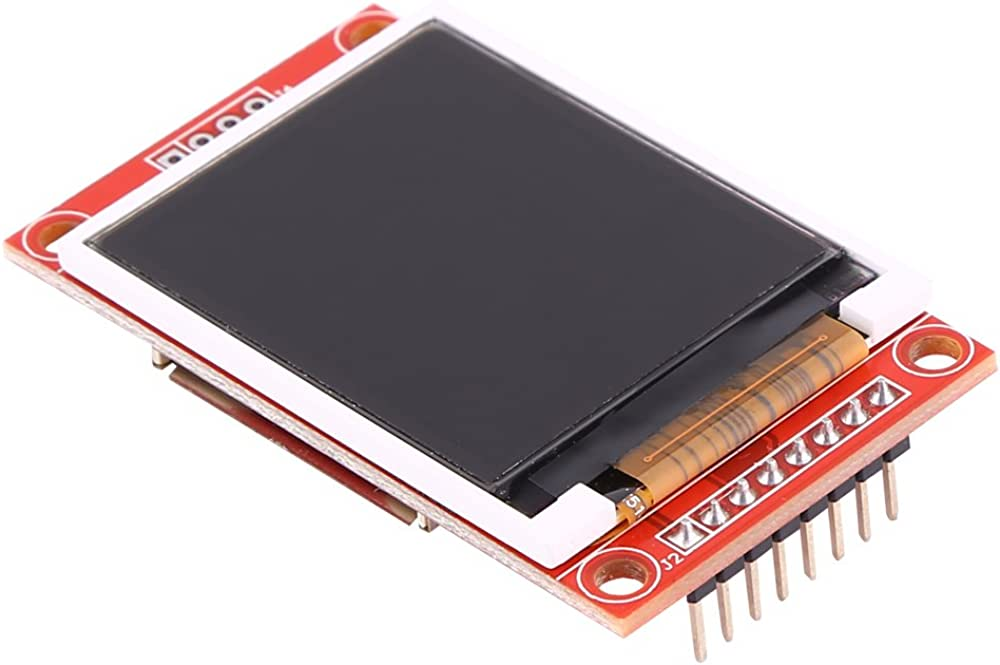
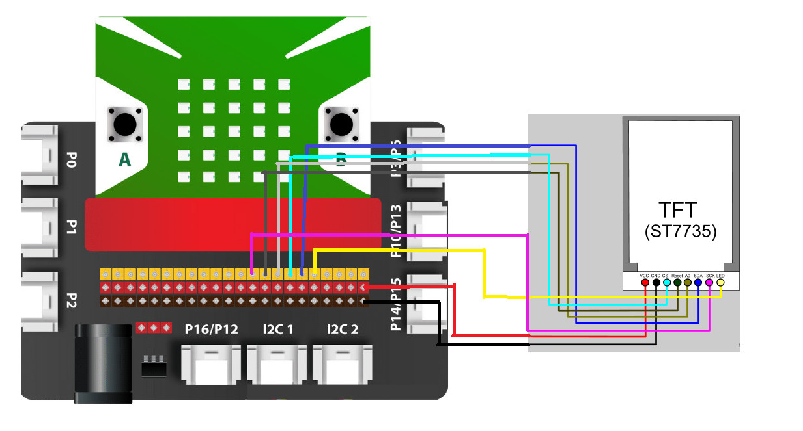
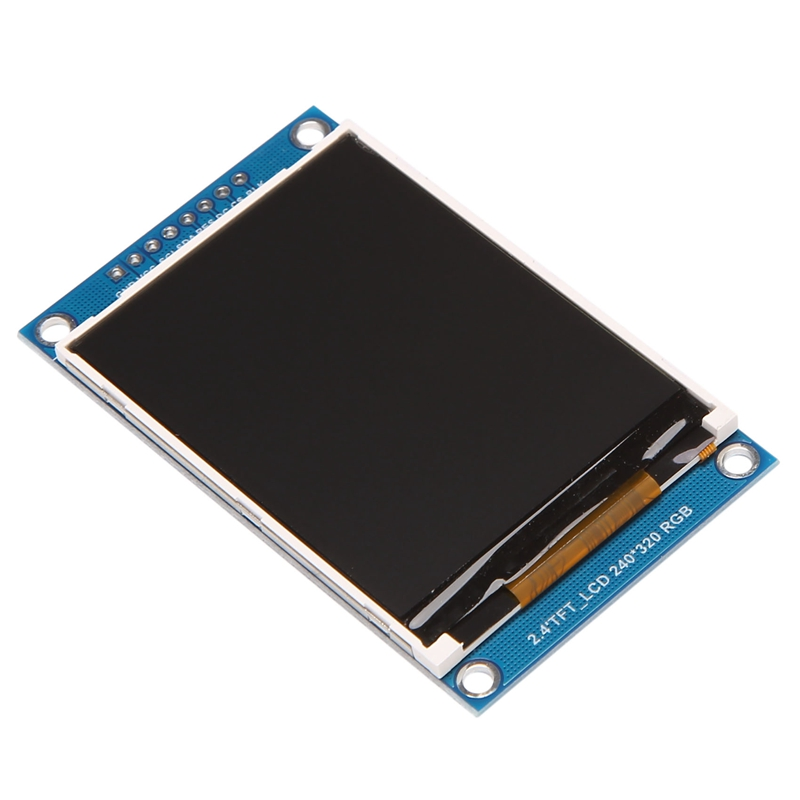
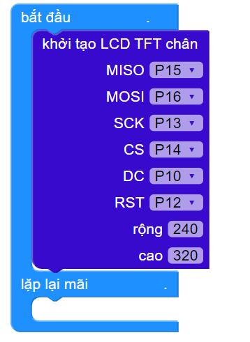
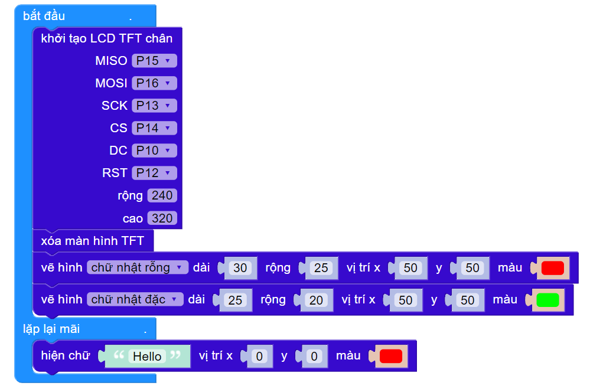

8. Màn hình TFT LCD
==============

1. Giới thiệu về màn hình TFT
------
----------

Màn hình LCD TFT luôn là một trong những lựa chọn tối ưu trong các ứng dụng DIY cần nhu cầu hiển thị. Với khả năng truyền dữ liệu nối tiếp thông qua giao tiếp SPI, vi điều khiển này chỉ mất vài chân I/O để có thể giao tiếp với module và việc điều khiển cũng vô cùng đơn giản.

**Tính năng:**

    - Kích thước màn hình tương đối lớn, tích hợp khe thẻ nhớ micro SD.
    - Driver ILI9341 hoặc ST7735 cho khả năng hiển thị các điểm ảnh (RGB) với 18 bit màu.
    - Tương thích với hầu hết các vi điều khiển hiện nay.
    - Giao thức hiển thị nối tiếp, chỉ sử dụng 5 chân (CS, RESET, DC/RS, SDI/MOSI, SCK) để điều khiển.
    - Thẻ SD sử dụng giao tiếp SPI (CS / MOSI / MISO / SCK).

Chúng tôi sẽ giới thiệu đến bạn 2 loại màn hình là **TFT ST7735 và TFT ILI9431**. Dưới đây là các thông số kỹ thuật của từng sản phẩm:

2. Thông số kỹ thuật và kết nối
---------
----------

2.1 Màn hình TFT ST7735 
----------

    Màn hình TFT ST7735

- **Các chân kết nối và chức năng:**

..  csv-table:: 
    :header: "STT", "Chân", "Chức năng"
    :widths: 10, 15, 30

    1, "LED", "Chân điều khiển LED nền, LED nền sẽ sáng khi cấp điện 3v vào chân này."
    2, "SCK/SCLK/SCL/CLK", "Chân CLK của giao tiếp SPI."
    3, "SDA", "Chân data của giao tiếp SPI"
    4, "A0/RS/DC", "Chân này thể hiện việc bạn đang truyền dữ liệu màu sắc hiển thị hay là truyền lệnh điều khiển hoạt động của màn hình:
        - Khi chân A0 bằng 0: LCD sẽ hiểu rằng dữ liệu bạn gửi đến là các lệnh để cấu hình, điều khiển LCD.
        - Khi chân A0 bằng 1: Dữ liệu bạn gửi sẽ được hiểu là dữ liệu hiển thị lên các pixel trên màn hình."
    5, "RST/RESET", "Chân reset LCD: Ở mức bình thường nối lên mức 1, lúc cần reset thì kéo xuống 0."
    6, "CS", "Chân giao tiếp SPI."
    7, "GND", "Nối vào chân GND."
    8, "VCC", "3.3V"

- **Kết nối:** Chuẩn bị các thiết bị sau:

.. list-table:: 
   :widths: auto
   :header-rows: 1
     
   * - .. image:: images/yolo.png
          :width: 200px
          :align: center
     - .. image:: images/mmr.png
          :width: 200px
          :align: center
     - .. image:: images/TFT_ST7735.jpg
          :width: 300px
          :align: center
   * - Máy tính lập trình Yolo:Bit
     - Mạch mở rộng cho Yolo:Bit
     - Màn hình TFT ST7735
   * - `Mua sản phẩm <https://ohstem.vn/product/may-tinh-lap-trinh-yolobit/>`_
     - `Mua sản phẩm <https://ohstem.vn/product/grove-shield/>`_
     - Mua ở các cửa hàng linh kiện điện tử
    

- **Đối với màn hình TFT ST7735, chúng ta sẽ nối các cặp dây tương ứng như sau:**

    - GND=GND
    - VCC=VCC
    - SCL = SCK=P13
    - SDA = MOSI=P16
    - RES=RST =P12
    - DC = DC =P10
    - CS = CS = P14
    - BL =VCC

    Hướng dẫn nối dây màn hình TFT_ST7735

2.2 Màn hình TFT ILI9431
----------

    Màn hình TFT ILI9431
    

**Các chân kết nối và chức năng:**

..  csv-table:: 
    :header: "STT", "Chân", "Chức năng"
    :widths: 10, 15, 30

    1, "MISO", "Chân được dùng để màn hình gửi dữ liệu đến vi điều khiển."
    2, "BLK", "Chân điều khiển LED nền, LED nền sẽ sáng khi cấp điện 3v3 vào chân này."
    3, "DC", " Chân này thể hiện việc bạn đang truyền dữ liệu màu sắc hiển thị hay là truyền lệnh điều khiển hoạt động của màn hình. 
        - Khi chân A0 bằng 0: LCD sẽ hiểu là dữ liệu bạn gửi đến là các lệnh để cấu hình, điều khiển LCD.
        - Khi chân A0 bằng 1: Dữ liệu bạn gửi sẽ được hiểu là dữ liệu hiển thị lên các pixel trên màn hình."
    4, "RES", "Chân reset"
    5, "MOSI", "Chân nối truyền dữ liệu từ vi điều khiển đến màn hình."
    6, "CLK", "Chân cung cấp xung CLK."
    7, "GND", "Nối vào chân GND."
    8, "VCC", "3.3V"

- **Kết nối:** Chuẩn bị các thiết bị sau:

.. list-table:: 
   :widths: auto
   :header-rows: 1
     
   * - .. image:: images/yolo.png
          :width: 200px
          :align: center
     - .. image:: images/mmr.png
          :width: 200px
          :align: center
     - .. image:: images/TFT_ILI9431.jpg
          :width: 200px
          :align: center
   * - Máy tính lập trình Yolo:Bit
     - Mạch mở rộng cho Yolo:Bit
     - Màn hình TFT ILI9431
   * - `Mua sản phẩm <https://ohstem.vn/product/may-tinh-lap-trinh-yolobit/>`_
     - `Mua sản phẩm <https://ohstem.vn/product/grove-shield/>`_
     - Mua ở các cửa hàng linh kiện điện tử
    

- **Đối với màn hình TFT ILI9431, chúng ta sẽ nối các cặp dây tương ứng như sau:**

    - GND=GND
    - VCC=VCC
    - MISO = P15
    - MOSI = P16
    - SCK = P13
    - CS = P14
    - DC = P10
    - RST = P12

.. note:: Nối dây tương tự với màn hình TFT ST7735

3. Lập trình Yolo:Bit với màn hình TFT:
--------
----------

**3.1 Tải thư viện**
------

Để điều khiển được màn hình TFT LCD, chúng ta phải cần thêm thư viện mở rộng **TFT LCD**, bạn hãy copy đường dẫn sau: `<https://github.com/AITT-VN/yolobit_extension_lcd_tft.git>`_ và dán vào mục mở rộng để tải thư viện mở rộng.

    Xem hướng dẫn tải thư viện `tại đây <https://docs.ohstem.vn/en/latest/module/cai-dat-thu-vien.html>`_.

    .. image:: images/tft.1.png
        :width: 300px
        :align: center 
    |

    Sau khi tải thư viện, trong danh mục khối lệnh sẽ xuất hiện các khối lệnh tương ứng:

    .. image:: images/tft.2.png
        :width: 800px
        :align: center 
    |

**3.2 Hướng dẫn lập trình**
-----

Đầu tiên, bạn cần nối dây theo mẫu hướng dẫn hoặc theo cách bạn tùy chỉnh, nhưng bạn cần nhớ thông số chiều rộng và chiều cao của màn hình để khai báo giao tiếp màn hình đúng. 

**Ví dụ:** Khi sử dụng 1 màn hình 2.4’ 240x320 RGB, kích thước chiều rộng tương ứng là 240 còn chiều cao là 320. Vì thế, bạn cần phải khai báo đúng thông số:

Sau khi đã cấu hình cho màn hình hiển thị, bạn có thể dùng các lệnh để hiện chữ, cũng như vẽ các hình theo ý muốn (trong phạm vi giới hạn của màn hình):

