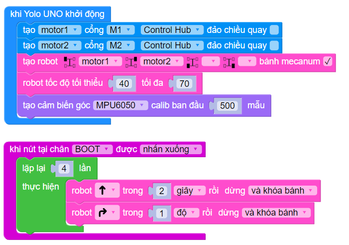

7. Cảm biến góc
=========

Ngoài cảm biến tốc độ encoder, chúng ta có thể giúp robot quay góc chính xác bằng cảm biến góc MPU6050 đã được tích hợp sẵn trên mạch ORC Control Hub. Cảm biến này đo được 6 trục, 3 trục XYZ của gia tốc và 3 trục XYZ của gyroscope.

1. Giới thiệu khối lệnh
---------
-----

..  figure:: images/7.2.png
    :scale: 70%
    :align: center 
|

.. code-block:: guess

    from mpu6050 import MPU6050
    from angle_sensor import AngleSensor
    imu = MPU6050()
    angle_sensor = AngleSensor(imu)
    angle_sensor.calibrate(500)
    create_task(angle_sensor.run()) # chạy tác vụ ngầm luôn cập nhật và tính toán góc quay hiện tại
    robot.angle_sensor(angle_sensor)

Khởi tạo cảm biến góc MPU6050 và chạy tinh chỉnh ban đầu với 500 mẫu. Việc tinh chỉnh này là cần thiết vì mỗi cảm biến luôn có sai số khác nhau. Số mẫu càng cao thì càng chính xác nhưng làm chương trình khởi chạy tốn thêm thời gian.

.. code-block:: guess

    angle_sensor.heading
    angle_sensor.pitch
    angle_sensor.roll

Đọc các góc quay của cảm biến, bao gồm heading (còn gọi là yaw), pitch và roll đã được tính toán sẵn. Bạn có thể tham khảo hình dưới đây để hiểu rõ chiều quay của các thông số này.

..  figure:: images/7.5.png
    :scale: 80%
    :align: center 
|

Thông thường, thông số heading (yaw) là thường dùng vì nó cho ta biết robot đang quay về góc nào khi đặt trên mặt phẳng di chuyển. Khi bật cảm biến góc quay, thư viện sẽ tự động sử dụng thông tin này để xử lý giúp robot có thể di chuyển chính xác hơn (đi thẳng và quay góc chính xác).

3. Chương trình mẫu
---------
-----------

Chương trình sau khởi tạo robot 2 bánh có sử dụng cảm biến góc và di chuyển một hình vuông khi nút BOOT trên ORC Control Hub được nhấn.

|

**Chương trình Python**

.. code-block:: guess

    import yolo_uno
    from mdv2 import *
    from motor import *
    from drivebase import *
    from mpu6050 import MPU6050
    from angle_sensor import AngleSensor
    from abutton import *

    async def on_BOOT_pressed():
        for count in range(4):
            await robot.forward_for(2, unit=SECOND, then=BRAKE)
            await robot.turn_right_for(90, unit=DEGREE, then=BRAKE)

    md_v2 = MotorDriverV2()
    motor1 = DCMotor(md_v2, M1, reversed=False)
    motor2 = DCMotor(md_v2, M2, reversed=False)
    robot = DriveBase(MODE_2WD, m1=motor1, m2=motor2, m3=None, m4=None)
    imu = MPU6050()
    angle_sensor = AngleSensor(imu)
    btn_BOOT= aButton(BOOT_PIN)

    def deinit():
        robot.stop()
        btn_BOOT.deinit()

    yolo_uno.deinit = deinit

    async def setup():
        robot.speed(90, min_speed=40)
        angle_sensor.calibrate(500)
        create_task(angle_sensor.run())
        robot.angle_sensor(angle_sensor)
        btn_BOOT.pressed(on_BOOT_pressed)

    async def main():
        await setup()
        while True:
            await asleep_ms(100)

    run_loop(main())
