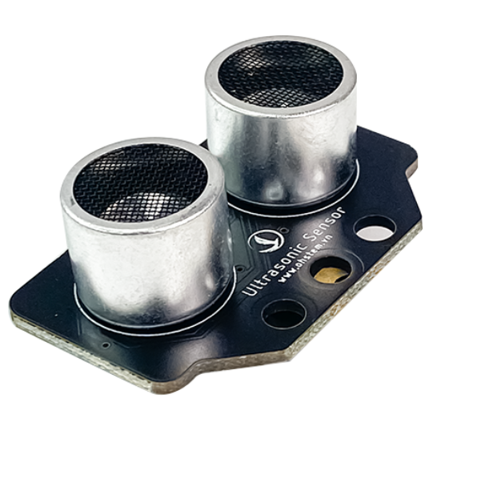

8. Cảm biến khoảng cách
========

Trong bài học này, chúng ta sẽ lập trình cho robot có thể phát hiện và tránh né vật cản khi di chuyển nhờ **cảm biến khoảng cách (cảm biến siêu âm)**. 

Cảm biến siêu âm được sử dụng để đo khoảng cách tới vật cản phía trước, giúp robot di chuyển an toàn, tránh va chạm với chướng ngại vật. Khi gặp vật cản, robot có thể được lập trình để rẽ hướng khác hoặc quay đầu.

    Cảm biến siêu âm

Cảm biến có 2 mắt: Một mắt phát và một mắt thu. Mắt phát có thể tạo ra âm thanh ở tần số cao mà tai người không thể nghe được. Mắt thu giúp phát hiện tiếng vang phản hồi về của âm thanh tần số cao khi nó gặp vật cản. Bằng cách đo khoảng thời gian của tiếng vang, bạn có thể tính toán khoảng cách giữa cảm biến và vật cản. 

    Cách hoạt động của cảm biến siêu âm

Phạm vi đo tối đa của cảm biến là 200cm (2m) và chúng chỉ phát hiện được vật cản trước mặt, không phát hiện được vật cản bên trái hoặc bên phải. Chúng ta dùng dây cắm chuẩn Grove gồm 4 dây tín hiệu khác nhau để kết nối cảm biến với ORC Control Hub:
   
    + Đỏ: nguồn dương (+)
    + Đen: Nguồn âm (đất, ground)
    + Vàng: Tín hiệu 1, phát ra sóng âm (Trigger)
    + Trắng: Tín hiệu 2, thu sóng âm phản xạ về (Echo) 

1. Kết nối phần cứng
---------
------

Kết nối cảm biến khoảng cách cổng màu trắng D3-D4 trên mạch ORC Control Hub.

    Kết nối module cảm biến siêu âm với ORC Control Hub
|

2. Chương trình mẫu
------------
---------

Chương trình dưới đây cho robot khi di chuyển sẽ phát hiện và tránh né vật cản. 

|

**Chương trình Python**

.. code-block:: guess

    import yolo_uno
    from motor import *
    from mdv2 import *
    from drivebase import *
    from ultrasonic import *

    md_v2 = MotorDriverV2()
    motor1 = DCMotor(md_v2, M1, reversed=False)
    motor2 = DCMotor(md_v2, M1, reversed=False)
    robot = DriveBase(MODE_2WD, m1=motor1, m2=motor2, m3=None, m4=None)
    ultrasonic = Ultrasonic(D3_PIN, D4_PIN)

    def deinit():
        robot.stop()

    yolo_uno.deinit = deinit

    async def task_forever():
        while True:
            robot.forward()
        if ultrasonic.distance_cm() < 15:
            await robot.backward_for(1, unit=SECOND, then=STOP)
            await robot.turn_left_for(1, unit=SECOND, then=STOP)
        await asleep_ms(50)

    async def setup():
        create_task(task_forever())

    async def main():
    await setup()
    while True:
        await asleep_ms(100)

    run_loop(main())