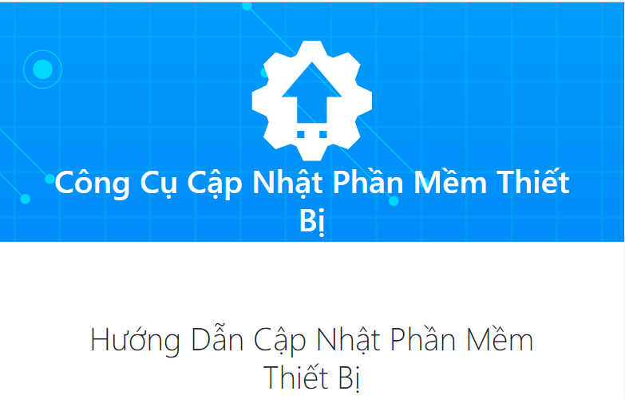
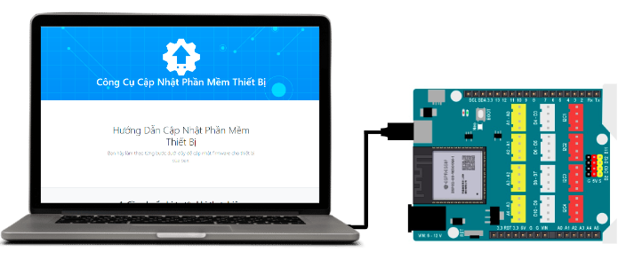
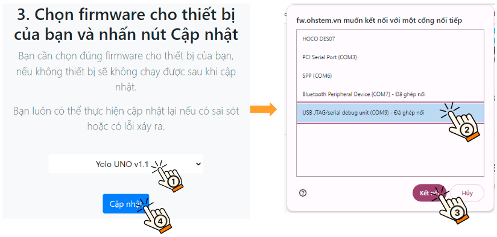
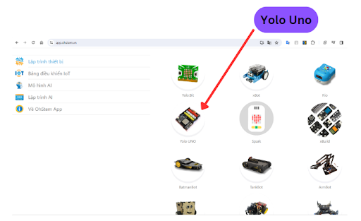
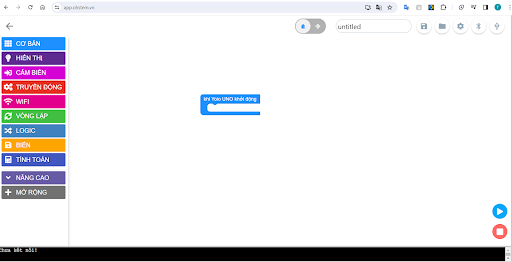
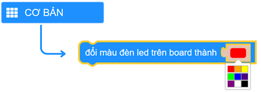
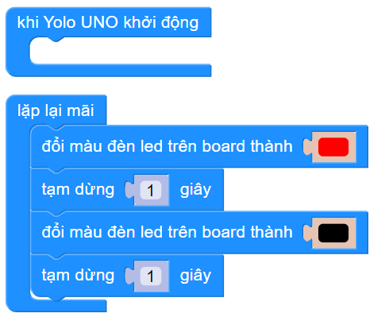

3. Chương trình đầu tiên
==========

Trong phần này, bạn sẽ tìm hiểu về cách làm việc với mạch Yolo UNO bằng phần mềm lập trình OhStem App, sau đó ứng dụng vào viết các chương trình cơ bản đầu tiên:

- Bật tắt đèn LED trên mạch Yolo UNO.
- Bật tắt đèn LED bằng nút nhấn trên mạch.

1. Cập nhật firmware
--------
--------

Phần mềm bên trong Yolo UNO (firmware) được OhStem nâng cấp và cập nhật thường xuyên. Do đó, khi mới dùng lần đầu, bạn nên cập nhật để đảm bảo thiết bị đang chạy firmware mới nhất, giúp chạy ổn định hơn.

- **Bước 1:** Truy cập vào link `<https://fw.ohstem.vn/>`_: 

|

- **Bước 2:** Kết nối mạch Yolo UNO với laptop bằng dây USB Type C:

|

- **Bước 3:** **Nhấn và giữ nút Boot** trên Yolo UNO, **trong lúc đó nhấn nút Reset và thả ra sau 1 giây**, **sau đó mới thả nút Boot** để thiết bị vào trạng thái sẵn sàng cập nhật firmware:

..  figure:: images/3.3.gif
    :scale: 100%
    :align: center 
|

- **Bước 4:** Chọn firmware cần cập nhật là **Yolo UNO v1.1**, chọn cổng kết nối có tên là **USB/JTAG serial…** và nhấn **Cập nhật**.

|

- **Bước 5:** Chọn **Install** để tiếp tục cập nhật firmware

..  figure:: images/3.5.png
    :scale: 100%
    :align: center 
|

- **Bước 6:** Chờ khoảng 2 phút để cập nhật. Màn hình hiển thị cập nhật thành công như hình:

..  figure:: images/3.6.png
    :scale: 100%
    :align: center 
|

- **Bước 7:** Nhấn nút Reset và thoát khỏi trang web cập nhật firmware và tiến hành lập trình.

2. Kết nối Yolo UNO với phần mềm lập trình OhStem App
-------
---------

- **Bước 1:** Truy cập vào link `<https://app.ohstem.vn/>`_:

..  figure:: images/3.7.png
    :scale: 100%
    :align: center 
|

- **Bước 2:** Chọn thiết bị lập trình là Yolo UNO

|

- **Bước 3:** Chọn vào **Lập trình**:

|

- **Bước 4:**

    + Kết nối Yolo UNO vào máy tính và phần mềm lập trình
    + Kết nối dây USB type C với Máy tính và Yolo UNO.

..  figure:: images/3.10.png
    :scale: 100%
    :align: center 
|

    + Chọn icon kết nối có dây/ Bluetooth → chọn cổng COM/ thiết bị có tên gần giống là **Espressif CDC Device (COMxx)** → nhấn nút Kết nối. (Số thứ tự của cổng COM có thể là khác nhau trên mỗi máy tính.)

..  figure:: images/3.11.png
    :scale: 100%
    :align: center 
|

    + Khi kết nối thành công biểu tượng USB sẽ sáng đèn màu xanh:

..  figure:: images/3.12.png
    :scale: 100%
    :align: center 
|

3. Chương trình 1: Nháy đèn LED trên mạch
--------
--------

Trong bài này, chúng ta sẽ viết chương trình đầu tiên, lập trình cho Yolo UNO bật tắt đèn LED màu trên board sau mỗi giây.

- **Giới thiệu khối lệnh lập trình:**

|

Câu lệnh dùng để thay đổi màu đèn led RGB trên board, màu đen dùng để tắt đèn.

- **Chương trình lập trình:**

|

- **Link chương trình mẫu:**

Bật tắt đèn LED trên board: `Xem code mẫu tại đây <https://app.ohstem.vn/#!/share/yolouno/2aLcEMEIMJYYvq47M7660i2djBN>`_ hoặc quét mã QR bên dưới:

|