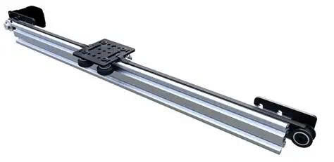
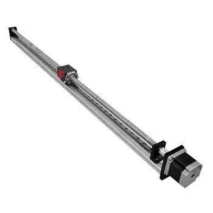

11. Kit mở rộng nâng - hạ
============

Ngoài cách lắp ráp cơ bản, bạn có thể nâng cấp cơ cấu nâng hạ cho robot thông qua hướng dẫn lắp ráp sau:

`Xem HDLR <https://www.canva.com/design/DAG3DPvRGIo/sWp93ezBbGOIyaHe6vY7yA/view?utm_content=DAG3DPvRGIo&utm_campaign=designshare&utm_medium=link2&utm_source=uniquelinks&utlId=h6ef5366a81>`_

`Mua sản phẩm <https://shop.ohstem.vn/bo-nang-ha-robot-ORC>`_

`File 3D robot <https://grabcad.com/library/orc-parts-1/details?folder_id=14037169>`_

`Video minh họa hoạt động <https://youtu.be/j6eztPLkGlQ?si=keRkseM0UePXGyZl>`_

Gợi ý thêm các bộ phận để mở rộng thêm bộ nâng:

**Cơ cấu dùng ray trượt**

|

**Cơ cấu dùng vitme**

|

