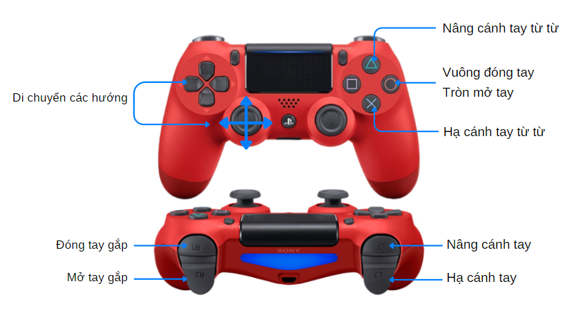

6. Robot điều khiển từ xa bằng Gamepad
=============

Ngoài di chuyển tự động, một trong những tính năng quan trọng trong các dự án làm robotics hoặc cuộc thi robocon đó là khả năng điều khiển từ xa qua mobile app hoặc các tay cầm điều khiển (gamepad) như PS4.

1. **Tay cầm điều khiển (gamepad)**
-----
--------

Tay cầm điều khiển là thiết bị không thể thiếu trong các cuộc thi về robotics, giúp người chơi có thể điều khiển chính xác với tốc độ cao các hoạt động của robot. Tay cầm điều khiển chúng ta sử dụng có kiểu dáng giống tay cầm tiêu chuẩn PS4 mà bạn thường thấy trong các máy chơi game PlayStation của Sony.

    Các nút nhấn trên gamepad
|

..  figure:: images/6.2.png
    :scale: 80%
    :align: center 

    Chức năng của các nút trên Gamepad
|

Trong phần này, chúng ta sẽ bổ sung chương trình ở bài trước để robot có thể được điều khiển bằng phần mềm OhStem app trên di động hoặc từ tay cầm điều khiển theo bảng gán chức năng sau.

..  csv-table:: 
    :widths: 15, 45

    "**Nút nhấn Gamepad**", "**Chức năng**"
    "Lên, xuống, trái, phải, Joystick trái", "- Di chuyển robot theo các hướng tới lùi trái phải.
    - Riêng với robot sử dụng bánh xe mecanum thì nút trái/phải để đi ngang trái/phải, còn joystick kéo qua trái/phải để quay trái/phải."
    "L1 và L2", "Nâng và hạ cánh tay gắp hết hành trình"
    "R1 và R2", "Đóng và mở tay gắp hết hành trình"
    "Cross (X)", "Hạ tay gắp từ từ"
    "Triangle (tam giác)", "Nâng tay gắp từ từ"
    "Square (vuông)", "Không làm gì"
    "Circle (tròn)", "Không làm gì"

**2. Kết nối phần cứng**
----------
---------

Trong trường hợp bạn có bộ tay cầm PS4 và module nhận tín hiệu, bạn cần kết nối module nhận tín hiệu vào cổng I2C màu đỏ bất kỳ trên mạch Yolo UNO do module này giao tiếp thông qua chuẩn I2C.

    Kết nối module gamepad receiver với Yolo UNO

Nếu bạn không có sẵn tay cầm PS4, bạn hoàn toàn có thể sử dụng giao diện tay cầm điều khiển trên OhStem mobile app.

|

|

**3. Giới thiệu khối lệnh**
--------
--------

Các khối lệnh để bật chế độ điều khiển từ xa nằm trong phần Di chuyển.

..  figure:: images/6.7.png
    :scale: 100%
    :align: center 

.. code-block:: guess

    await robot.run_teleop(gamepad: Gamepad, accel_steps=5)

Bật chế độ điều khiển từ xa bằng gamepad hoặc Ohstem App. Khi chế độ này được bật, thư viện tự động xử lý các nút lệnh gửi đến liên quan đến di chuyển như tới, lui, trái, phải và cả joystick bên trái của gamepad.

**Tham số:**
    
    - **gamepad**: Đối tượng nhận các lệnh được nhấn trên gamepad (OhStem App hoặc tay cầm PS4)
    - **accel_steps**: Độ nhạy. Độ nhạy càng cao thì robot di chuyển càng nhanh nhưng sẽ khó di chuyển chính xác. Ngược lại, độ nhạy càng nhỏ thì robot tăng tốc chậm hơn nhưng sẽ dễ dàng di chuyển chính xác hơn.

.. code-block:: guess

    robot.on_teleop_command(cmd, callback)

Khai báo các lệnh cần chạy khi một nút nhấn trên gamepad được nhấn.

**Tham số:**
    
    - **cmd**: Tên nút nhấn trên gamepad cần xử lý, nhận các giá trị:
        
        + BTN_UP, BTN_DOWN, BTN_LEFT, BTN_RIGHT
        + BTN_SQUARE (nút vuông), BTN_TRIANGLE (tam giác), BTN_CROSS (nút X), BTN_CIRCLE (nút tròn)
        + BTN_L1, BTN_R1, BTN_L2, BTN_R2

    - **callback**: Hàm xử lý khi nút nhấn được nhấn

.. code-block:: guess

    gamepad.data[PARAM]

Lấy các thông số trạng thái hiện tại của 1 trong 2 joystick có trên gamepad.

**Tham số:**

    - **PARAM**: Thông số cần lấy giá trị, nhận một trong các giá trị:
        + ALX: Trục X của joystick trái
        + ALY: Trục Y của joystick trái
        + AL_DIR: Góc quay của joystick trái
        + AL_DISTANCE: Khoảng cách kéo của joystick trái
        + ARX = 'ARX'
        + ARY: Trục Y của joystick phải
        + AR_DIR: Góc quay của joystick phải
        + AR_DISTANCE: Khoảng cách kéo của joystick phải

.. code-block:: guess

    robot.mode_auto = True

Tắt chế độ điều khiển bằng gamepad, được dùng khi chuyển sang chạy chế độ tự động. Sau khi chạy xong chế độ tự động, có thể gọi lại khối lệnh bật chế độ điều khiển bằng gamepad lại.

**3. Chương trình mẫu**
--------
--------

..  figure:: images/6.11.jpg
    :scale: 80%
    :align: center 

