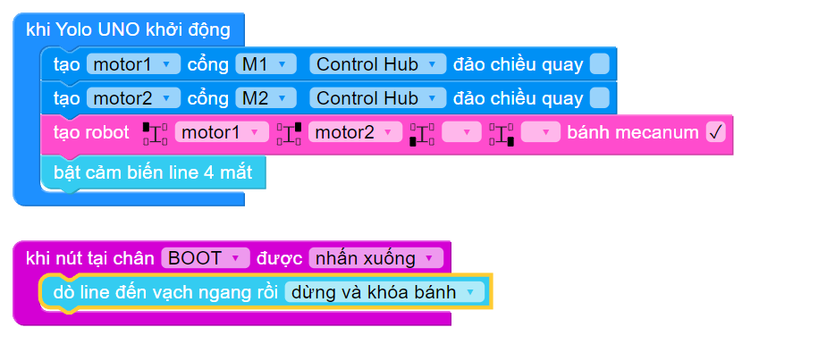

9. Robot dò line
==========

Trong bài học này, chúng ta sẽ tìm hiểu cách lập trình cho robot di chuyển theo vạch đen trên sa bàn sử dụng cảm biến dò line 4 mắt.

Cảm biến dò line được dùng để phát hiện màu đen và màu trắng trên nền thông qua tia hồng ngoại. Dựa vào đặc tính phản xạ ánh sáng trên bề mặt, cảm biến sẽ phát hiện được màu đen và trắng: 

..  csv-table:: 
    :widths: 15, 45

    "**Màu sắc bề mặt**", "**Đặc tính phản xạ**"
    "Trắng", "**Phản xạ lại gần như toàn bộ tia hồng ngoại nhận được**. Cảm biến nhận tia hồng ngoại ở mức tối đa."
    "Đen", "**Hấp thụ hầu hết tia hồng ngoại**. Cảm biến nhận tia hồng ngoại ở mức tối thiểu."

|

Nhờ vào đó, chúng ta có thể xây dựng nhiều tính năng khác nhau cho robot như:

- Robot có thể di chuyển chính xác theo đường đi màu đen mà chúng ta đã thiết lập sẵn trên nền trắng, giống như một đoàn tàu di chuyển trên các đường ray. 
- Robot tự động né các vạch đen để tránh khỏi khu vực nguy hiểm, bằng việc robot rẽ hướng hoặc quay đầu khi thấy vạch đen. Các vạch đen lúc này đóng vai trò như một “đường bảo vệ”, để giữ robot ở bên trong hoặc bên ngoài một khu vực nhất định.
- Robot đếm số vạch đen mà nó đã đi qua khi đang di chuyển, nhờ đó ta có thể lập trình để robot dừng lại hoặc quay đầu, rẽ hướng khác khi đạt đến số vạch mong muốn.
- Robot tự động tránh việc bị rơi bằng cách dừng lại, khi giá trị trả về của cảm biến quá cao (đồng nghĩa với phía trước robot đang là điểm rơi, chẳng hạn như mép bạn, bậc thang,...)

    Cảm biến dò line 4 mắt

1. Kết nối phần cứng
------
--------

Cảm biến dò line sử dụng giao tiếp I2C nên cần cắm vào cổng màu đỏ bất kỳ trên ORC Control Hub.

    Kết nối module cảm biến dò line 4 mắt với ORC Control Hub
|

2. Chuẩn bị sa bàn
---------
-------

Bạn có thể in ra một sa bàn dò đường đã được thiết kế sẵn hoặc sử dụng băng keo đen (có thể mua rất dễ dàng ở các cửa hàng điện nước) dán lên các bề mặt sáng

    Một thiết kế sa bàn dò đường

**Cách thức hoạt động**

Để robot có thể dò đường theo đúng đường line đen trên sa bàn, chúng ta cần tìm hiểu các tình huống có thể xảy ra như sau:

    Các trường hợp di chuyển của robot với từng mắt đọc

Các trường hợp này đều đã được thư viện xử lý giúp chúng ta khiến cho việc lập trình robot dò line trở nên rất dễ dàng. Thay vào đó, chúng ta có thể tập trung vào xây dựng logic chức năng theo yêu cầu của bài thi đấu.

3. Chương trình mẫu
----------
---------

Chương trình dưới đây sẽ điều khiển robot di chuyển theo đường line đen cho đến vạch đen kế tiếp mỗi khi nhấn nút BOOT có trên ORC Control Hub.

|

Ngoài ra, còn có các khối lệnh điều khiển robot di chuyển đến cuối vạch đen, xoay cho đến khi gặp vạch đen… dùng cho các tình huống khác nhau trên sa bàn.

|

Lưu ý: Bạn cần kết nối cảm biến dò line vào đúng cổng I2C màu đỏ trên mạch ORC Control Hub và cảm biến phải được tinh chỉnh để phân biệt được nền trắng vào nền đen trên sa bàn thì chức năng di chuyển này mới hoạt động chính xác được.
