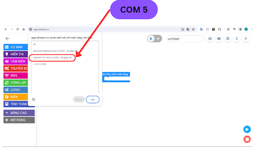
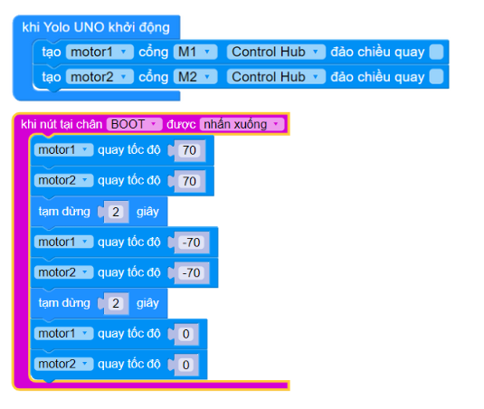
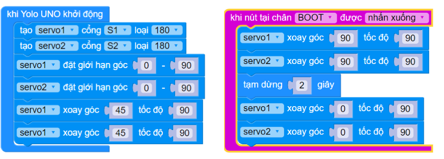

4. Làm việc với động cơ
===========

Trong bài hướng dẫn này, bạn sẽ tìm hiểu cách làm việc với động cơ DC và động cơ Servo có trong bộ Robotics Starter Kit.

1. **Cài đặt thư viện Robotics Open Platform**
------
----

Để làm được điều đó, bạn cần cài đặt thư viện Robotics Open Platform trong giao diện lập trình của ORC Control Hub trên OhStem App theo các bước sau:

- **Bước 1:** Mở OhStem App qua link `<https://app.ohstem.vn/>`_:

- **Bước 2:** Kết nối ORC Control Hub với OhStem App qua USB hoặc Bluetooth, cho đến khi biểu tượng kết nối hiển thị màu xanh, báo hiệu đã kết nối thành công:

    Kết nối ORC Control Hub với máy tính:

    Click vào icon USB, chọn cổng COM kết nối với ORC Control Hub để kết nối

..  figure:: images/3.12.png
    :scale: 100%
    :align: center 

    Kết nối thành công

- **Bước 3**: Chọn mục **“Mở rộng”**, tìm kiếm thư viện mở rộng **ROBOTICS**:

    Kết nối thành công

- **Bước 4:** Sau khi cài đặt, trên danh mục khối lệnh bên trái sẽ xuất hiện ROBOTICS. **Bạn cần click vào danh mục này** để mở ra các khối lệnh con bên trong:

Trong tài liệu này, chúng ta sẽ dùng các khối lệnh trong các danh mục trên để lập trình các tính năng của Robot.

**2. Động cơ DC**
-----------
------

Robot của chúng ta có thể di chuyển là nhờ 2 động cơ DC trái và phải. Trong bài này, chúng ta sẽ thử làm việc với từng động cơ riêng biệt, cấu hình và lập trình điều khiển động cơ DC quay tới và lùi.

Để làm việc với đúng động cơ, chúng ta cần biết rõ động cơ nào được nối vào cổng nào của ORC Control Hub. Theo hướng dẫn lắp ráp của bộ kit, động cơ bên trái được nối vào cổng M1 và động cơ bên phải nối vào cổng M2.

- **Giới thiệu khối lệnh:**

Các khối lệnh làm việc với động cơ nằm trong danh mục Động cơ, chúng ta cần quan tâm đến các khối lệnh trong phần Động cơ DC.

|

- **Ý nghĩa các khối lệnh:**

.. code-block:: guess

    class DCMotor(driver, port, reversed=False)

Khai báo động cơ nối với một cổng trên mạch điều khiển. Có thể chọn 1 trong các cổng M1, M2, M3, M4, E1, E2. 

Nếu dùng mạch điều khiển V1 thì chọn motor driver V1, nếu là mạch V2 thì chọn V2. 

Mặc định khi động cơ quay với tốc độ >0 thì sẽ quay theo chiều kim đồng hồ (nhìn thẳng từ trước mặt vào bánh xe). Nếu dùng động cơ nối dây bị ngược, có chiều quay mặc định ngược lại thì bật lựa chọn “đảo chiều quay” để đổi ngược lại.

**Tham số:**

- **driver**: Đối tượng MotorDriver để điều khiển động cơ.
- **port**: Cổng trên mạch ORC Control Hubmà động cơ gắn vào. Nhận các giá trị: M1, M2, M3, M4 (động cơ thường), E1, E2 (động cơ encoder)
- **reversed**: Đảo chiều quay mặc định của động cơ nếu là True

.. code-block:: guess

    set_encoder(rpm, ppr, gears)

Bật cảm biến tốc độ dùng encoder trên động cơ có hỗ trợ cảm biến encoder (loại động cơ có 6 dây tín hiệu thay vì 2 dây).

Các thông số này cần tham khảo thông tin từ nhà sản xuất, mỗi loại động cơ có giá trị khác nhau.

**Tham số:**

- **rpm**: Tốc độ quay tối đa của động cơ (Revolutions Per Minute)
- **ppr**: Số encoder ticks đếm được khi động cơ quay hết 1 vòng (Pulse per Revolution)
- **gears**: Tỉ số truyền của động cơ. Ví dụ nếu động cơ có tỉ số truyền là 1:90 thì gears = 90

.. code-block:: guess
    
    run(speed)

Cho động cơ quay với tốc độ chỉ định. 

**Tham số:**

    - **speed**: Tốc độ chỉ định, đơn vị là % so với tốc độ tối đa của động cơ, nhận giá trị từ -100 đến 100. Tốc độ < 0: Động cơ quay ngược chiều kim đồng hồ và ngược lại.

.. code-block:: guess
    
    await run_time(speed, time, then=STOP):

Cho động cơ quay trong một khoảng thời gian chỉ định.

**Tham số:**
    
    - **speed**: Tốc độ, đơn vị %, nhận giá trị từ -100 đến 100
    - **time**: Thời gian cần quay, đơn vị là giây. Hết thời gian động cơ dừng lại
    - **then**: Chế độ dừng lại khi hết thời gian, mặc định là STOP (dừng bình thường, không cấp nguồn và để động cơ tự dừng lại sau khi quay hết quán tính) hoặc BRAKE (cấp nguồn để khóa bánh lại ngay lập tức)

.. code-block:: guess
    
    await run_angle(speed, angle, then=BRAKE)

Cho động cơ quay hết một góc chỉ định rồi dừng lại. Câu lệnh này chỉ áp dụng cho các động cơ có hỗ trợ và có bật cảm biến encoder.

**Tham số:**
    
    - **speed**: Tốc độ, đơn vị %, nhận giá trị từ -100 đến 100
    - **angle**: Góc cần quay, đơn vị là độ. Quay đến góc này thì động cơ dừng lại
    - **then**: Chế độ dừng lại khi hết thời gian, mặc định là **BRAKE** (khóa bánh lại ngay lập tức) hoặc **STOP** (dừng bình thường, và để động cơ tự dừng lại sau khi quay hết theo quán tính).

.. code-block:: guess
    
    await run_rotation(speed, rotation, then=BRAKE)

Cho động cơ quay theo số vòng chỉ định rồi dừng lại. Câu lệnh này chỉ áp dụng cho các động cơ có hỗ trợ và có bật cảm biến encoder.

**Tham số:**

    - **speed**: Tốc độ, đơn vị %, nhận giá trị từ -100 đến 100
    - **rotation**: Số vòng cần quay.
    - **then**: Chế độ dừng lại khi hết thời gian, mặc định là BRAKE (khóa bánh lại ngay lập tức) hoặc STOP (dừng bình thường, không cấp nguồn và để động cơ tự dừng lại sau khi quay hết quán tính).

.. code-block:: guess
    
    await run_until_stalled(speed, then=STOP)

Quay động cơ cho đến khi phát hiện bị kẹt. Chỉ áp dụng với động cơ có cảm biến tốc độ encoder

**Tham số:**

    - **speed**: Tốc độ, đơn vị %, nhận giá trị từ -100 đến 100

.. code-block:: guess
    
    motor1.angle()

Trả về góc (đơn vị: độ) đã xoay tính từ khi bắt đầu chương trình hoặc sau khi reset. Chỉ áp dụng với động cơ có cảm biến tốc độ encoder.

.. code-block:: guess
    
    motor1.encoder_ticks()

Trả về số ticks encoder đo được tính từ khi bắt đầu chương trình hoặc sau khi reset. Chỉ áp dụng với động cơ có cảm biến tốc độ encoder.

.. code-block:: guess
    
    motor1.speed()

Trả về tốc độ quay hiện tại của động cơ trong 100ms gần nhất, đơn vị là rpm (revolutions per minute). Chỉ áp dụng với động cơ có cảm biến tốc độ encoder.

.. code-block:: guess
    
    motor1.reset_angle()

Reset số encoder ticks đã quay về lại 0.

**Chương trình mẫu**

Chương trình sau sẽ quay 2 động cơ tới 2 giây và quay ngược 2 giây rồi dừng lại mỗi khi nhấn nút Boot trên mạch ORC Control Hub.

|

**Chương trình Python**

.. code-block:: guess

    import yolo_uno
    from mdv2 import *
    from motor import *
    from abutton import *

    md_v2 = MotorDriverV2()
    motor1 = DCMotor(md_v2, M1, reversed=False)
    motor2 = DCMotor(md_v2, M2, reversed=False)
    btn_BOOT= aButton(BOOT_PIN)

        async def on_button_BOOT_pressed():
        motor1.run(70)
        motor2.run(70)
        await asleep_ms(2000)
        motor1.run((-70))
        motor2.run((-70))
        await asleep_ms(2000)
        motor1.run(0)
        motor2.run(0)

    async def setup():
        btn_BOOT.pressed(on_abutton_BOOT_pressed)

    async def main():
        await setup()
        while True:
            await asleep_ms(100)

    run_loop(main())

Chúng ta lưu ý là khi nhìn vào bánh xe, khi động cơ quay với tốc độ dương thì bánh xe sẽ quay theo chiều kim đồng hồ, còn nếu tốc độ là số âm, thì bánh xe sẽ quay ngược chiều kim đồng hồ. 

Do động cơ bên trái được lắp ngược bên với động cơ phải nên 2 bánh sẽ luôn quay ngược chiều nhau khi 2 động cơ cùng quay với tốc độ dương hoặc âm. Tạm thời chúng ta không cần quan tâm vấn đề này vì thư viện robotics sẽ tự đảo chiều động cơ khi chúng ta cấu hình robot và các motor dùng để di chuyển ở phần sau.

**3. Động cơ Servo**
------
--------

Động cơ servo được sử dụng trong các cơ cấu tay gắp đóng mở hoặc di chuyển lên xuống với các góc cố định. Khác với động cơ DC dùng để di chuyển và quay bánh xe, servo có thể quay một góc chính xác trong khoảng từ 0 đến 180 độ hoặc 270 tùy loại servo. Tính năng này rất phù hợp cho các cơ cấu đóng mở, lên xuống theo một hành trình cố định.

Hai servo đi kèm bộ tay gắp 2 bậc là loại servo 180 độ. Chúng ta sẽ thử lập trình điều khiển góc của các động cơ này để tạo hành động đóng/mở và nâng/hạ của tay gắp.

- **Kết nối phần cứng**

Động cơ servo phụ trách việc nâng/hạ tay gắp ta sẽ quy ước là servo 1 và nối vào cổng S1 trên mạch Motor Driver, và servo phụ trách việc đóng/mở tay gắp ta quy ước là servo 2, nối vào cổng S2.

- **Giới thiệu khối lệnh**

Các khối lệnh làm việc với động cơ servo cũng nằm trong danh mục khối lệnh Động cơ.

|

.. code-block:: guess

    class Servo(driver, port, max_angle)

**Tham số:**
    
    - **driver**: Đối tượng sử dụng để điều khiển mạch motor driver
    - **port**: Cổng kết nối servo với mạch motor driver, nhận các giá trị S1, S2, S3, S4
    - **max_angle**: Góc quay tối đa của loại servo đang sử dụng, nhận các giá trị 180, 270 hay 360 (loại quay liên tục được như động cơ DC nhưng không quay đến góc chính xác được)

.. code-block:: guess

    servo1.limit(min, max)

Đặt giới hạn góc quay cho servo để bảo vệ động cơ tránh quay quá góc kẹt, gây hư hỏng cháy động cơ servo. Góc giới hạn này tùy thuộc vào cơ cấu mà chúng ta lắp ráp. 

Khi quay đến giới hạn, thư viện sẽ không cho servo quay quá giới hạn dù nhận được lệnh điều khiển mới.

**Tham số:**

    - **min**: Góc quay nhỏ nhất
    - **max**: Góc quay tối đa

.. code-block:: guess

    await servo1.run_angle(angle, speed=100)

Quay động cơ servo đến góc chỉ định với tốc độ chỉ định.

**Tham số:**
    
    - **angle**: Góc cần quay
    - **speed**: Tốc độ quay, mặc định là 100

.. code-block:: guess

    await servo1.run_steps(steps, speed=100)

Quay động cơ servo thêm một góc chỉ định với tốc độ chỉ định. Ví dụ servo đang ở góc 90, nếu quay thêm 90 thì servo sẽ quay đến góc 180 độ.

**Tham số:**

    - steps: Giá trị góc cần quay thêm, có thể âm hoặc dương tùy chiều cần quay thêm
    - speed: Tốc độ quay

.. code-block:: guess

    servo1.spin(speed)

Quay tròn động cơ (như động cơ DC) với tốc độ chỉ định. Nếu tốc độ âm, quay theo chiều ngược lại. Chỉ áp dụng cho động cơ servo loại 360 độ.

**Tham số:**
    
    - **speed**: Tốc độ quay, nhận giá trị từ -100 đến 100.

- **Chương trình mẫu:**

Chương trình sau khai báo 2 động cơ servo, và quay góc để tay gắp nâng lên hạ xuống, đóng và mở sau 2 giây.

|

- **Chương trình Python:** 

.. code-block:: guess

    from servo import *
    from mdv2 import *
    from abutton import *

    md_v2 = MotorDriverV2()
    servo1 = Servo(md_v2, S1, 180)
    servo2 = Servo(md_v2, S2, 180)
    btn_BOOT= aButton(BOOT_PIN)

    async def on_abutton_BOOT_pressed():
        await servo1.run_angle(angle=90, speed=90)
        await servo2.run_angle(angle=90, speed=90)
        await asleep_ms(2000)
        await servo1.run_angle(angle=0, speed=90)
        await servo2.run_angle(angle=0, speed=90)

    async def setup():
        servo1.limit(min=0, max=90)
        servo2.limit(min=0, max=90)
        await servo1.run_angle(angle=45, speed=90)
        await servo2.run_angle(angle=45, speed=90)
        btn_BOOT.pressed(on_abutton_BOOT_pressed)

    async def main():
        await setup()
        while True:
            await asleep_ms(100)

    run_loop(main())