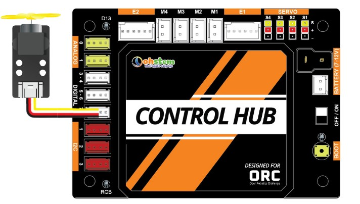

1. Giới thiệu
=============

Tài liệu này là chuỗi nhiều bài hướng dẫn bạn làm quen, lắp ráp, lập trình và làm chủ bộ kit robot ORC, để bạn có thể tự chế tạo một hệ thống robot hoạt động theo ý mình, phục vụ các ứng dụng khác nhau hoặc trong các cuộc thi Robocon hoàn thành các nhiệm vụ theo yêu cầu.

Các bài hướng dẫn sẽ giới thiệu song song 2 ngôn ngữ lập trình:

- Ngôn ngữ khối lệnh kéo thả: phù hợp với những người mới bắt đầu, chưa có kiến thức về lập trình 

- Python: dành cho người đã có nền tảng lập trình, muốn hiện thực các tính năng phức tạp hơn hoặc nâng cao kiến thức lập trình của mình

Bộ kit robot chúng ta sẽ xây dựng theo tài liệu hướng dẫn này là một robot tiêu chuẩn có 2 động cơ và 4 bánh. Tuy nhiên, bạn hoàn toàn có thể tự sáng tạo ra một bộ robot của riêng mình vì thư viện Robotics Open Platform chúng ta sẽ sử dụng do OhStem xây dựng là nguồn mở, được thiết kế để đáp ứng các thiết kế robot khác nhau, đáp ứng linh hoạt các nhu cầu khác nhau.

1. Bộ kit ORC
---------
-----------

Trong phần này, bạn sẽ làm quen với bộ kit ORC (OhStem Robotics Challenge) của OhStem, bộ kit được sử dụng trong tài liệu về Robotics này. Bộ kit này có đầy đủ các thành phần để giúp bạn dễ dàng lắp ráp được một xe robot tiêu chuẩn có 4 bánh, 2 động cơ và tay gắp 2 bậc giúp robot thao tác gắp thả di chuyển các vật theo ý muốn.

Sau khi lắp ráp theo hướng dẫn lắp ráp của bộ kit, bạn sẽ có một robot trông giống như thế này:

.. image:: images/1.1.png
    :scale: 60%
    :align: center
|

2. Thành phần chính của robot
-------
-------

Chúng ta sẽ cùng nhau tìm hiểu các thành phần của robot này để hiểu rõ hơn một hệ thống Robotics cần có những gì và chúng hoạt động như thế nào.

2.1. **Mạch điều khiển**
----------

Mạch điều khiển đóng vai trò như bộ não của hệ thống, là bộ phận sẽ thực thi chương trình và xử lý giúp robot hoạt động theo thiết kế. Chúng ta sẽ sử dụng mạch điều khiển tên là ORC Control Hub do OhStem thiết kế dành riêng cho mục đích giáo dục. 

|

Mạch sử dụng dòng chip ESP32-S3, một dòng System-on-Chip (SoC) có bộ xử lý lõi kép 32-bit, tốc độ xung nhịp lên đến 240MHz, low-power, hỗ trợ WiFi chuẩn 2.4 GHz và BLE+Mesh, được tích hợp nhiều tính năng như USB native và bộ tăng tốc xử lý AI (NPU). 3 cổng nguồn vào chuẩn chữ T, XH 2P và Jack DC 5521, hỗ trợ nguồn vào tối đa 12V

Bạn có thể lập trình ORC Control Hub bằng nhiều ngôn ngữ: Arduino C, Python, khối lệnh kéo thả. ORC Control Hub hỗ trợ cả giao tiếp có dây USB và không dây Bluetooth, giúp xây dựng các ứng dụng Robot dễ dàng hơn.

|

Trên mạch ORC Control Hub tích hợp **18 cổng mở rộng**, dùng để kết nối với các động cơ, module cảm biến bên ngoài:

- Tối đa 10 động cơ bao gồm:

    + 2 động cơ DC với Encoder
    + 4 động cơ DC thường
    + 4 động cơ Servo

|

- 8 cổng mở rộng chuẩn Grove: 

|    

Nhờ các dây điện đã chuẩn hóa về nguồn đất và tín hiệu điều khiển, bạn gần như không cần phải lo lắng về việc kết nối các thiết bị với nhau. Các dây kết nối cũng chỉ có 1 chiều cắm, nhằm hạn chế tối đa việc cắm ngược, gây chập nguồn và hư hỏng thiết bị. 

|

Đây là một lợi thế vô cùng lớn của hệ thống mạch điện tử khi đã được chuẩn hóa. Lúc này, xác suất gặp lỗi sẽ ít hơn và bạn có thể tập trung vào việc lập trình của mình, thay vì phải tốn thời gian cho việc tìm lỗi từ việc kết nối mạch.

2.2. **Động cơ**
------------

Có nhiều loại động cơ được sử dụng trong các dự án robotics, mỗi loại có ưu và nhược điểm riêng. Có 2 loại động cơ phổ biến nhất mà chúng ta sẽ sử dụng chính trong dự án này là:

**1 Động cơ DC:**

|

- **Ưu điểm:**

    + Mô-men xoắn cao
    + Tốc độ đa dạng

- **Nhược điểm:**
    
    + Độ chính xác thấp hơn so với servo
    + Kiểm soát chuyển động phức tạp hơn
    + Kích thước lớn hơn

**2 Động cơ Servo:**

    Một số loại động cơ Servo thông dụng
|

- **Ưu điểm:**

    + Độ chính xác cao
    + Kiểm soát chuyển động tốt
    + Kích thước nhỏ gọn
    + Dễ dàng sử dụng

- **Nhược điểm:**
    
    + Mô-men xoắn thấp
    + Tốc độ tương đối chậm

Ngoài ra, còn số 1 loại động cơ khác bạn có thể sẽ dùng đến cho các ứng dụng đặc biệt:

1. **Động cơ bước (Stepper):**

    Một số loại động cơ bước

- **Ưu điểm:**

    + Độ chính xác cao
    + Kiểm soát chuyển động tốt
    + Mô-men xoắn cao
    + Giá thành rẻ

- **Nhược điểm:**
    
    + Tốc độ tương đối chậm
    + Tiếng ồn lớn

2. **Động cơ Brushless:**

- **Ưu điểm:**

    + Hiệu suất cao
    + Độ ồn thấp
    + Tuổi thọ cao
    + Mô-men xoắn cao

- **Nhược điểm:**
    
    + Giá thành cao
    + Kiểm soát phức tạp hơn

3. **Động cơ khí nén:**

- **Ưu điểm:**

    + Mô-men xoắn cao
    + Tốc độ đa dạng
    + Cơ cấu đơn giản, dễ lắp ráp

- **Nhược điểm:**
    
    + Cần nguồn khí nén

Dưới đây là một số lời khuyên để lựa chọn động cơ phù hợp:

    - Nếu bạn cần mô-men xoắn cao và tốc độ đa dạng, hãy sử dụng động cơ DC, dùng nhiều cho các cơ cấu di chuyển, 
    - Nếu bạn cần độ chính xác cao và kiểm soát chuyển động tốt, hãy sử dụng động cơ servo, dùng nhiều cho các cơ cấu gắp thả, lên xuống như cánh tay.
    - Nếu bạn cần độ chính xác cao, mô-men xoắn cao và giá thành rẻ, hãy sử dụng động cơ bước, dùng nhiều trong các máy cần độ chính xác cao như máy in 3D hay CNC
    - Nếu bạn cần hiệu suất cao, độ ồn thấp và tuổi thọ cao, hãy sử dụng động cơ brushless, ví dụ như các cơ cấu bắn bóng hoặc máy bay drone

2.3. **Cảm biến:**
---------

Cảm biến là các bộ phận đầu vào, giúp thu thập dữ liệu từ môi trường bên ngoài. Nút nhấn BOOT có sẵn trên mạch ORC Control Hub cũng có thể xem là bộ phận đầu vào. 

Trong các dự án robotics, các cảm biến thông dụng bao gồm cảm biến tốc độ encoder (thường đi kèm theo động cơ), cảm biến siêu âm (cảm biến khoảng cách) giúp phát hiện vật cản phía trước, cảm biến dò đường giúp robot nhận biết bề mặt đen trắng và đi theo đường kẻ, cảm biến góc giúp robot xoay góc chính xác, cảm biến va chạm…

    Cảm biến khoảng cách và cảm biến dò line 4 mắt
|

2.4. **Nguồn điện - Pin**
------------

Có nhiều loại pin sạc khác nhau được sử dụng cho robot, mỗi loại có ưu và nhược điểm riêng. Dưới đây là một số loại pin sạc phổ biến nhất:

1. **Pin Lithium-Ion (Li-Ion):**

- **Ưu điểm:**

    + Mật độ năng lượng cao (thời gian hoạt động dài)
    + Hiệu suất cao (tỷ lệ tự xả thấp)
    + Tuổi thọ cao (số lần sạc lại cao)

- **Nhược điểm:**
    
    + Kích thước lớn
    + Nguy cơ cháy nổ nếu không sử dụng đúng cách

2. **Pin Lithium-Polymer (Li-Po):**

- **Ưu điểm:**

    + Mật độ năng lượng cao (thời gian hoạt động dài)
    + Hiệu suất cao (tỷ lệ tự xả thấp)
    + Dễ dàng tạo hình
    + Nhẹ và nhỏ gọn

- **Nhược điểm:**
    
    + Giá thành cao
    + Tuổi thọ thấp hơn Li-Ion
    + Nguy cơ cháy nổ nếu không sử dụng đúng cách

    Pin Li-Ion so với pin Lipo
|

3. **Pin Nickel-Metal Hydride (NiMH):**

- **Ưu điểm:**

    + An toàn
    + Tuổi thọ cao

- **Nhược điểm:**
    
    + Mật độ năng lượng thấp (thời gian hoạt động ngắn)
    + Hiệu suất thấp (tỷ lệ tự xả cao)
    + Giá thành cao

4. **Pin Acid Chì (Pb):**

- **Ưu điểm:**

    + Giá thành rẻ
    + Dòng điện cao

- **Nhược điểm:**
    + Mật độ năng lượng thấp (thời gian hoạt động ngắn)
    + Hiệu suất thấp (tỷ lệ tự xả cao)
    + Nặng và cồng kềnh
    + Nguy cơ rò rỉ axit

Loại pin phổ biến nhất và kinh tế nhất trong các dự án robotics là pin sạc Pin Lithium Ion (Li-ion) 18650 (kích thước 18x65mm), có điện áp từ 3.7V (khi yếu pin) đến 4.2V (khi sạc đầy). Tùy loại động cơ sử dụng mà bạn cần chọn nguồn pin phù hợp. Chủ yếu có 3 loại điện áp phổ biến là: 5V (dùng 1 cục pin 3.7V, qua mạch tăng áp lên 5V cấp cho động cơ và hệ thống), 7.4V hay 8.4V (2 cục pin mắc nối tiếp), 12V (dùng 3 cục pin) hoặc 24V.

    Hộp nguồn 2 pin (không mạch bảo vệ) và loại 3 pin (kèm mạch bảo vệ) Lithium-Ion 18650
|

3. **Thư viện Robotics Open Platform**
----------

Thông thường, mỗi khi chúng ta cần làm các dự án robotics, đặc biệt là các dự án xe robot di chuyển, chúng ta sẽ phải xây dựng chương trình để xử lý các tác vụ cơ bản của robot là điều khiển động cơ, di chuyển, làm việc với các cảm biến thông dụng và hỗ trợ chế độ điều khiển từ xa (chế độ Teleop) bằng Gamepad hay từ mobile app. 

Việc xử lý các tác vụ này không hẳn là đơn giản, đặc biệt là với người mới bắt đầu, chưa có nhiều kinh nghiệm. Ngoài ra, các tác vụ xử lý giúp robot di chuyển chính xác (đi thẳng, xoay góc, đo quãng đường di chuyển…) cũng là những yêu cầu khá phức tạp. 

Thư viện Robotics Open Platform là một thư viện nguồn mở, được viết bằng Python, giúp xử lý sẵn các tác vụ cơ bản trên để chúng ta có thể tập trung vào các tính năng quan trọng cần xây dựng, giúp tiết kiệm nhiều thời gian khi làm các ứng dụng robotics.

