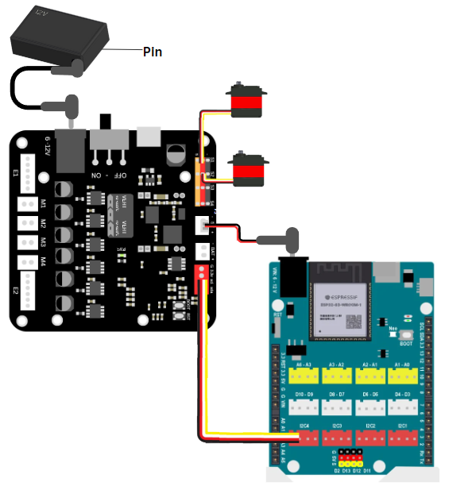
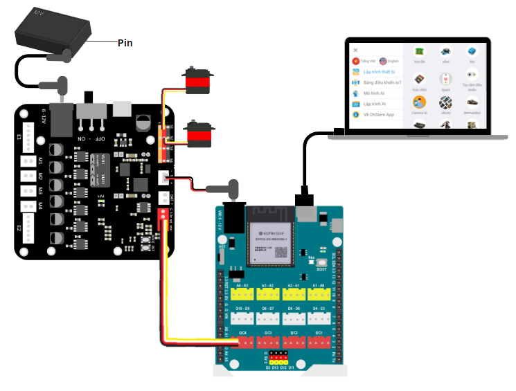
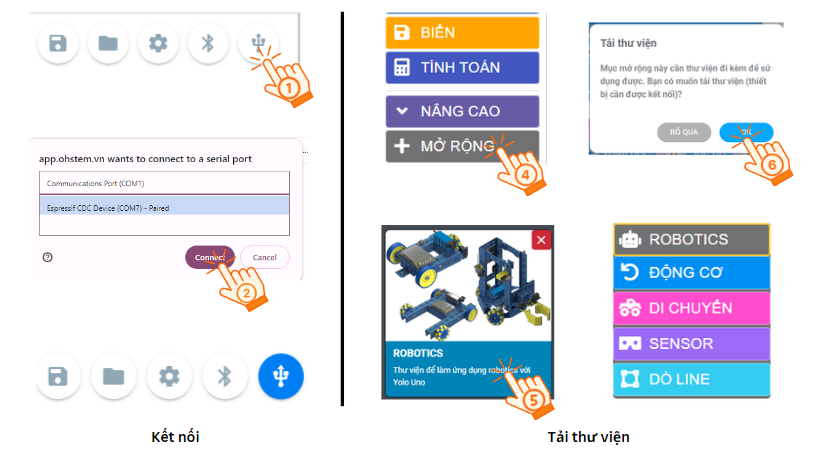
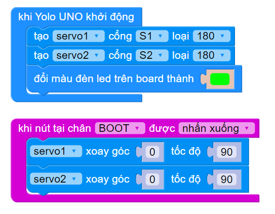
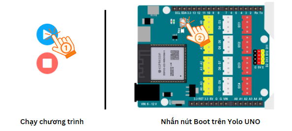
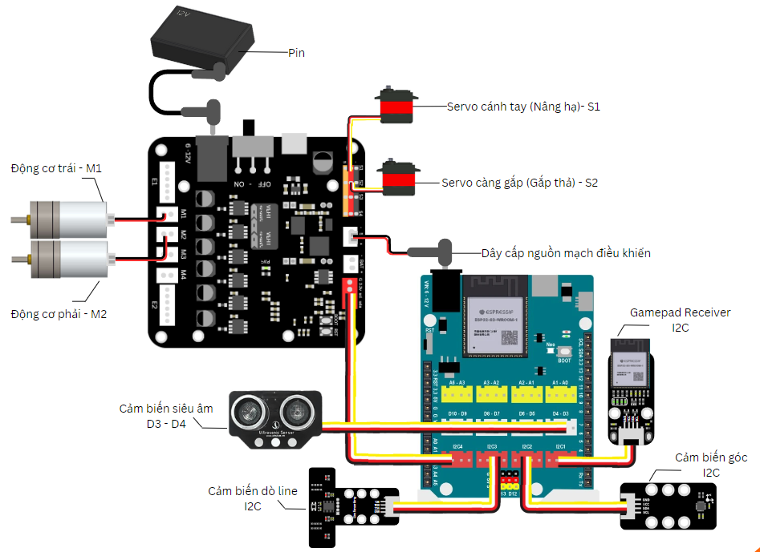

2. Hướng dẫn lắp ráp
==========

1. Chỉnh góc cho servo 
------
--------

Trước khi tiến hành lắp ráp robot, chúng ta cần hiệu chỉnh góc servo của cánh tay và đầu gắp của robot về **góc 0 độ**. Đây là góc hạ cánh tay và mở đầu gắp. 

Các bước thực hiện như sau: 

- **Bước 1:** Kết nối 2 servo với mạch điều khiển động cơ vào **chân S1 và S2**

    Kết nối servo với Yolo UNO

- **Bước 2:** Kết nối Yolo UNO với máy tính qua cổng USB 

    Kết nối Yolo UNO với máy tính

- **Bước 3:** Truy cập vào `<https://app.ohstem.vn/>`_, chọn thiết bị lập trình là **Yolo UNO** --> **Lập trình** --> **Kết nối** và tải thư viện **ROBOTICS**. Thực hiện thao tác như hình: 

    Kết nối và tải thư viện

- **Bước 4:** Thực hiện chương trình như sau: 

    `<https://app.ohstem.vn/#!/share/yolouno/2gAUKQ2O8r1VrxOKc9CdZcoScqU>`_

- **Bước 5:** Gửi chương trình và nhấn nút Boot trên mạch Yolo UNO. Lúc này, servo sẽ quay đến góc 0 độ.

    Gửi chương trình và nhấn nút Boot

- **Bước 6:** Tiến hành lắp ráp robot

2. Lắp ráp robot
---------
---------

**Xem hướng dẫn lắp ráp** `tại đây <https://drive.google.com/file/d/1xv8T31mbkkWIwzzcmgcjEIyZy95ugNt_/view?usp=drive_link>`_

3. Sơ đồ kết nối dây
-------
-----------

    Sơ đồ kết nối dây
|