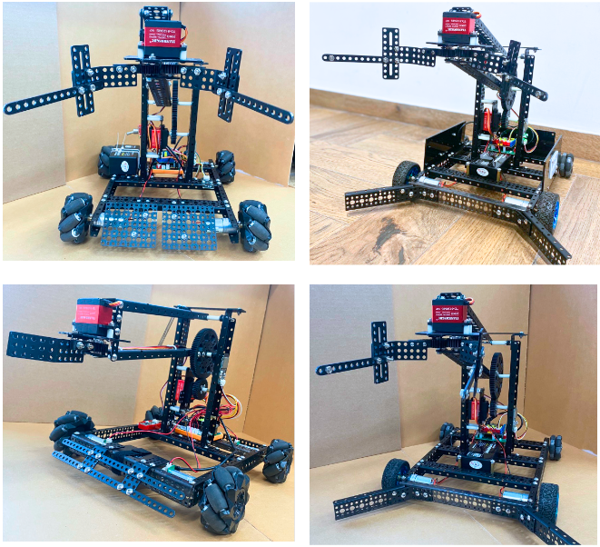

10. Các hướng nâng cấp
============

Ngoài cách lắp ráp cơ bản, bạn có thể nâng cấp thêm một vài cơ cấu của robot như: 

1. Lắp thêm kẹp cho đầu gắp, giúp gắp các vật lớn như khối vuông dễ hơn
2. Gắn thêm cản trước để không kẹt bóng vào trong
3. Sử dụng bánh xe to hơn, bánh truyền động và bánh điều hướng Omni
4. Sử dụng 4 động cơ và 4 bánh truyền động để mạnh hơn
5. Sử dụng cơ cấu mecanum

Một vài hình ảnh minh họa: 

