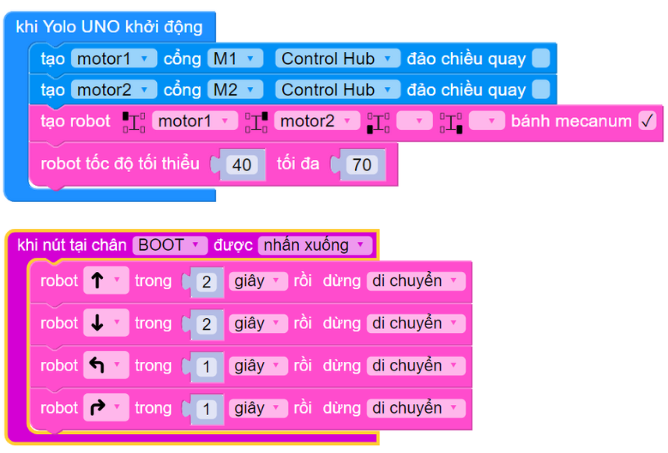

5. Robot di chuyển
=========

Sau khi chúng ta đã biết cách làm việc với các động cơ, trong phần này chúng ta sẽ cấu hình và lập trình cho một robot để có thể di chuyển được.

Robot di chuyển có thể có nhiều loại cấu hình. Cấu hình phổ biến nhất là loại 2 động cơ (có thể dùng 3 bánh xe hoặc 4 bánh xe). 

|

Ngoài ra, robot có thể sử dụng cả 4 động cơ cho 4 bánh chuyển động, giúp vững vàng và mạnh mẽ hơn.

|

Một loại cấu hình di chuyển rất mạnh mẽ trong thi đấu robotics là loại bánh xe mecanum, có thể di chuyển được 8 hướng dễ dàng, giúp tạo sự linh hoạt cao trong thi đấu.

|

1. **Giới thiệu khối lệnh**
------
----

Các khối lệnh để khai báo và điều khiển robot di chuyển nằm trong mục Di chuyển.

|

.. code-block:: guess

    class DriveBase(drive_mode, m1, m2, m3=None, m4=None)

Khai báo khung robot di chuyển với các động cơ sử dụng.

**Tham số:**
    
    - **drive_mode**: Chế độ di chuyển, nhận các giá trị **MODE_2WD** (robot 2 động cơ), **MODE_4WD** (robot 4 động cơ), **MODE_MECANUM** (robot 4 động cơ sử dụng bánh đa hướng mecanum)
    - **m1**: Động cơ dùng cho bánh trước bên trái, có thể là None nếu không dùng
    - **m2**: Động cơ dùng cho bánh trước bên phải, có thể là None nếu không dùng
    - **m3**: Động cơ dùng cho bánh sau bên trái, có thể là None nếu không dùng
    - **m4**: Động cơ dùng cho bánh sau bên phải, có thể là None nếu không dùng

.. code-block:: guess

    robot.size(wheel, width)

Khai báo kích thước robot, chủ yếu dùng để tính toán trong các lệnh di chuyển theo khoảng cách và quay góc chính xác. Nếu chỉ cần robot di chuyển bình thường hoặc điều khiển từ xa thì không cần dùng khối lệnh này.

Đường kính của bánh xe giúp robot di chuyển một khoảng cách chính xác, dựa vào số vòng bánh xe quay được (số vòng được tính toán dựa vào số tick cảm biến tốc độ encoder đo được khi bánh xe quay).

Bề rộng robot giúp thư viện tính toán ra quãng đường cong bánh xe cần xoay khi quay một góc chính xác.

**Tham số:**
    
    - **wheel**: Đường kính bánh xe (mm)
    - **width**: Bề rộng robot, khoảng cách tính từ tâm của 2 bánh xe (mm)

.. code-block:: guess

    robot.forward()
    robot.backward()
    robot.turn_left()
    robot.turn_right()
    robot.move_left()
    robot.move_right()

Điều khiển robot di chuyển tới, lùi, quay trái/phải, đi ngang trái/phải (chỉ áp dụng cho robot sử dụng 4 bánh xe mecanum) liên tục cho đến khi có lệnh điều khiển di chuyển mới.

.. code-block:: guess

    await robot.forward_for(amount, unit=SECOND, then=STOP):
    await robot.backward_for(amount, unit=SECOND, then=STOP):
    await robot.move_left_for(amount, unit=SECOND, then=STOP):
    await robot.move_right_for(amount, unit=SECOND, then=STOP)

Điều khiển robot di chuyển tới/lùi, đi ngang trái/phải (chỉ áp dụng cho robot sử dụng 4 bánh xe mecanum) trong thời gian hoặc khoảng cách chỉ định. Hết thời gian hoặc đạt được khoảng cách chỉ định thì robot dừng lại và thực hiện lệnh tiếp theo.

**Tham số:**
    
    - **amount**: Khoảng thời gian hoặc khoảng cách cần di chuyển
    - **unit**: Đơn vị của tham số amount, là SECOND nếu di chuyển theo thời gian và CM nếu di chuyển theo khoảng cách.
    - **then**: Cách robot dừng lại sau khi hoàn tất di chuyển, mặc định là STOP (tắt động cơ và để tự dừng lại theo quán tính) hoặc BRAKE (khóa động cơ để dừng ngay lập tức)

.. code-block:: guess

    await robot.turn_left_for(amount, unit=SECOND, then=STOP)
    await robot.turn_right_for(amount, unit=SECOND, then=STOP)

Điều khiển robot quay trái/phải trong khoảng thời gian hoặc một góc chỉ định. Hết thời gian hoặc đạt được góc chỉ định thì robot dừng lại và thực hiện lệnh tiếp theo.

Quay theo góc chỉ có tác dụng khi robot có cảm biến góc hoặc sử dụng động cơ có cảm biến tốc độ encoder.

**Tham số:**
    
    - **amount**: Khoảng thời gian hoặc góc cần quay
    - **unit**: Đơn vị của tham số amount, là SECOND nếu quay theo thời gian và DEGREE nếu quay theo góc.
    - **then**: Cách robot dừng lại sau khi hoàn tất di chuyển, mặc định là STOP (tắt động cơ và để tự dừng lại theo quán tính) hoặc BRAKE (khóa động cơ để dừng ngay lập tức)

.. code-block:: guess

    robot.stop()
    robot.brake()

Cho robot dừng lại theo quán tính (stop) hoặc khóa bánh (brake) để dừng lại ngay lập tức. Khi dùng brake thì sẽ đảm bảo độ chính xác cao hơn nếu điều khiển di chuyển theo khoảng cách hoặc quay theo góc.

.. code-block:: guess

    robot.speed(speed, min_speed=None)

Cài đặt tốc độ tối thiểu và tốc độ tối đa khi chuyển của robot. Khi robot di chuyển, thư viện sẽ tự tính toán để tốc độ tăng dần từ tối thiểu đến tối đa, giúp việc di chuyển của robot mượt hơn.

**Tham số:**

    - **speed**: Tốc độ di chuyển tối đa, nhận giá trị từ 0 đến 100
    - **min_speed**: Tốc độ di chuyển tối thiểu, giá trị từ 0 đến 100, cần phải nhỏ hơn hay bằng tốc độ tối đa

2. **Chương trình mẫu**
-----
-------

Chương trình sau khai báo một cấu hình robot có 2 động cơ, động cơ bên trái gắn vào cổng M4, và động cơ bên phải gắn vào cổng M1. Chương trình cho robot đi tới/lùi/quay trái/quay phải sau mỗi 2 giây khi nhấn nút BOOT trên mạch Yolo UNO.

**Chương trình Python**

.. code-block:: guess

    import yolo_uno
    from mdv2 import *
    from motor import *
    from drivebase import *
    from abutton import *

    async def on_BOOT_pressed():
        await robot.forward_for(2, unit=SECOND, then=STOP)
        await robot.backward_for(2, unit=SECOND, then=STOP)
        await robot.turn_left_for(1, unit=SECOND, then=STOP)
        await robot.turn_right_for(1, unit=SECOND, then=STOP)

    md_v2 = MotorDriverV2()
    motor1 = DCMotor(md_v2, M1, reversed=False)
    motor2 = DCMotor(md_v2, M2, reversed=False)
    robot = DriveBase(MODE_2WD, m1=motor1, m2=motor2, m3=None, m4=None)
    btn_BOOT= aButton(BOOT_PIN)

    def deinit():
        robot.stop()

    yolo_uno.deinit = deinit

    async def setup():
        robot.speed(70, min_speed=40)
        btn_BOOT.pressed(on_BOOT_pressed)

    async def main():
        await setup()
        while True:
            await asleep_ms(100)

    run_loop(main())

Bạn cần lưu ý khai báo tên các động cơ của robot một cách chính xác. Đối với robot 2 bánh, vì việc khai báo động cơ cho bánh trước hay bánh sau không quan trọng, quan trọng cần đúng bên trái và bên phải, tránh trường hợp động cơ gắn bên trái nhưng lại khai báo bên phải trong chương trình, dẫn đến robot di chuyển không đúng.

.. note::
    
    - Khi chọn tốc độ quá thấp, lực quay của bánh xe không đủ mạnh để robot di chuyển,  robot sẽ đứng im tại chỗ. Để giải quyết vấn đề này, bạn chỉ cần chọn tốc độ cao hơn.
    - Nếu robot di chuyển ngược hướng mong muốn: Kiểm tra lại dây cắm của 2 động cơ đã cắm đúng vị trí chưa.
    - Tùy vào lượng pin còn lại trong robot, địa hình di chuyển phẳng hay gập ghềnh,... thì tốc độ thực tế của robot sẽ có sai lệch mặc dù là cùng tốc độ di chuyển.
