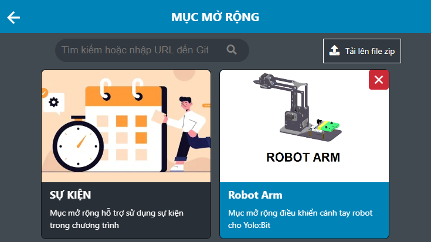
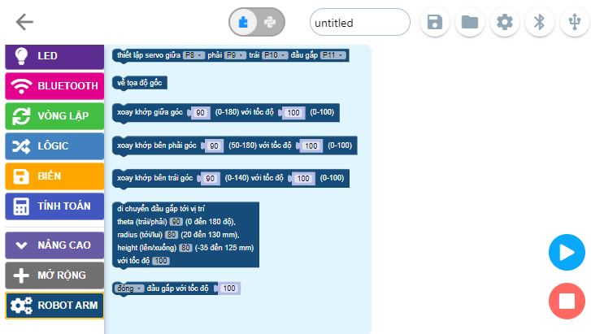

2. Cài đặt thư viện
============================

Để lập trình điều khiển robot Arm, bạn cần cài đặt thư viện, thực hiện như sau: 

1. Chọn mục "Mở rộng" và tải thư viện mở rộng robot Arm

|

2. Trong danh mục khối lệnh bên trái sẽ xuất hiện “ROBOT ARM”

|
