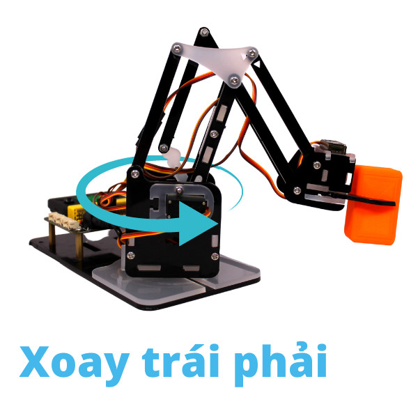
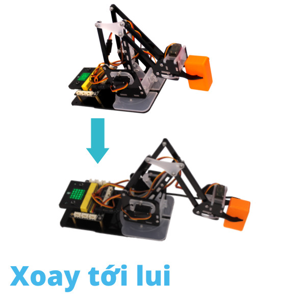
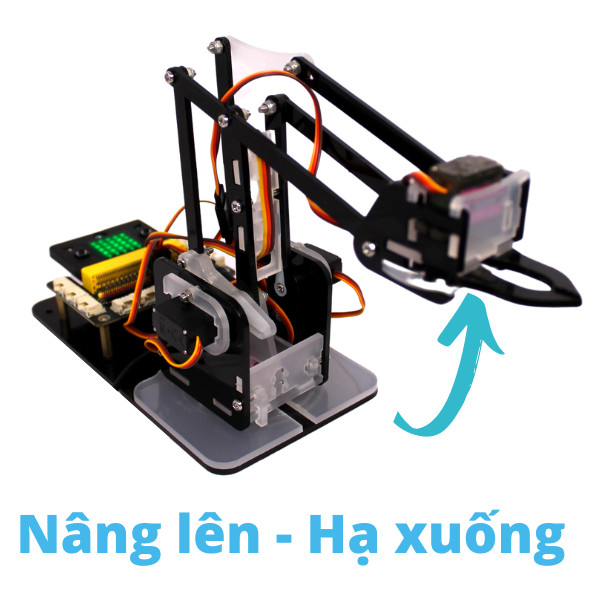

5. Lập trình di chuyển các bộ phận
=================================

*Xin chào các bạn! Đã đến lúc bắt đầu hành trình khám phá những điều mới rồi! Hãy bắt đầu cùng Robot Arm nào.*

Mục tiêu
---------------------
---------------------

- Giới thiệu các khối lệnh sử dụng với ArmBot.
- Hiểu được cách điều khiển các khớp để di chuyển cơ bản.
- Hướng dẫn sử dụng các câu lệnh để điều khiển riêng từng servo.

Giới thiệu khối lệnh di chuyển cơ bản
---------------------------
----------------------

- Khối lệnh khởi tạo các chân servo:

    .. image:: images/arm-block-init.png
        :width: 500px
        :align: center
    |

    Khối lệnh này được gọi ở đầu chương trình để khởi tạo lại các chân tín hiệu servo mà bạn đã kết nối với mạch mở rộng. Mặc định, các chân tín hiệu này được khai báo như sau:

        - P8  - Servo khớp giữa
        - P9  - Servo khớp phải
        - P10 - Servo khớp trái
        - P11 - Servo đầu gắp

    Bạn có thể thay đổi các chân tín hiệu này nếu các chân tín hiệu mặc định bạn muốn dùng cho mục đích khác. 

- Khối lệnh về tọa độ gốc

    .. image:: images/arm-block-origin.png
        :width: 600px
        :align: center
    |

    Khối lệnh này có tác dụng điều khiển các servo sao cho đầu gắp của robot trở về vị trí tọa độ gốc. Khi đó:

        - Góc mặc định của 4 servo là `90` độ.
        - Tọa độ gốc của đầu gắp trong hệ tọa độ ORZ là `(90,80,80)`. Mình sẽ tìm hiểu kỹ hơn về hệ tọa này ở bài sau nhé.

**Servo khớp giữa:** có tác dụng xoay toàn bộ phần cánh tay quay phải sang trái tương ứng góc 0-180 độ

|

    - Khối lệnh điều khiển servo khớp giữa tới một góc nào đó tức thời. 

    .. image:: images/arm-block-move-base.png
        :width: 400px
        :align: center
    |

    Trong đó:

        `degree` là tham số góc quay của servo có giá trị `0 đến 180 độ`.

        `speed` là tốc độ của động cơ trong khoảng `0~100`.

    - Khối lệnh điều khiển servo khớp giữa tới một góc tới hạn degree với thời gian nghỉ sleep sau mỗi bước di chuyển change.

    .. image:: images/arm-block-rotate-base.png
        :width: 400px
        :align: center
    |    

    Trong đó:

        `change` là tham số 1 bước di chuyển tới góc mới của servo. Là giá trị số có giá trị từ 0 đến (degree/change). change có giá trị càng nhỏ thì servo chuyển bước càng mượt.

        `sleep` là thời gian nghỉ giữa mỗi bước change có đơn vị là mili giây.

        `degree` là tham số góc quay tới hạn của servo có giá trị `0 ~ 180 độ`.

        `speed` là tốc độ của động cơ trong khoảng `0~100`.

**Servo khớp phải:** có tác dụng xoay phần vai của robot với góc xoay trong giới hạn 50-180 độ, giúp đầu gắp robot di chuyển tới/lui một cách tương đối.

|

    - Khối lệnh điều khiển servo khớp phải tới một góc nào đó tức thời. 

    .. image:: images/arm-block-move-right.png
        :width: 400px
        :align: center
    |

    Trong đó:

        `degree` là tham số góc quay của servo có giá trị `50 đến 180 độ`.

        `speed` là tốc độ của động cơ trong khoảng `0~100`.

    - Khối lệnh điều khiển servo khớp phải tới một góc tới hạn degree với thời gian nghỉ sleep sau mỗi bước di chuyển change.

    .. image:: images/arm-block-rotate-right.png
        :width: 400px
        :align: center
    |    

    Trong đó:

        `change` là tham số 1 bước di chuyển tới góc mới của servo. Là giá trị số có giá trị từ 0 đến (degree/change). change có giá trị càng nhỏ thì servo chuyển bước càng mượt.

        `sleep` là thời gian nghỉ giữa mỗi bước change có đơn vị là mili giây.

        `degree` là tham số góc quay tới hạn của servo có giá trị `50 ~ 180 độ`.

        `speed` là tốc độ của động cơ trong khoảng `0~100`.

**Servo khớp trái:** có tác dụng xoay phần khuỷu tay của robot với góc xoay trong giới hạn 0-140 độ, giúp đầu gắp robot di chuyển lên/xuống một cách tương đối.

|

    - Khối lệnh điều khiển servo khớp trái tới một góc nào đó tức thời. 

    .. image:: images/arm-block-move-left.png
        :width: 400px
        :align: center
    |

    Trong đó:

        `degree` là tham số góc quay của servo có giá trị `0 đến 140 độ`.

        `speed` là tốc độ của động cơ trong khoảng `0~100`.

    - Khối lệnh điều khiển servo khớp trái tới một góc tới hạn degree với thời gian nghỉ sleep sau mỗi bước di chuyển change.

    .. image:: images/arm-block-rotate-left.png
        :width: 400px
        :align: center
    |    

    Trong đó:

        `change` là tham số 1 bước di chuyển tới góc mới của servo. Là giá trị số có giá trị từ 0 đến (degree/change). change có giá trị càng nhỏ thì servo chuyển bước càng mượt.

        `sleep` là thời gian nghỉ giữa mỗi bước change có đơn vị là mili giây.

        `degree` là tham số góc quay tới hạn của servo có giá trị `0 ~ 140 độ`.

        `speed` là tốc độ của động cơ trong khoảng `0~100`.

**Servo đầu gắp:**

- Khối lệnh điều khiển servo đầu gắp đóng/mở. 

    Góc đóng của đầu gắp là 90 độ:

        .. image:: images/dau-gap-dong.png
            :width: 400px
            :align: center
        |

    Góc mở của đầu gắp là 0 độ:

        .. image:: images/dau-gap-mo.png
            :width: 400px
            :align: center
        |

    Trong đó:

        `degree` là tham số góc quay của servo có giá trị `50 đến 180 độ`.

        `speed` là tốc độ của động cơ trong khoảng `0~100`.

