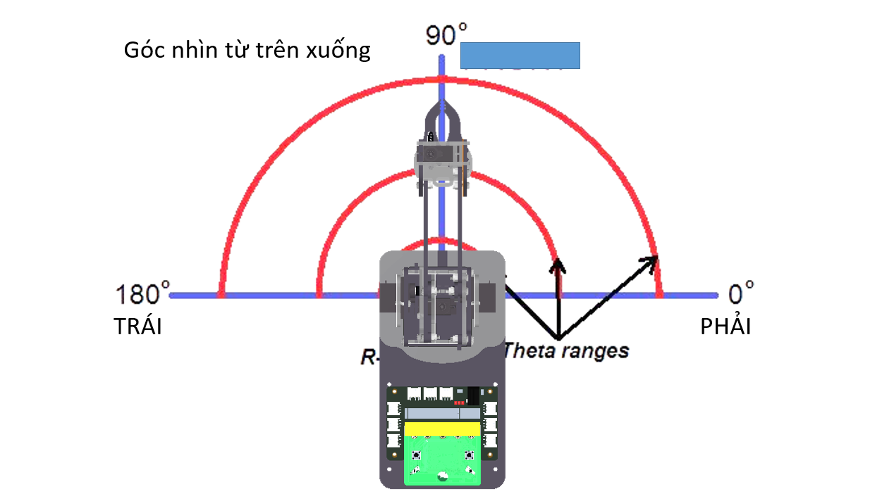
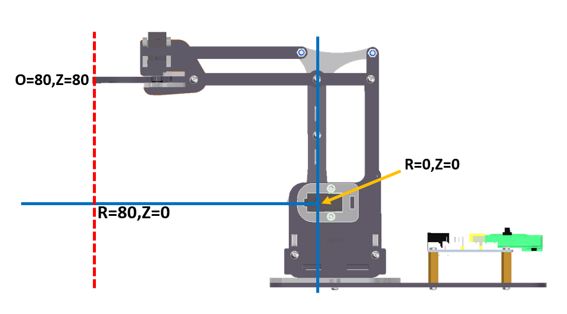
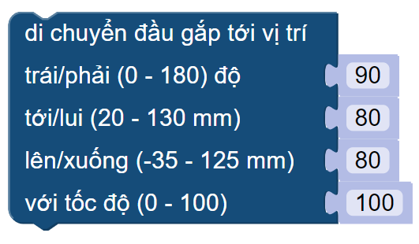

6. Lập trình di chuyển theo tọa độ ORZ
=================================

Mục tiêu
---------------------
---------------------

- Giới thiệu về tọa độ ORZ
- Hướng dẫn sử dụng câu lệnh để di chuyển đầu gắp đến vị trí theo ORZ.
- Biết cách tìm các giá trị ORZ của ArmBot tại các vị trí bạn mong muốn.

Hệ tọa trụ ORZ
---------------
-------------------------

Hệ tọa độ hình trụ là hệ tọa độ ba chiều, chỉ định vị trí điểm theo khoảng cách từ trục tham chiếu đã chọn, hướng từ trục so với hướng tham chiếu đã chọn và khoảng cách từ mặt phẳng tham chiếu đã chọn vuông góc với trục. Khoảng cách sau được cho là số dương hoặc âm tùy thuộc vào phía nào của mặt phẳng tham chiếu đối diện với điểm.

Nguồn gốc của hệ thống là điểm mà cả ba tọa độ có thể được cho là 0. Đây là giao điểm giữa mặt phẳng tham chiếu và trục.

Trục này được gọi khác nhau là trục hình trụ hoặc trục dọc , để phân biệt nó với trục cực , là tia nằm trong mặt phẳng tham chiếu, bắt đầu từ điểm gốc và chỉ theo hướng tham chiếu.

Khoảng cách từ trục có thể được gọi là khoảng cách xuyên tâm hoặc bán kính , trong khi tọa độ góc đôi khi được gọi là vị trí góc hoặc là góc phương vị . Bán kính và góc phương vị được gọi là tọa độ cực , vì chúng tương ứng với hai hệ tọa độ cực chiều trong mặt phẳng qua điểm, song song với mặt phẳng tham chiếu. Tọa độ thứ ba có thể được gọi là chiều cao hoặc độ cao (nếu mặt phẳng tham chiếu được coi là nằm ngang), vị trí dọc hoặc vị trí trục .

- O là tọa đội góc (vị trí góc hoặc góc phương vị). Tương ứng di chuyển đầu gắp quanh tâm của robot.
- R là bán kính (khoảng cách xuyên tâm). Tương ứng di chuyển đầu gắp một đường thẳng song song với mặt đất.
- Z là độ cao (vị trí theo chiều dọc). Tương ứng di chuyển đầu gắp một đường thẳng vuông góc với mặt đất.

**Góc nhìn từ trên xuống dưới:** Ta quan sát góc chuyển động O

|

**Góc nhìn từ trái qua phải:** Ta quan sát được 2 hướng chuyển động của đầu gắp là lên/xuống và tới/lui.

|

Giới thiệu khối lệnh
---------------------------
----------------------

|

Trong đó, 4 tham số theo thứ tự từ trên xuống là:

    `theta` là tham số ị trí góc hoặc góc phương vị O có giá trị `0 ~ 180 độ`. Tương ứng di chuyển đầu gắp quanh tâm của robot.

    `radius` là tham số khoảng cách xuyên tâm R có giá trị `20 ~ 130 milimet`. Tương ứng di chuyển đầu gắp một đường thẳng song song với mặt đất

    `height` là tham số vị trí theo chiều dọc Z có giá trị `-35 ~ 125 milimet`. Tương ứng di chuyển đầu gắp một đường thẳng vuông góc với mặt đất

    `speed` là tốc độ của chuyển động trong khoảng `0~100`.

Cách lấy các giá trị ORZ của Robot
---------------------
--------------------------

    1.  Trong giao diện lập trình Yolo:Bit, bật cửa sổ nhập lệnh bằng cách vào Cài đặt > Bật cửa sổ nhập lệnh.

    .. image:: images/arm-get-value-2.png
        :width: 650px
        :align: center  
    |

    2.  Kết nối ArmBot với máy tính qua cổng USB của Yolo:Bit
    
    .. image:: images/arm-get-value-1.png
        :width: 650px
        :align: center  
    |

    3.  Vào App Controller của Yolo:Bit trên điện thoại, kết nối Bluetooth và điều khiển ArmBot tới các vị trí bạn mong muốn.
    
    .. image:: images/arm-get-value-4.png
        :width: 300px
        :align: center  
    |

    .. image:: images/arm-get-value-5.png
        :width: 300px
        :align: center  
    |

    4.  Nhìn vào cửa sổ nhập lệnh, Các giá trị ORZ được hiện liên tục, bạn chọn giá trị cuối cùng nhé. Nhưu trong hình, vị trí đầu gắp của ArmBot ORZ hiện tại là: [40,105,-25]
    
    .. image:: images/arm-get-value-3.png
        :width: 650px
        :align: center  
    |

Viết chương trình
---------------------
--------------------------

.. image:: images/sample-move-a-to-b-manual.gif
    :width: 700px
    :align: center  
|

**Chương trình:** Giống như bài trước. Ta sẽ giải chương trình điều khiển ArmBot gắp vật từ vị trí A sang vị trí B. Nhưng trong bài này, ta sẽ tập trung sử dụng khối lệnh trên để giúp đầu gắp di chuyển các phương trong tọa độ ORZ tốt hơn nhé!

    .. image:: images/sample-move-a-to-b-manual-hd3.png
        :width: 500px
        :align: center
    |

    1.  Khai báo ban đầu. Thực hiện kéo các khối lệnh theo trình tự sau:

        - Đầu tiên ta sẽ khai báo các chân servo đã được sử dụng trên ArmBot.

        - Tạo biến `tốc độ` để lưu giá trị tốc độ hoạt động của robot. Bạn có thể thay đổi giá trị này từ `0-100` tùy vào sở thích và yêu cầu của bạn.

        .. image:: images/sample-move-a-to-b-orz-s1.png
            :width: 400px
            :align: center
        |

    2.  Với việc dùng khối lệnh điều khiển cánh tay trong hệ tọa độ ORZ, ta chỉ cần tìm được tọa độ các vị trí cần di chuyển đến và nhập vào khối lệnh. Tọa độ ORZ của nhiệm vụ trên được xác định như sau:

        - Mở đầu gắp

        - [45,30,-40] - Xoay về phía vật cần gắp.

        - [45,130,-40] - Di chuyển đầu gắp lại gần vật cần gắp (trong video là vị trí màu đỏ).

        - Đóng đầu gắp để gắp vật.

        - [45,30,80] - Gắp vật cao lên giúp để dễ dàng di chuyển.

        - [135,30,-40] - Xoay về phía cần thả vật.

        - [135,130,-40] - Di chuyển vật tới nơi cần thả (trong video là vị trí màu xanh).

        - Mở đầu gắp để thả vật.

        - [135,30,80] - Về vị trí an toàn và kết thúc 1 chu trình gắp - thả vật.

        .. image:: images/sample-move-a-to-b-orz.png
            :width: 400px
            :align: center
        |

Chương trình mẫu
--------------
-------------------

- Nhấp vào chữ **tại đây** để xem chương trình mẫu, hoặc quét mã QR bên dưới để xem chương trình.

- Robot di chuyển tới lui: `Tại đây <https://app.ohstem.vn/#!/share/yolobit/2DhsDGYb0hAEEpgH9TbgTpH1KqH>`_

.. image:: images/sample-move-a-to-b-orz-qr.png
    :width: 200px
    :align: center 
| 