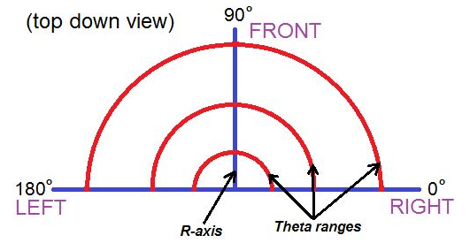

6. Lập trình di chuyển theo tọa độ ORZ
=================================

Mục tiêu
---------------------
---------------------

- Giới thiệu về tọa độ ORZ
- hướng dẫn sử dụng câu lệnh để di chuyển đầu gắp đến vị trí theo ORZ.

Hệ tọa trụ ORZ
---------------
-------------------------

Hệ tọa độ hình trụ là hệ tọa độ ba chiều, chỉ định vị trí điểm theo khoảng cách từ trục tham chiếu đã chọn, hướng từ trục so với hướng tham chiếu đã chọn và khoảng cách từ mặt phẳng tham chiếu đã chọn vuông góc với trục. Khoảng cách sau được cho là số dương hoặc âm tùy thuộc vào phía nào của mặt phẳng tham chiếu đối diện với điểm.

Nguồn gốc của hệ thống là điểm mà cả ba tọa độ có thể được cho là 0. Đây là giao điểm giữa mặt phẳng tham chiếu và trục.

Trục này được gọi khác nhau là trục hình trụ hoặc trục dọc , để phân biệt nó với trục cực , là tia nằm trong mặt phẳng tham chiếu, bắt đầu từ điểm gốc và chỉ theo hướng tham chiếu.

Khoảng cách từ trục có thể được gọi là khoảng cách xuyên tâm hoặc bán kính , trong khi tọa độ góc đôi khi được gọi là vị trí góc hoặc là góc phương vị . Bán kính và góc phương vị được gọi là tọa độ cực , vì chúng tương ứng với hai hệ tọa độ cực chiều trong mặt phẳng qua điểm, song song với mặt phẳng tham chiếu. Tọa độ thứ ba có thể được gọi là chiều cao hoặc độ cao (nếu mặt phẳng tham chiếu được coi là nằm ngang), vị trí dọc hoặc vị trí trục .

- O là tọa đội góc (vị trí góc hoặc góc phương vị). Tương ứng di chuyển đầu gắp quanh tâm của robot.
- R là bán kính (khoảng cách xuyên tâm). Tương ứng di chuyển đầu gắp một đường thẳng song song với mặt đất.
- Z là độ cao (vị trí theo chiều dọc). Tương ứng di chuyển đầu gắp một đường thẳng vuông góc với mặt đất.

|

Giới thiệu khối lệnh
---------------------------
----------------------

Khối lệnh bắt đầu chương trình:

.. image:: images/arm-block-kinematic.png
    :width: 400px
    :align: center
|

Trong đó, 4 tham số theo thứ tự từ trên xuống là:

    `theta` là tham số góc quay tới hạn của servo có giá trị `0 ~ 180 độ`.

    `radius` là tham số góc quay tới hạn của servo có giá trị `20 ~ 130 milimet`.

    `height` là tham số góc quay tới hạn của servo có giá trị `-35 ~ 125 milimet`.

    `speed` là tốc độ của chuyển động trong khoảng `0~100`.

