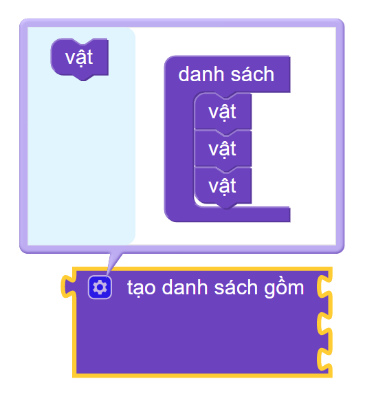

7. Tự động hóa 
=================================

Mục tiêu
---------------------
---------------------

- Biết cách dùng mảng để lưu sẵn các vị trí.
- Thực hiện điều khiển robot tới các vị trí được lưu sẵn trong mảng.

Mảng là gì?
---------------
-------------------------

Mảng là một phần cơ bản của tất cả các ngôn ngữ lập trình, nó là tập hợp các phần tử của một kiểu dữ liệu duy nhất, ví dụ mảng số nguyên, mảng chuỗi.

Không giống như mảng, mỗi list có thể lưu trữ phần tử với bất kỳ kiểu dữ liệu nào và làm được mọi thứ mà mảng có thể làm.

Trong giao diện lập trình khối lệnh, 1 mảng được gọi là 1 `Danh sách`.

**Các khối lệnh danh sách:** Cách lấy các hàm dùng cho danh sách: Vào Nâng cao > Danh sách

.. image:: images/array-1.png
    :width: 600px
    :align: center
|

**Thêm các thành phần trong danh sách:** Chọn dấu bánh răng, sau đó kéo "vật" vào vị trí bạn muốn bổ sung 1 vật mới trong danh sách:

|

**Chương trình mẫu:** Tạo danh sách và in giá trị đầu tiên của danh sách:

|

Link chương trình mẫu: `Tại đây <https://app.ohstem.vn/#!/share/yolobit/2Di5Eent9dLZj8QBNkEeRsOEMEt>`_

Viết chương trình
---------------------
--------------------------

.. image:: images/sample-move-a-to-b-manual.gif
    :width: 700px
    :align: center  
|

**Chương trình:** Tiếp nối bài trước. Ta sẽ giải chương trình điều khiển ArmBot gắp vật từ vị trí A sang vị trí B bằng khối lệnh di chuyển thông minh. Tuy nhiên ở đây ta sẽ tạo danh sách gồm các vị trí được lưu sẵn. Giúp chương trình của chúng ta gọn và dễ quản lý hơn nhé!

    .. image:: images/sample-move-a-to-b-manual-hd3.png
        :width: 500px
        :align: center
    |

    1.  Khai báo ban đầu. Thực hiện kéo các khối lệnh theo trình tự sau:

        - Đầu tiên ta sẽ khai báo các chân servo đã được sử dụng trên ArmBot.

        - Tạo biến `tốc độ` để lưu giá trị tốc độ hoạt động của robot. Bạn có thể thay đổi giá trị này từ `0-100` tùy vào sở thích và yêu cầu của bạn.

        - Tạo danh sách ORZ chứa các vị trí cần di chuyển đến. Bộ 3 giá trị O,R,Z là 3 phần tử trong 1 mảng con của mảng ORZ. Phần tử thứ 4 trong các bản con này là True hoặc False tương ứng với Đóng hoặc mở đầu gắp.

        .. image:: images/sample-move-a-to-b-automation-2.png
            :width: 400px
            :align: center
        |

        Tọa độ ORZ của nhiệm vụ trên được xác định như sau (Tương tự nhưu bài trước):

            - Mở đầu gắp

            - [45,30,-40] - Xoay về phía vật cần gắp.

            - [45,130,-40] - Di chuyển đầu gắp lại gần vật cần gắp (trong video là vị trí màu đỏ).

            - Đóng đầu gắp để gắp vật.

            - [45,30,80] - Gắp vật cao lên giúp để dễ dàng di chuyển.

            - [135,30,-40] - Xoay về phía cần thả vật.

            - [135,130,-40] - Di chuyển vật tới nơi cần thả (trong video là vị trí màu xanh).

            - Mở đầu gắp để thả vật.

            - [135,30,80] - Về vị trí an toàn và kết thúc 1 chu trình gắp - thả vật.

        .. image:: images/sample-move-a-to-b-automation-1.png
            :width: 500px
            :align: center
        |

        2. Lấy từng phần tử và xử lý:

            - Lấy 3 phần tử O,R,Z trong danh sách con của danh sách ORZ vào hàm điều khiển thông mình.

            - Lấy phần tử thứ 4 so sánh và ra quyết định đóng hay mở đầu gắp.

        .. image:: images/sample-move-a-to-b-automation-3.png
            :width: 650px
            :align: center
        |

        3. Chương trình hoàn thiện:

        .. image:: images/sample-move-a-to-b-automation-full.png
            :width: 650px
            :align: center
        |

Chương trình mẫu
--------------
-------------------

- Nhấp vào chữ **tại đây** để xem chương trình mẫu, hoặc quét mã QR bên dưới để xem chương trình.

- Robot di chuyển tới lui: `Tại đây <https://app.ohstem.vn/#!/share/yolobit/2Di7J3dzcxP4jLltBr6w1HB4CRZ>`_

.. image:: images/sample-move-a-to-b-automation-qr.png
    :width: 200px
    :align: center 
| 