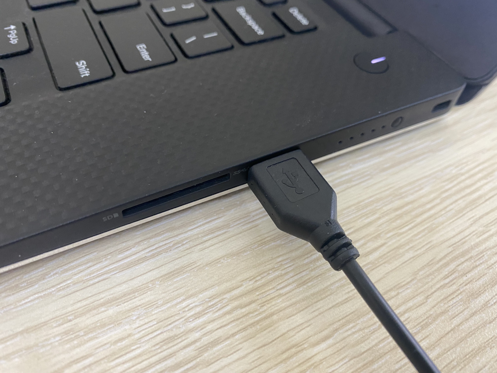

2. Hướng dẫn lắp ráp
======================================

**2.1 Lắp ráp**
+++++++++++++++++++++
--------------------------------------

1. Các bộ phận chính của ArmBot

.. image:: images/lap-rap-2.png
    :width: 500px
    :align: center
|

2. Bu lông M3-16 + đai ốc chống tháo M3 

.. image:: images/lap-rap-5.png
    :width: 500px
    :align: center
|
3. Bu lông M3-16 + đệm mica M3 + đai ốc chống tháo M3

.. image:: images/lap-rap-6.png
    :width: 500px
    :align: center
|
4. Servo khớp bên phải + tấm 22 + 2 đai ốc M3

.. image:: images/lap-rap-7.png
    :width: 500px
    :align: center  
|
5. Servo khớp bên trái + tấm 22 + 2 đai ốc M3

.. image:: images/lap-rap-8.png
    :width: 500px
    :align: center  
|
6. 3 bu lông M3-12 + đai ốc chống tháo M3

.. image:: images/lap-rap-9.png
    :width: 500px
    :align: center 
|
7. Tấm 14 + khối vừa lắp

.. image:: images/lap-rap-10.png
    :width: 500px
    :align: center 
|
8. Tấm 1 + bu lông M3-6 + khối vừa lắp. (Chú ý vị trí của cánh servo)

.. image:: images/lap-rap-11.png
    :width: 500px
    :align: center 
|
9. 4 trụ đồng 10mm + 4 bu lông M3-6

.. image:: images/lap-rap-12.png
    :width: 500px
    :align: center 
|
10. Mạch mở rộng Yolo:Bit + 4 bu lông M3-6

.. image:: images/lap-rap-13.png
    :width: 500px
    :align: center 
|
11. Lắp Máy tính lập trình Yolo:Bit vào mạch mở rộng.

.. image:: images/lap-rap-14.png
    :width: 500px
    :align: center 
|

12. Cắm dây Servo

P8  - Servo khớp giữa
P9  - Servo khớp phải
P10 - Servo khớp trái
P11 - Servo đầu gắp

|

**Lưu ý**

Sau khi lắp xong, thực hiện các bước quan trọng sau để kiểm tra:

- Không cắm nguồn hoặc pin vào mạch điều khiển.
- Dùng tay di chuyển các khớp nối với servo một cách nhẹ nhàng xem có khớp nào bị cứng hay kẹt không. 
- Nếu có, bạn hãy nới lỏng các khớp này cho đúng sao cho di chuyển được mượt và nhẹ nhàng.

**2.2 Hướng dẫn cấp nguồn**
+++++++++++++++++++++++++++++
---------------------------------

**Chuyển đổi chế độ cấp nguồn**

Mạch mở rộng Yolo:Bit có 2 chế độ cấp nguồn đầu vào. Để chuyển 2 chế độ này, bạn hãy chuyển jumpper như 2 hình sau:

- 3.3V với nguồn cấp từ Yolo:Bit

|

- VIN (4.5-6V) với nguồn cấp từ cổng DC

|

**Cắm dây nguồn**

1. Cắm đầu USB của dây cáp vào cốc sạc, cổng USB máy tính, laptop,...

|

|

2. Cắm cổng DC vào mạch mở rộng Yolo:Bit

|

    **Lưu ý: Nguồn cấp tối thiếu là 500mA và tối đa là 2A để Robot hoạt động ổn định**

