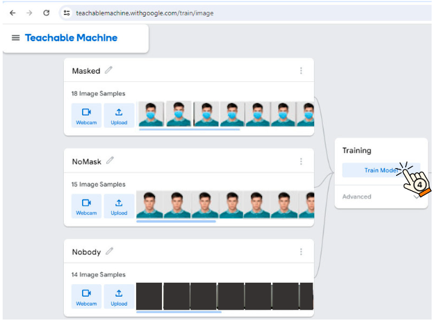
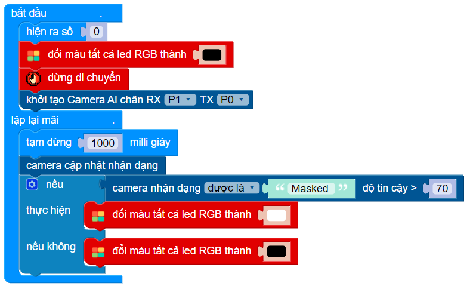
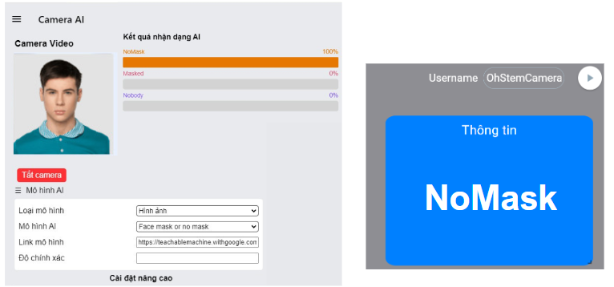
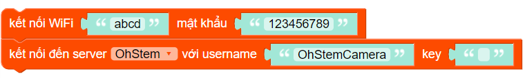

**Camera AI V2**
=============

1. Giới thiệu
----------
----------

.. image:: images/camera_v2_1.png
    :scale: 100%
    :align: center

**Thiết kế mới, dễ lắp ráp:**

Camera AI V2 được thiết kế lại theo kích thước module chuẩn của hệ sinh thái OhStem, giúp dễ dàng lắp ráp vào các ứng dụng. Vỏ nhựa bọc bảo vệ giúp bảo vệ camera khỏi hư hại. Các lỗ tương thích Lego giúp lắp ráp camera với các mô-đun khác của OhStem, giúp người dùng dễ dàng sáng tạo các dự án robot và ứng dụng AI độc đáo của riêng mình.

**Kết nối linh hoạt, tốc độ xử lý nhanh gấp đôi:**

Camera AI V2 tích hợp cổng USB type C đồng nhất với các thiết bị khác, giúp kết nối dễ dàng. Cổng nạp tích hợp giúp cập nhật firmware dễ dàng. Cổng kết nối Grove giúp xuất ra kết quả xử lý cho robot và mạch điều khiển mà không cần thông qua server IoT làm trung gian, giúp ứng dụng ổn định và chạy nhanh hơn.

**Chip xử lý mới, tính năng mới:**

Camera AI V2 được nâng cấp lên phiên bản chip xử lý mới hơn camera V1 với tốc độ xử lý AI nhanh gấp đôi. Hỗ trợ kết nối mạng WiFi chuẩn 2.4Ghz lẫn 5Ghz. Ngoài ra, tính năng xử lý AI ngay trên camera mà không cần mạng WiFi và máy tính cũng đang được phát triển và sẽ cập nhật trong thời gian tới.

Đây là một sản phẩm có cải tiến vượt trội so với phiên bản trước, mang đến nhiều tính năng. dễ dàng sử dụng, phù hợp với học sinh, sinh viên, giáo viên đang nghiên cứu phát triển các ứng dụng về AI

..  image:: images/gio.png
    :alt: some image
    :target: https://shop.ohstem.vn/san-pham/esp32-camera-ai-v2-cho-robot-va-iot/
    :class: with-shadow
    :scale: 100%
    :align: center
|

2. Thông số kỹ thuật
----------
----------

- Nguồn cấp: 5V từ cổng USB type C hoặc 3.3V qua cổng kết nối Grove (3.3V) hoặc cổng pin rời (3.7-6V)
- Sử dụng Camera OV2640 2MP
- Hỗ trợ kết nối mạng WiFi chuẩn 2.4Ghz lẫn 5Ghz.
- Chip xử lý: ESP32-S3 Xtensa dual-core 32-bit LX7 CPU 240MHz 4MB Flash 8MB PSRAM
- Giao tiếp: UART

3. Hướng dẫn lắp ráp
-----
-----

.. raw:: html

    <iframe width="560" height="315" src="https://www.youtube.com/embed/1UjtZpZsOeU?si=gXz7Wq6j0qS-Pxr7" title="YouTube video player" frameborder="0" allow="accelerometer; autoplay; clipboard-write; encrypted-media; gyroscope; picture-in-picture; web-share" allowfullscreen></iframe>

|

4. Chương trình nhận diện qua kết nối UART
-----
-----

Để làm việc trực tiếp với camera AI V2, bạn cần thực hiện theo các bước sau đây: 

    1. Kết nối wifi cho camera
    2. Huấn luyện mô hình AI 
    3. Nhận dạng qua camera
    4. Lập trình thiết bị thực hiện nhiệm vụ theo mô hình đã huấn luyện

**4.1 Kết nối wifi cho camera AI V2:**
------------

1. Sau khi kết nối camera với thiết bị, hãy bật nguồn. Đèn báo trên camera sẽ sáng màu đỏ (báo hiệu camera chưa có kết nối internet).

|

2. Lúc này, dùng điện thoại hoặc laptop vào biểu tượng kết nối wifi, tìm kiếm mạng wifi của camera là **ohstem-ai-camera- xxxxx (với x là id của camera)**.

|

    *Chọn vào tên wifi, một trang web mới tự động mở ra như hình bên dưới (Nếu không tự mở lên bạn có thể nhập ip 192.168.4.1 vào thanh tìm kiếm của Google Chrome, Cốc cốc…):*

|

3. Chọn tiếp vào **Configure WiFi**

|

Ở giao diện này bạn sẽ chọn mạng wifi mà mình muốn camera kết nối, **nhập mật khẩu wifi vào ô Password và chọn Save**:  

|

4. Khi kết nối wifi thành công, đèn trên camera sẽ chuyển sang màu xanh lá như hình:

**Lưu ý:** Camera AI và laptop/ điện thoại phải kết nối chung 1 mạng wifi ở bước 3.

|

    **Để xóa mạng wifi đang kết nối, bạn cần ấn giữ nút Boot trong 5 giây (ngay cạnh đèn led), khi đèn chuyển từ xanh qua đỏ là camera của bạn đã xóa mạng wifi đang kết nối thành công.**

|

5. **Lấy địa chỉ IP của camera:** Bấm vào biểu tượng kết nối wifi trên laptop, bạn sẽ thấy 1 mạng wifi có tên là **192.168.x.xxx - cam - id** xuất hiện, đây chính là địa chỉ IP của camera (mỗi mạng wifi sẽ cho ra một địa chỉ IP khác nhau): 

|

6. **Truy cập vào địa chỉ IP của camera**: Vào trình duyệt Chrome/ Cốc cốc… gõ vào ô tìm kiếm địa chỉ ip của camera để truy cập vào Camera AI. Trang web sẽ hiển thị giao diện như sau:

|

**Các thông tin chúng ta cần lưu ý là:**

    + **Mô hình AI:** để trống nếu như muốn sử dụng mô hình của mình tự huấn luyện. Hoặc chọn mô hình có sẵn.
    + **Link mô hình:** là đường liên kết mô hình của mình tự huấn luyện (hướng dẫn ở phần sau). Nếu sử dụng mô hình có sẵn thì hệ thống sẽ tự điền link.
    + **Độ chính xác:** từ 0-100 là mức độ chính xác mà kết quả nhận diện mà bạn mong muốn.

**4.2 Huấn luyện mô hình - Tạo link mô hình**
------------

Ở phần này, chúng ta sẽ cần dùng 1 công cụ tạo mô hình AI của Google:

1. Mở 1 tab mới trên trình duyệt và truy cập vào trang web: `<https://teachablemachine.withgoogle.com/>`_  và chọn **Get Started**:

|

2. Giao diện sẽ hiện ra như hình chọn vào **Image Project**:

|

3. Chọn tiếp vào **Standard image model**: 

.. image:: images/camera_ai_9.png
    :scale: 100%
    :align: center
|

Giao diện được hiển thị tương tự với giao diện Mô hình AI trên OhStem App

.. image:: images/camera_ai_10.png
    :scale: 100%
    :align: center
| 

4. **Bắt đầu huấn luyện mô hình AI**:

Chọn vào **Webcam** và nhấn **Hold to Record** để thu thập mẫu. Sau khi hoàn tất, chọn **Train Model**

|

5. Chọn **Export Model** để xuất ra mô hình:

.. image:: images/camera_v2_12.png
    :scale: 100%
    :align: center 
|

6. Sau đó bạn ấn vào chọn **Upload my model**:

.. image:: images/camera_v2_13.png
    :scale: 100%
    :align: center
|

7. Một đường link sẽ xuất hiện, hãy **sao chép và dán vào đường dẫn AI trên trang địa chỉ của camera**: 

.. image:: images/camera_v2_14.png
    :scale: 100%
    :align: center 

Kết quả như hình: 

|

**4.3 Nhận dạng qua camera**
---------

Sau khi đã điền xong các thông tin, bạn ấn **Bật camera** để bắt đầu nhận dạng:

|

Chờ khoảng 1 phút để hiện hình ảnh và kết quả nhận dạng sẽ được thể hiện trên màn hình, tương tự như hình sau: 

|

**4.4 Lập trình thiết bị thực hiện nhiệm vụ**
--------

Đối với camera AI V2, bạn có thể gửi kết quả trực tiếp sang thiết bị qua kết nối UART.

1. Truy cập vào `<https://app.ohstem.vn/>`_, chọn lập trình thiết bị **Yolo:Bit**.

|

2. Trong mục **Mở rộng**, tải thư viện **AI Camera**, để thiết bị đọc kết quả trực tiếp từ module camera AI:.

   **Link thư viện**: `<https://github.com/AITT-VN/yolobit_extension_ai_camera.git>`_

|

Các khối lệnh trong danh mục Camera AI: 

|

3. Gửi chương trình cơ bản sau lên Robot Rover:

    `<https://app.ohstem.vn/#!/share/yolobit/2af4ex5ZvT1H6uh2rrWNMEFt4Ql>`_ 

**Giải thích chương trình:** Đầu tiên chúng ta khởi tạo kết nối của camera AI V2 với robot Rover thông qua cổng P0/P1. Tiếp theo, trong vòng lặp lại mãi, sau mỗi giây, chúng ta sẽ liên tục cập nhật kết quả nhận dạng từ camera và so sánh với mô hình đã huấn luyện, với độ chính xác mà bạn mong muốn.

5. Nâng cao - Chương trình nhận dạng qua sever IoT
----
---------

Quy trình thực hiện:

    1. Kết nối wifi cho camera
    2. Huấn luyện mô hình AI 
    3. Nhận dạng qua camera
    4. Tạo bảng điều khiển IoT
    5. Cấu hình camera gửi dữ liệu lên bảng điều khiển 
    6. Viết chương trình cho thiết bị nhận dữ liệu từ bảng điều khiển

Các bước 1, 2, 3 thực hiện tương tự như mục 4.1, 4.2 và 4.3. Dưới đây sẽ hướng dẫn bạn cách thực hiện các bước còn lại. 

**5.1. Tạo bảng điều khiển IoT:**
--------

Truy cập vào `<https://app.ohstem.vn/>`_, chọn **Bảng điều khiển IoT** và tạo một bảng điều mới.

Với bảng điều khiển mới, bạn cần thực hiện các thao tác sau: 

    1. Đặt lại tên cho **Username** (đặt thêm ký tự hoặc số để không trùng với các username khác)
    2. Chọn **kênh thông tin**.  Đây là 2 thông tin quan trọng của server MQTT. 

|

**5.2 Cấu hình camera gửi dữ liệu lên bảng điều khiển**
-----------

Trên trang địa chỉ IP của camera, ở phần **Cài đặt nâng cao (Cài đặt IoT)**, chúng ta cần chú ý các thông tin sau: 

|

- **Server**: bạn chọn vào server OhStem, nơi bạn sẽ gửi thông tin kết quả nhận dạng. 
- **User**: điền tên username của bảng điều khiển IoT mà bạn đã tạo ở mục 5.1.
- **Kênh dữ liệu**: điền tên kênh thông tin đã chọn ở mục 5.2 (V1 … V20)
- **Tần suất gửi**: Với các mẫu giống nhau bạn có thể chọn tần suất gửi lâu hơn. Ví dụ, khi nhận diện 1 vật không thay đổi, tần suất gửi là 10s 1 lần, vậy cứ sau 10s thông tin về vật sẽ được gửi lên server nếu như vật đó không thay đổi. 

Điền thông tin **Username** và **kênh dữ liệu** vào trang địa chỉ của camera, kết quả như hình: 

|

**Kết quả nhận diện:**

Bật cùng lúc 2 tab địa chỉ IP của camera và bảng điều khiển IoT, kết quả được hiển thị tương tự như hình: 

|

Ở phần Kết quả nhận dạng sẽ là kết quả mà camera AI nhận dạng được và độ tin cậy của kết quả, kết quả sẽ được gửi lên trực tiếp server IoT của OhStem. 

**5.3 Viết chương trình cho thiết bị nhận dữ liệu từ bảng điều khiển**
------

Mở tab mới, truy cập vào `<https://app.ohstem.vn/>`_ chọn **lập trình thiết bị Yolo:Bit,** trong mục **Mở rộng** tìm kiếm và tải thư viện **MQTT**: 

|

Cuối cùng, gửi chương trình sau vào Yolo:Bit:

    `<https://app.ohstem.vn/#!/share/yolobit/2af4I5bvMQKIS5uUTxvzoy3ptf4>`_ 

**Giải thích chương trình:**

Để nhận được thông tin từ bảng điều khiển, Yolo:Bit cần được kết nối với wifi và kết nối với bảng điều khiển mà bạn đã tạo trước đó. Do đó, bạn cần nhập đúng thông tin wifi và username của bảng điều khiển vào 2 khối lệnh:   

|

Tiếp theo, đăng ký nhận thông tin từ kênh dữ liệu (từ V1.. V20) để so sánh kết quả và thực hiện nhiệm vụ: 

|

Sử dụng thêm khối lệnh tạm dừng 1000 milli giây và cập nhật thông tin từ server để thiết bị luôn nhận được thông tin mới nhất. 