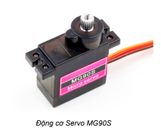

**Tay gắp 2 bậc**
=============

1. Giới thiệu
----------
----------

Tay gắp 2 bậc là một phụ kiện mở rộng, được thiết kế để hỗ trợ cả hai tính năng gắp và nâng vật, giúp bạn dễ dàng điều khiển, lập trình robot hoàn thành các nhiệm vụ đặt ra dễ dàng hơn.

Sản phẩm sử dụng 2 động cơ Servo 180 độ. Bạn có thể gắn tay gắp này lên **robot Rover, robot xBot hoặc các sản phẩm robot khác do OhStem cung cấp**.

.. raw:: html

    <iframe width="560" height="315" src="https://www.youtube.com/embed/f70IHFEc5rU" title="YouTube video player" frameborder="0" allow="accelerometer; autoplay; clipboard-write; encrypted-media; gyroscope; picture-in-picture; web-share" allowfullscreen></iframe>

|

2. Link sản phẩm 
-------
------------

..  image:: images/gio.png
    :alt: some image
    :target: https://shop.ohstem.vn/san-pham/tay-gap-2-bac/
    :class: with-shadow
    :scale: 100%
    :align: center
|

3. Thông số kỹ thuật 
--------
--------

- Chất liệu: Khung tay gắp 2 bậc làm từ nhựa có độ bền cao, chống gãy vỡ tốt
- Sản phẩm sử dụng 2 động cơ Servo 180 độ

4. Hướng dẫn kết nối
-----
---------

Trên tay gắp 2 bậc được sử dụng 2 động cơ servo MG90S, loại động cơ này giúp cho lực kéo khỏe và có độ bền cao. 

Thứ tự và chức năng của servo trên tay gắp 2 bậc như sau:  

.. image:: images/hai_bac_1.png
    :scale: 100%
    :align: center
|

**Kết nối hai servo này vào Robot Rover như sau:** 

- Servo 1 - Đóng/ Mở - Kết nối vào chân S1
- Servo 2 - Nâng/ Hạ - Kết nối vào chân S2

.. image:: images/hai_bac_2.png
    :scale: 100%
    :align: center
|

Hãy lưu ý khi cắm dây, bạn cần cắm chân màu vàng của động cơ vào chân màu vàng trên robot. Lúc đó, chân màu xám của động cơ sẽ kết nối được với nguồn âm của robot (chân màu đen).

5. Hướng dẫn sử dụng
----
-------

Để điều khiển được tay gắp, bạn sẽ cần thực hiện các bước như sau: 

1. Tải thư viện Rover cho Yolo:Bit. Xem hướng dẫn tải thư viện `tại đây <https://docs.ohstem.vn/en/latest/robot_rover/rover/cai-dat-thu-vien.html>`_. 

2. Trên giao diện lập trình thiết bị Yolo:Bit, chọn vào **Gamepad**: 

.. image:: images/hai_bac_3.png
    :scale: 100%
    :align: center
|

3. Giao diện sẽ hiện ra như hình bên dưới, bạn cần kết nối Bluetooth đến robot của mình và nhấn các nút sau để điều khiển tay gắp:

    - Nút A: Mở tay gắp
    - Nút D: Đóng tay gắp
    - Nút B: Nâng lên
    - Nút C: Hạ xuống

.. image:: images/hai_bac_4.png
    :scale: 100%
    :align: center
|

6. Hướng dẫn lập trình
------
------

Động cơ servo có thể thực hiện được lệnh xoay cánh tay động cơ đến vị trí được lập trình sẵn (từ 0 đến 180 độ) một cách tức thời hoặc theo một tốc độ cho trước.

Chiều xoay của động cơ servo là hướng khi chúng ta quan sát trực diện với mặt trục xoay. Theo quay ước, chiều xoay từ phải sang trái tức ngược chiều kim đồng hồ của động cơ servo sẽ tính từ góc 0 độ đến 180 độ.

**Các góc đóng - mở, nâng - hạ của tay gắp như sau:**

|

**6.1 Giới thiệu khối lệnh**
+++++++

Trong thư viện **Rover**, sử dụng khối lệnh sau để điều khiển servo của tay gắp:

..  figure:: images/tay_gap_3.png
    :scale: 100%
    :align: center

    Điều khiển động cơ servo 180 độ quay tới 1 góc nào đó từ 0-180. 

.. note::

    Trên Rover, có 2 cổng kết nối để điều khiển servo S1 và S2. Khi lập trình bạn cần chọn đúng cổng đã kết nối!

**6.2 Viết chương trình**
+++++++++++

**Yêu cầu:** Lập trình robot mở - đóng, nâng - hạ  tay gắp sau mỗi 2 giây. Lặp lại liên tục 

Chương trình sẽ được thực hiện như sau: 

|

**Chương trình mẫu:**

Bạn có thể chương trình `tại đây <https://app.ohstem.vn/#!/share/yolobit/2QuMPwAUBzZk42CMBEirDIzSMsp>`_. 
