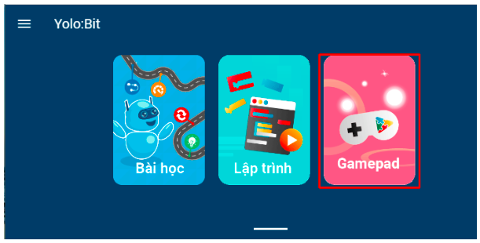

**Kit bắn bóng**
==============

    ..  image:: images/ban_bong.1.jpg
        :scale: 80%
        :align: center 

1. Giới thiệu 
----------
-----------

Phụ kiện bắn bóng là bộ mở rộng giúp robot có thể bắn được bóng bàn ra xa, có thể được áp dụng vào trong các cuộc thi Robocon. Bạn có thể điều chỉnh độ cao cũng như tốc độ bắn, để bóng bắn trúng đích mình muốn.

Bộ bắn bóng này có lối thiết kế lắp ráp đơn giản, cách lập trình dễ dàng phù hợp cho học sinh và giáo viên dùng để giảng dạy.

2. Link sản phẩm 
-------
------------

..  image:: images/gio.png
    :alt: some image
    :target: https://shop.ohstem.vn/san-pham/phu-kien-ban-bong-dung-cho-robot/
    :class: with-shadow
    :scale: 100%
    :align: center
|

3. Hướng dẫn lắp ráp
------
------------

.. raw:: html

    <iframe width="560" height="315" src="https://www.youtube.com/embed/nHmTWMwyIu4?si=JkyYsJKuXJNKLVPT" title="YouTube video player" frameborder="0" allow="accelerometer; autoplay; clipboard-write; encrypted-media; gyroscope; picture-in-picture; web-share" referrerpolicy="strict-origin-when-cross-origin" allowfullscreen></iframe>

| 

4. Hướng dẫn sử dụng
------
------------

Để điều khiển được bộ kit bắn bóng trên robot Rover, bạn sẽ cần thực hiện các bước như sau

1. Tải thư viện Rover cho Yolo:Bit. Xem hướng dẫn tải thư viện `tại đây <https://docs.ohstem.vn/en/latest/robot_rover/rover/cai-dat-thu-vien.html>`_. 
|

2. **Sau khi tải thư viện và khởi động lại robot, bạn hãy nhấn giữ nút B trên Yolo:Bit trong 3 giây, cho đến khi màn hình Yolo:Bit hiển thị số 2 như thao tác bên dưới**. Khi đó, chế độ điều khiển bắn bóng trên robot Rover được khởi tạo:

..  image:: images/ban-bong.3.gif
    :scale: 80%
    :align: center
|

3. Trên giao diện lập trình thiết bị Yolo:Bit, chọn vào **Gamepad**: 

|

4. Giao diện sẽ hiện ra như hình bên dưới, bạn cần kết nối Bluetooth đến robot của mình và nhấn các nút sau để điều khiển kit bắn bóng:

    - Nút A: Nạp bóng
    - Nút B: Bắn bóng

.. image:: images/hai_bac_4.png
    :scale: 100%
    :align: center
|

5. Hướng dẫn lập trình
---------
------

Ngoài ra, bạn có thể tự lập trình bộ bắn bóng của mình như sau: 

1. Tải thư viện Robocon cho Yolo:Bit. Xem hướng dẫn tải thư viện `tại đây <https://docs.ohstem.vn/en/latest/robot_rover/rover/cai-dat-thu-vien.html>`_. 

    ..  image:: images/ban-bong.2.png
        :scale: 80%
        :align: center 
    |

    Các khối lệnh mới sẽ được xuất hiện như hình: 

    ..  image:: images/ban-bong.4.png
        :scale: 80%
        :align: center 
    |

2. Nạp chương trình sau mẫu vào Yolo:Bit: 

    ..  figure:: images/ban-bong.5.png
        :scale: 50%
        :align: center

        Link chương trình mẫu: `<https://app.ohstem.vn/#!/share/yolobit/2pydrrJvcWwMCKJd4VYiSK3MxE4>`_ 

.. note:: Giải thích chương trình: 

    Khi nút A trên Gamepad được nhấn, động cơ servo ở chân S1 (nạp bóng) và động cơ servo ở chân S2 (bắn bóng) sẽ quay đến góc chuẩn bị đặt bóng lên thanh bắn. 

    Khi nút D được nhấn, động cơ S2 (bắn bóng) sẽ quay đến góc 180 độ. Lúc này, bóng sẽ được bắn đi. 

    **Bạn có thể tùy chỉnh góc bắn và góc nạp bóng. Tuy nhiên, để bảo vệ cho động cơ servo được hoạt động tốt, bạn chỉ nên cho động cơ hoạt động trong phạm vi góc như sau:** 

        - **S1 - nạp bóng: Phạm vi từ 90 - 180 độ**
        - **S2 - bắn bóng: Phạm vi từ 20 - 180 độ**

3. Lưu chương trình vào robot theo hướng dẫn: 

    1. Chọn **Lưu project vào thiết bị**:

        ..  image:: images/ban-bong.6.png
            :scale: 80%
            :align: center  
    |

    2. Sau khi lưu thành công, **tắt nguồn và bật lại robot**. Lúc này, chương trình đã được lưu vào bộ nhớ Flash của robot. 

        ..  image:: images/ban-bong.7.png
            :scale: 80%
            :align: center 
    |

4. Quay lại giao diện của lập trình thiết bị Yolo:Bit, chọn vào **Gamepad**. Lúc này, bạn chỉ cần kết nối Bluetooth đến robot của mình và nhấn các nút như trong chương trình vừa thực hiện để điều khiển kit bắn bóng:

        - Nút A: Nạp bóng
        - Nút D: Bắn bóng

    .. image:: images/hai_bac_4.png
        :scale: 100%
        :align: center
    |